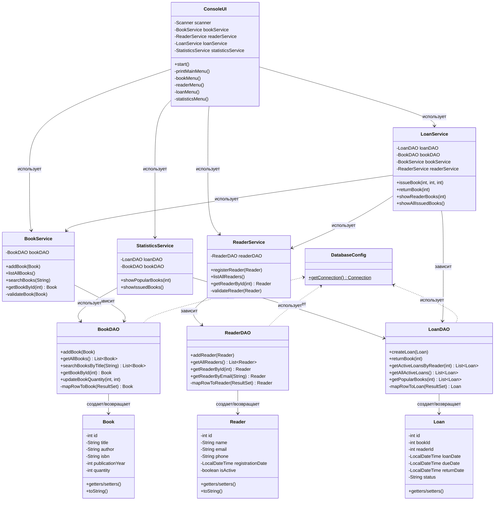
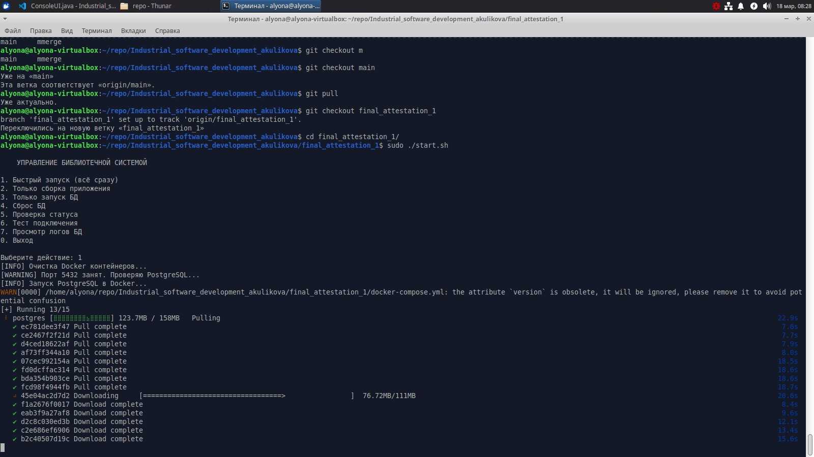
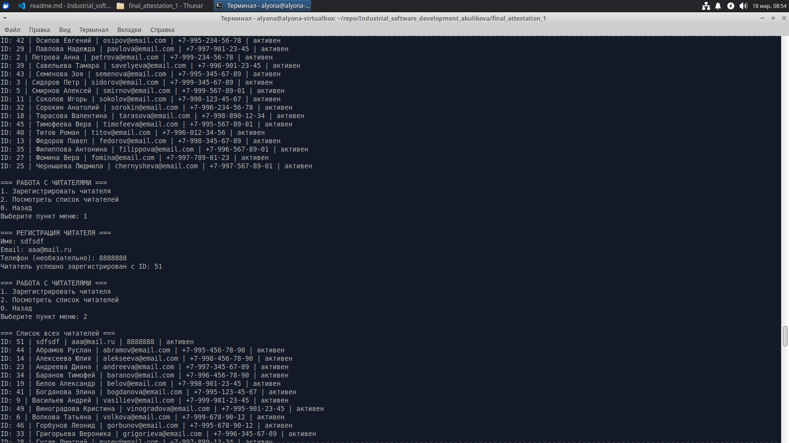

# Итоговая аттестация. Дисциплины: «Программирование на языках высокого уровня: продвинутые техники» и «Современные базы данных: технологии и подходы»

Выполнил студент Куликова А.В.

## Содержание

1.  [Введение](#введение)
2.  [Архитектура проекта (SOLID)](#архитектура-проекта-solid)
3.  [Структура проекта](#структура-проекта)
4.  [Необходимые требования](#необходимые-требования)
5.  [Работа самой программы](#работа-самой-программы)

## Введение

Консольное приложение для управления библиотекой на Java с использованием PostgreSQL и JDBC. Проект реализует полный функционал работы с книгами, читателями и операциями выдачи.

Функциональность программы:

- Работа с книгами
    - Добавление новой книги (название, автор, ISBN, год издания, количество)
    - Просмотр списка всех книг
    - Поиск книги по названию
- Работа с читателями
    - Регистрация нового читателя (имя, email, телефон)
    - Просмотр списка всех читателей
- Операции выдачи
    - Выдача книги читателю (с указанием срока)
    - Возврат книги
    - Просмотр книг, выданных конкретному читателю
- Статистика
    - Топ популярных книг
    - Список всех выданных книг

## Архитектура проекта (SOLID)

- [S]   Single Responsibility
    - Каждый класс отвечает за одну функциональность
- [O]   Open/Closed    
    - Сервисы легко расширяются без изменения кода
- [L]    Liskov Substitution
    - Модели данных независимы от способа хранения
- [I]    Interface Segregation
    - DAO классы предоставляют только нужные методы
- [D]    Dependency Injection
    - Сервисы получают зависимости через конструктор



## Структура проекта

```
.
├── docker-compose.yml
├── init-scripts
│   ├── 01-cleanup.sql
│   ├── 02-init.sql
│   └── 03-seed.sql
├── pom.xml
├── readme.md
├── screens
│   └── 01_start_script.png
└── src
   └── main
       ├── java
       │   └── com
       │       └── library
       │           ├── config
       │           │   └── DatabaseConfig.java
       │           ├── dao
       │           │   ├── BookDAO.java
       │           │   ├── LoanDAO.java
       │           │   └── ReaderDAO.java
       │           ├── Main.java
       │           ├── model
       │           │   ├── Book.java
       │           │   ├── Loan.java
       │           │   └── Reader.java
       │           ├── service
       │           │   ├── BookService.java
       │           │   ├── LoanService.java
       │           │   ├── ReaderService.java
       │           │   └── StatisticsService.java
       │           └── ui
       │               └── ConsoleUI.java
       └── resources
           └── application.properties
```

## Необходимые требования

- Docker и Docker Compose
- Java 11
- Maven
- PostgreSQL

## Работа самой программы

### Быстрый старт

```
# Запустить PostgreSQL в Docker
sudo docker-compose up -d

# Собрать приложение
mvn clean compile dependency:copy-dependencies

# Запустить приложение
java -cp "target/classes:target/dependency/*" com.library.Main
```

### Запуск скрипта

Cам скрипт запускается с помощью команды `./start.sh` в терминале, после чего будет запущен проект:

1. Очистка и запуск docker
2. Очистка и инициализация БД (см. init-scripts/*sql)
3. Запуск самого приложения



### Скрин



### Пример работы

```
=== БИБЛИОТЕЧНАЯ СИСТЕМА ===
1. Работа с книгами
2. Работа с читателями
3. Операции выдачи
4. Статистика
0. Выход
Выберите пункт меню: 1

=== РАБОТА С КНИГАМИ ===
1. Добавить книгу
2. Посмотреть список книг
3. Найти книгу по названию
0. Назад
Выберите пункт меню: 2

=== Список всех книг ===
ID: 48 | Generation П | Виктор Пелевин | 978-5-23-222222-2 | 4 экз.
ID: 4 | Анна Каренина | Лев Толстой | 978-5-17-345678-9 | 2 экз.
ID: 39 | Архипелаг ГУЛАГ | Александр Солженицын | 978-5-21-222222-2 | 2 экз.
ID: 23 | Белые ночи | Федор Достоевский | 978-5-18-444444-4 | 4 экз.
ID: 20 | Бесы | Федор Достоевский | 978-5-18-111111-1 | 3 экз.
ID: 33 | Борис Годунов | Александр Пушкин | 978-5-19-888888-8 | 2 экз.
ID: 11 | Братья Карамазовы | Федор Достоевский | 978-5-17-111111-1 | 3 экз.
ID: 16 | Вишневый сад | Антон Чехов | 978-5-17-666666-6 | 3 экз.
ID: 42 | В круге первом | Александр Солженицын | 978-5-21-555555-5 | 2 экз.
ID: 1 | Война и мир | Лев Толстой | 978-5-17-082578-1 | 5 экз.
ID: 8 | Герой нашего времени | Михаил Лермонтов | 978-5-17-890123-4 | 3 экз.
ID: 14 | Горе от ума | Александр Грибоедов | 978-5-17-444444-4 | 5 экз.
ID: 36 | Дар | Владимир Набоков | 978-5-20-333333-3 | 3 экз.
ID: 24 | Двойник | Федор Достоевский | 978-5-18-555555-5 | 2 экз.
ID: 38 | Доктор Живаго | Борис Пастернак | 978-5-21-111111-1 | 4 экз.
ID: 27 | Дубровский | Александр Пушкин | 978-5-19-222222-2 | 4 экз.
ID: 18 | Дядя Ваня | Антон Чехов | 978-5-17-888888-8 | 3 экз.
ID: 7 | Евгений Онегин | Александр Пушкин | 978-5-17-234567-8 | 6 экз.
ID: 49 | Жизнь насекомых | Виктор Пелевин | 978-5-23-333333-3 | 3 экз.
ID: 22 | Записки из мертвого дома | Федор Достоевский | 978-5-18-333333-3 | 3 экз.
ID: 35 | Защита Лужина | Владимир Набоков | 978-5-20-222222-2 | 2 экз.
ID: 25 | Игрок | Федор Достоевский | 978-5-18-666666-6 | 3 экз.
ID: 5 | Идиот | Федор Достоевский | 978-5-17-901234-5 | 3 экз.
ID: 26 | Капитанская дочка | Александр Пушкин | 978-5-19-111111-1 | 5 экз.
ID: 43 | Колымские рассказы | Варлам Шаламов | 978-5-22-111111-1 | 3 экз.
ID: 34 | Лолита | Владимир Набоков | 978-5-20-111111-1 | 3 экз.
ID: 3 | Мастер и Маргарита | Михаил Булгаков | 978-5-17-789012-3 | 4 экз.
ID: 32 | Медный всадник | Александр Пушкин | 978-5-19-777777-7 | 4 экз.
ID: 9 | Мертвые души | Николай Гоголь | 978-5-17-456789-0 | 4 экз.
ID: 45 | Москва-Петушки | Венедикт Ерофеев | 978-5-22-333333-3 | 4 экз.
ID: 13 | Обломов | Иван Гончаров | 978-5-17-333333-3 | 3 экз.
ID: 40 | Один день Ивана Денисовича | Александр Солженицын | 978-5-21-333333-3 | 5 экз.
ID: 50 | Омон Ра | Виктор Пелевин | 978-5-23-444444-4 | 3 экз.
ID: 12 | Отцы и дети | Иван Тургенев | 978-5-17-222222-2 | 4 экз.
ID: 28 | Пиковая дама | Александр Пушкин | 978-5-19-333333-3 | 3 экз.
ID: 21 | Подросток | Федор Достоевский | 978-5-18-222222-2 | 2 экз.
ID: 31 | Полтава | Александр Пушкин | 978-5-19-666666-6 | 3 экз.
ID: 2 | Преступление и наказание | Федор Достоевский | 978-5-17-123456-7 | 3 экз.
ID: 37 | Приглашение на казнь | Владимир Набоков | 978-5-20-444444-4 | 2 экз.
ID: 44 | Пушкинский дом | Андрей Битов | 978-5-22-222222-2 | 2 экз.
ID: 41 | Раковый корпус | Александр Солженицын | 978-5-21-444444-4 | 3 экз.
ID: 15 | Ревизор | Николай Гоголь | 978-5-17-555555-5 | 4 экз.
ID: 29 | Руслан и Людмила | Александр Пушкин | 978-5-19-444444-4 | 4 экз.
ID: 30 | Сказка о царе Салтане | Александр Пушкин | 978-5-19-555555-5 | 6 экз.
ID: 6 | Собачье сердце | Михаил Булгаков | 978-5-17-567890-1 | 2 экз.
ID: 10 | Тихий Дон | Михаил Шолохов | 978-5-17-678901-2 | 2 экз.
ID: 17 | Три сестры | Антон Чехов | 978-5-17-777777-7 | 2 экз.
ID: 19 | Чайка | Антон Чехов | 978-5-17-999999-9 | 4 экз.
ID: 47 | Чапаев и Пустота | Виктор Пелевин | 978-5-23-111111-1 | 5 экз.
ID: 46 | Школа для дураков | Саша Соколов | 978-5-22-444444-4 | 2 экз.

=== РАБОТА С КНИГАМИ ===
1. Добавить книгу
2. Посмотреть список книг
3. Найти книгу по названию
0. Назад
Выберите пункт меню: 1

=== ДОБАВЛЕНИЕ КНИГИ ===
Название: werwer
Автор: a
ISBN (необязательно): 
Год издания (необязательно): 2000
Количество экземпляров: 10000
Книга успешно добавлена с ID: 51

=== РАБОТА С КНИГАМИ ===
1. Добавить книгу
2. Посмотреть список книг
3. Найти книгу по названию
0. Назад
Выберите пункт меню: 0

=== БИБЛИОТЕЧНАЯ СИСТЕМА ===
1. Работа с книгами
2. Работа с читателями
3. Операции выдачи
4. Статистика
0. Выход
Выберите пункт меню: 3

=== ОПЕРАЦИИ ВЫДАЧИ ===
1. Выдать книгу читателю
2. Вернуть книгу
3. Посмотреть книги, выданные читателю
0. Назад
Выберите пункт меню: 3

Введите ID читателя: 1

=== Книги, выданные читателю "Иванов Иван" ===
ID выдачи: 4 | Книга: Анна Каренина | Дата выдачи: 2026-03-13 | Срок до: 2026-03-27
ID выдачи: 1 | Книга: Война и мир | Дата выдачи: 2026-03-08 | Срок до: 2026-03-22
ID выдачи: 52 | Книга: Мастер и Маргарита | Дата выдачи: 2026-03-07 | Срок до: 2026-03-21

=== ОПЕРАЦИИ ВЫДАЧИ ===
1. Выдать книгу читателю
2. Вернуть книгу
3. Посмотреть книги, выданные читателю
0. Назад
Выберите пункт меню: 0

=== БИБЛИОТЕЧНАЯ СИСТЕМА ===
1. Работа с книгами
2. Работа с читателями
3. Операции выдачи
4. Статистика
0. Выход
Выберите пункт меню: 4

=== СТАТИСТИКА ===
1. Показать популярные книги
2. Показать список выданных книг
0. Назад
Выберите пункт меню: 1
Сколько книг показать? 15

=== Топ-15 популярных книг ===
Generation П - Виктор Пелевин (примерно 17 выдач)
werwer - a (примерно 6 выдач)
Анна Каренина - Лев Толстой (примерно 9 выдач)
Архипелаг ГУЛАГ - Александр Солженицын (примерно 14 выдач)
Белые ночи - Федор Достоевский (примерно 12 выдач)
Бесы - Федор Достоевский (примерно 11 выдач)
Борис Годунов - Александр Пушкин (примерно 9 выдач)
Братья Карамазовы - Федор Достоевский (примерно 8 выдач)
Вишневый сад - Антон Чехов (примерно 8 выдач)
В круге первом - Александр Солженицын (примерно 7 выдач)
Война и мир - Лев Толстой (примерно 8 выдач)
Герой нашего времени - Михаил Лермонтов (примерно 13 выдач)
Горе от ума - Александр Грибоедов (примерно 6 выдач)
Дар - Владимир Набоков (примерно 18 выдач)
Двойник - Федор Достоевский (примерно 6 выдач)

=== СТАТИСТИКА ===
1. Показать популярные книги
2. Показать список выданных книг
0. Назад
Выберите пункт меню: 2

=== Список всех выданных книг ===
ID выдачи: 9 | Книга: Мертвые души | Читатель: Новикова Ольга | Выдана: 2026-03-15 | Срок: 2026-03-29 | Активна
ID выдачи: 29 | Книга: Руслан и Людмила | Читатель: Гусев Дмитрий | Выдана: 2026-03-14 | Срок: 2026-03-28 | Активна
ID выдачи: 69 | Книга: Бесы | Читатель: Тарасова Валентина | Выдана: 2026-03-13 | Срок: 2026-03-27 | Активна
ID выдачи: 4 | Книга: Анна Каренина | Читатель: Иванов Иван | Выдана: 2026-03-13 | Срок: 2026-03-27 | Активна
ID выдачи: 39 | Книга: Архипелаг ГУЛАГ | Читатель: Крылов Никита | Выдана: 2026-03-13 | Срок: 2026-03-27 | Активна
ID выдачи: 44 | Книга: Пушкинский дом | Читатель: Семенова Зоя | Выдана: 2026-03-12 | Срок: 2026-03-26 | Активна
ID выдачи: 24 | Книга: Двойник | Читатель: Андреева Диана | Выдана: 2026-03-12 | Срок: 2026-03-26 | Активна
ID выдачи: 64 | Книга: Ревизор | Читатель: Федоров Павел | Выдана: 2026-03-12 | Срок: 2026-03-26 | Активна
ID выдачи: 34 | Книга: Лолита | Читатель: Григорьева Вероника | Выдана: 2026-03-11 | Срок: 2026-03-25 | Активна
ID выдачи: 6 | Книга: Собачье сердце | Читатель: Смирнов Алексей | Выдана: 2026-03-11 | Срок: 2026-03-25 | Активна
ID выдачи: 59 | Книга: Тихий Дон | Читатель: Новикова Ольга | Выдана: 2026-03-11 | Срок: 2026-03-25 | Активна
ID выдачи: 49 | Книга: Жизнь насекомых | Читатель: Миронов Валентин | Выдана: 2026-03-10 | Срок: 2026-03-24 | Активна
ID выдачи: 19 | Книга: Чайка | Читатель: Тарасова Валентина | Выдана: 2026-03-10 | Срок: 2026-03-24 | Активна
ID выдачи: 54 | Книга: Идиот | Читатель: Сидоров Петр | Выдана: 2026-03-09 | Срок: 2026-03-23 | Активна
ID выдачи: 14 | Книга: Горе от ума | Читатель: Федоров Павел | Выдана: 2026-03-09 | Срок: 2026-03-23 | Активна
ID выдачи: 1 | Книга: Война и мир | Читатель: Иванов Иван | Выдана: 2026-03-08 | Срок: 2026-03-22 | Активна
ID выдачи: 57 | Книга: Герой нашего времени | Читатель: Волкова Татьяна | Выдана: 2026-03-08 | Срок: 2026-03-22 | Активна
ID выдачи: 52 | Книга: Мастер и Маргарита | Читатель: Иванов Иван | Выдана: 2026-03-07 | Срок: 2026-03-21 | Активна
ID выдачи: 22 | Книга: Записки из мертвого дома | Читатель: Киселева Алина | Выдана: 2026-03-07 | Срок: 2026-03-21 | Активна
ID выдачи: 11 | Книга: Братья Карамазовы | Читатель: Зайцева Наталья | Выдана: 2026-03-06 | Срок: 2026-03-20 | Активна
ID выдачи: 47 | Книга: Чапаев и Пустота | Читатель: Горбунов Леонид | Выдана: 2026-03-06 | Срок: 2026-03-20 | Активна
ID выдачи: 67 | Книга: Дядя Ваня | Читатель: Орлова Ксения | Выдана: 2026-03-06 | Срок: 2026-03-20 | Активна
ID выдачи: 27 | Книга: Дубровский | Читатель: Зыков Виталий | Выдана: 2026-03-05 | Срок: 2026-03-19 | Активна
ID выдачи: 62 | Книга: Обломов | Читатель: Соколов Игорь | Выдана: 2026-03-05 | Срок: 2026-03-19 | Активна
ID выдачи: 16 | Книга: Вишневый сад | Читатель: Никитин Сергей | Выдана: 2026-03-04 | Срок: 2026-03-18 | ПРОСРОЧЕНА
ID выдачи: 37 | Книга: Приглашение на казнь | Читатель: Мартынов Георгий | Выдана: 2026-03-04 | Срок: 2026-03-18 | ПРОСРОЧЕНА
ID выдачи: 42 | Книга: В круге первом | Читатель: Богданова Элина | Выдана: 2026-03-03 | Срок: 2026-03-19 | Активна
ID выдачи: 3 | Книга: Мастер и Маргарита | Читатель: Сидоров Петр | Выдана: 2026-03-03 | Срок: 2026-03-17 | ПРОСРОЧЕНА
ID выдачи: 32 | Книга: Медный всадник | Читатель: Лебедева Марина | Выдана: 2026-03-02 | Срок: 2026-03-20 | Активна
ID выдачи: 21 | Книга: Подросток | Читатель: Комаров Денис | Выдана: 2026-03-01 | Срок: 2026-03-15 | ПРОСРОЧЕНА
ID выдачи: 31 | Книга: Полтава | Читатель: Кузьмин Владислав | Выдана: 2026-02-27 | Срок: 2026-03-13 | ПРОСРОЧЕНА
ID выдачи: 26 | Книга: Капитанская дочка | Читатель: Чернышева Людмила | Выдана: 2026-02-25 | Срок: 2026-03-11 | ПРОСРОЧЕНА
ID выдачи: 13 | Книга: Обломов | Читатель: Михайлова Светлана | Выдана: 2026-02-24 | Срок: 2026-03-10 | ПРОСРОЧЕНА
ID выдачи: 36 | Книга: Дар | Читатель: Филиппова Антонина | Выдана: 2026-02-23 | Срок: 2026-03-09 | ПРОСРОЧЕНА
ID выдачи: 41 | Книга: Раковый корпус | Читатель: Титов Роман | Выдана: 2026-02-22 | Срок: 2026-03-08 | ПРОСРОЧЕНА
ID выдачи: 46 | Книга: Школа для дураков | Читатель: Тимофеева Вера | Выдана: 2026-02-21 | Срок: 2026-03-07 | ПРОСРОЧЕНА
ID выдачи: 51 | Книга: Преступление и наказание | Читатель: Казаков Станислав | Выдана: 2026-02-20 | Срок: 2026-03-06 | ПРОСРОЧЕНА
ID выдачи: 56 | Книга: Евгений Онегин | Читатель: Смирнов Алексей | Выдана: 2026-02-19 | Срок: 2026-03-05 | ПРОСРОЧЕНА
ID выдачи: 61 | Книга: Отцы и дети | Читатель: Зайцева Наталья | Выдана: 2026-02-18 | Срок: 2026-03-04 | ПРОСРОЧЕНА
ID выдачи: 66 | Книга: Три сестры | Читатель: Никитин Сергей | Выдана: 2026-02-17 | Срок: 2026-03-03 | ПРОСРОЧЕНА

=== СТАТИСТИКА ===
1. Показать популярные книги
2. Показать список выданных книг
0. Назад
Выберите пункт меню: 0

=== БИБЛИОТЕЧНАЯ СИСТЕМА ===
1. Работа с книгами
2. Работа с читателями
3. Операции выдачи
4. Статистика
0. Выход
Выберите пункт меню: 2

=== РАБОТА С ЧИТАТЕЛЯМИ ===
1. Зарегистрировать читателя
2. Посмотреть список читателей
0. Назад
Выберите пункт меню: 2

=== Список всех читателей ===
ID: 44 | Абрамов Руслан | abramov@email.com | +7-995-456-78-90 | активен
ID: 14 | Алексеева Юлия | alekseeva@email.com | +7-998-456-78-90 | активен
ID: 23 | Андреева Диана | andreeva@email.com | +7-997-345-67-89 | активен
ID: 34 | Баранов Тимофей | baranov@email.com | +7-996-456-78-90 | активен
ID: 19 | Белов Александр | belov@email.com | +7-998-901-23-45 | активен
ID: 41 | Богданова Элина | bogdanova@email.com | +7-995-123-45-67 | активен
ID: 9 | Васильев Андрей | vasiliev@email.com | +7-999-901-23-45 | активен
ID: 49 | Виноградова Кристина | vinogradova@email.com | +7-995-901-23-45 | активен
ID: 6 | Волкова Татьяна | volkova@email.com | +7-999-678-90-12 | активен
ID: 46 | Горбунов Леонид | gorbunov@email.com | +7-995-678-90-12 | активен
ID: 33 | Григорьева Вероника | grigorieva@email.com | +7-996-345-67-89 | активен
ID: 28 | Гусев Дмитрий | gusev@email.com | +7-997-890-12-34 | активен
ID: 37 | Денисова Регина | denisova@email.com | +7-996-789-01-23 | активен
ID: 10 | Зайцева Наталья | zaitseva@email.com | +7-999-012-34-56 | активен
ID: 24 | Захаров Максим | zakharov@email.com | +7-997-456-78-90 | активен
ID: 26 | Зыков Виталий | zykov@email.com | +7-997-678-90-12 | активен
ID: 1 | Иванов Иван | ivanov@email.com | +7-999-123-45-67 | активен
ID: 50 | Казаков Станислав | kazakov@email.com | +7-995-012-34-56 | активен
ID: 21 | Киселева Алина | kiseleva@email.com | +7-997-123-45-67 | активен
ID: 4 | Козлова Елена | kozlova@email.com | +7-999-456-78-90 | активен
ID: 17 | Козлов Владимир | kozlov@email.com | +7-998-789-01-23 | активен
ID: 20 | Комаров Денис | komarov@email.com | +7-998-012-34-56 | активен
ID: 38 | Крылов Никита | krylov@email.com | +7-996-890-12-34 | активен
ID: 30 | Кузьмин Владислав | kuzmin@email.com | +7-997-012-34-56 | активен
ID: 47 | Лазарева Инна | lazareva@email.com | +7-995-789-01-23 | активен
ID: 31 | Лебедева Марина | lebedeva@email.com | +7-996-123-45-67 | активен
ID: 22 | Макаров Илья | makarov@email.com | +7-997-234-56-78 | активен
ID: 36 | Мартынов Георгий | martynov@email.com | +7-996-678-90-12 | активен
ID: 48 | Миронов Валентин | mironov@email.com | +7-995-890-12-34 | активен
ID: 12 | Михайлова Светлана | mikhailova@email.com | +7-998-234-56-78 | активен
ID: 7 | Морозов Дмитрий | morozov@email.com | +7-999-789-01-23 | активен
ID: 15 | Никитин Сергей | nikitin@email.com | +7-998-567-89-01 | активен
ID: 8 | Новикова Ольга | novikova@email.com | +7-999-890-12-34 | активен
ID: 16 | Орлова Ксения | orlova@email.com | +7-998-678-90-12 | активен
ID: 42 | Осипов Евгений | osipov@email.com | +7-995-234-56-78 | активен
ID: 29 | Павлова Надежда | pavlova@email.com | +7-997-901-23-45 | активен
ID: 2 | Петрова Анна | petrova@email.com | +7-999-234-56-78 | активен
ID: 39 | Савельева Тамара | savelyeva@email.com | +7-996-901-23-45 | активен
ID: 43 | Семенова Зоя | semenova@email.com | +7-995-345-67-89 | активен
ID: 3 | Сидоров Петр | sidorov@email.com | +7-999-345-67-89 | активен
ID: 5 | Смирнов Алексей | smirnov@email.com | +7-999-567-89-01 | активен
ID: 11 | Соколов Игорь | sokolov@email.com | +7-998-123-45-67 | активен
ID: 32 | Сорокин Анатолий | sorokin@email.com | +7-996-234-56-78 | активен
ID: 18 | Тарасова Валентина | tarasova@email.com | +7-998-890-12-34 | активен
ID: 45 | Тимофеева Вера | timofeeva@email.com | +7-995-567-89-01 | активен
ID: 40 | Титов Роман | titov@email.com | +7-996-012-34-56 | активен
ID: 13 | Федоров Павел | fedorov@email.com | +7-998-345-67-89 | активен
ID: 35 | Филиппова Антонина | filippova@email.com | +7-996-567-89-01 | активен
ID: 27 | Фомина Вера | fomina@email.com | +7-997-789-01-23 | активен
ID: 25 | Чернышева Людмила | chernysheva@email.com | +7-997-567-89-01 | активен

=== РАБОТА С ЧИТАТЕЛЯМИ ===
1. Зарегистрировать читателя
2. Посмотреть список читателей
0. Назад
Выберите пункт меню: 1

=== РЕГИСТРАЦИЯ ЧИТАТЕЛЯ ===
Имя: sdfsdf
Email: aaa@mail.ru
Телефон (необязательно): 8888888
Читатель успешно зарегистрирован с ID: 51

=== РАБОТА С ЧИТАТЕЛЯМИ ===
1. Зарегистрировать читателя
2. Посмотреть список читателей
0. Назад
Выберите пункт меню: 2

=== Список всех читателей ===
ID: 51 | sdfsdf | aaa@mail.ru | 8888888 | активен
ID: 44 | Абрамов Руслан | abramov@email.com | +7-995-456-78-90 | активен
ID: 14 | Алексеева Юлия | alekseeva@email.com | +7-998-456-78-90 | активен
ID: 23 | Андреева Диана | andreeva@email.com | +7-997-345-67-89 | активен
ID: 34 | Баранов Тимофей | baranov@email.com | +7-996-456-78-90 | активен
ID: 19 | Белов Александр | belov@email.com | +7-998-901-23-45 | активен
ID: 41 | Богданова Элина | bogdanova@email.com | +7-995-123-45-67 | активен
ID: 9 | Васильев Андрей | vasiliev@email.com | +7-999-901-23-45 | активен
ID: 49 | Виноградова Кристина | vinogradova@email.com | +7-995-901-23-45 | активен
ID: 6 | Волкова Татьяна | volkova@email.com | +7-999-678-90-12 | активен
ID: 46 | Горбунов Леонид | gorbunov@email.com | +7-995-678-90-12 | активен
ID: 33 | Григорьева Вероника | grigorieva@email.com | +7-996-345-67-89 | активен
ID: 28 | Гусев Дмитрий | gusev@email.com | +7-997-890-12-34 | активен
ID: 37 | Денисова Регина | denisova@email.com | +7-996-789-01-23 | активен
ID: 10 | Зайцева Наталья | zaitseva@email.com | +7-999-012-34-56 | активен
ID: 24 | Захаров Максим | zakharov@email.com | +7-997-456-78-90 | активен
ID: 26 | Зыков Виталий | zykov@email.com | +7-997-678-90-12 | активен
ID: 1 | Иванов Иван | ivanov@email.com | +7-999-123-45-67 | активен
ID: 50 | Казаков Станислав | kazakov@email.com | +7-995-012-34-56 | активен
ID: 21 | Киселева Алина | kiseleva@email.com | +7-997-123-45-67 | активен
ID: 4 | Козлова Елена | kozlova@email.com | +7-999-456-78-90 | активен
ID: 17 | Козлов Владимир | kozlov@email.com | +7-998-789-01-23 | активен
ID: 20 | Комаров Денис | komarov@email.com | +7-998-012-34-56 | активен
ID: 38 | Крылов Никита | krylov@email.com | +7-996-890-12-34 | активен
ID: 30 | Кузьмин Владислав | kuzmin@email.com | +7-997-012-34-56 | активен
ID: 47 | Лазарева Инна | lazareva@email.com | +7-995-789-01-23 | активен
ID: 31 | Лебедева Марина | lebedeva@email.com | +7-996-123-45-67 | активен
ID: 22 | Макаров Илья | makarov@email.com | +7-997-234-56-78 | активен
ID: 36 | Мартынов Георгий | martynov@email.com | +7-996-678-90-12 | активен
ID: 48 | Миронов Валентин | mironov@email.com | +7-995-890-12-34 | активен
ID: 12 | Михайлова Светлана | mikhailova@email.com | +7-998-234-56-78 | активен
ID: 7 | Морозов Дмитрий | morozov@email.com | +7-999-789-01-23 | активен
ID: 15 | Никитин Сергей | nikitin@email.com | +7-998-567-89-01 | активен
ID: 8 | Новикова Ольга | novikova@email.com | +7-999-890-12-34 | активен
ID: 16 | Орлова Ксения | orlova@email.com | +7-998-678-90-12 | активен
ID: 42 | Осипов Евгений | osipov@email.com | +7-995-234-56-78 | активен
ID: 29 | Павлова Надежда | pavlova@email.com | +7-997-901-23-45 | активен
ID: 2 | Петрова Анна | petrova@email.com | +7-999-234-56-78 | активен
ID: 39 | Савельева Тамара | savelyeva@email.com | +7-996-901-23-45 | активен
ID: 43 | Семенова Зоя | semenova@email.com | +7-995-345-67-89 | активен
ID: 3 | Сидоров Петр | sidorov@email.com | +7-999-345-67-89 | активен
ID: 5 | Смирнов Алексей | smirnov@email.com | +7-999-567-89-01 | активен
ID: 11 | Соколов Игорь | sokolov@email.com | +7-998-123-45-67 | активен
ID: 32 | Сорокин Анатолий | sorokin@email.com | +7-996-234-56-78 | активен
ID: 18 | Тарасова Валентина | tarasova@email.com | +7-998-890-12-34 | активен
ID: 45 | Тимофеева Вера | timofeeva@email.com | +7-995-567-89-01 | активен
ID: 40 | Титов Роман | titov@email.com | +7-996-012-34-56 | активен
ID: 13 | Федоров Павел | fedorov@email.com | +7-998-345-67-89 | активен
ID: 35 | Филиппова Антонина | filippova@email.com | +7-996-567-89-01 | активен
ID: 27 | Фомина Вера | fomina@email.com | +7-997-789-01-23 | активен
ID: 25 | Чернышева Людмила | chernysheva@email.com | +7-997-567-89-01 | активен

=== РАБОТА С ЧИТАТЕЛЯМИ ===
1. Зарегистрировать читателя
2. Посмотреть список читателей
0. Назад
Выберите пункт меню: 0

=== БИБЛИОТЕЧНАЯ СИСТЕМА ===
1. Работа с книгами
2. Работа с читателями
3. Операции выдачи
4. Статистика
0. Выход
Выберите пункт меню: 1

=== РАБОТА С КНИГАМИ ===
1. Добавить книгу
2. Посмотреть список книг
3. Найти книгу по названию
0. Назад
Выберите пункт меню: 3

Введите название для поиска: ewrwerwer
Книги с названием 'ewrwerwer' не найдены

=== РАБОТА С КНИГАМИ ===
1. Добавить книгу
2. Посмотреть список книг
3. Найти книгу по названию
0. Назад
Выберите пункт меню: 1

=== ДОБАВЛЕНИЕ КНИГИ ===
Название: eq
Автор: qwqwqw
ISBN (необязательно): qwe
Год издания (необязательно): qwe
Ошибка: введите корректное число

=== РАБОТА С КНИГАМИ ===
1. Добавить книгу
2. Посмотреть список книг
3. Найти книгу по названию
0. Назад
Выберите пункт меню: 3

Введите название для поиска: Война и мир

=== Результаты поиска ===
ID: 1 | Война и мир | Лев Толстой | 978-5-17-082578-1 | 5 экз.

=== РАБОТА С КНИГАМИ ===
1. Добавить книгу
2. Посмотреть список книг
3. Найти книгу по названию
0. Назад
Выберите пункт меню: 0

=== БИБЛИОТЕЧНАЯ СИСТЕМА ===
1. Работа с книгами
2. Работа с читателями
3. Операции выдачи
4. Статистика
0. Выход
Выберите пункт меню: 3

=== ОПЕРАЦИИ ВЫДАЧИ ===
1. Выдать книгу читателю
2. Вернуть книгу
3. Посмотреть книги, выданные читателю
0. Назад
Выберите пункт меню: 2

=== ВОЗВРАТ КНИГИ ===
ID выдачи: 1
Книга успешно возвращена

=== ОПЕРАЦИИ ВЫДАЧИ ===
1. Выдать книгу читателю
2. Вернуть книгу
3. Посмотреть книги, выданные читателю
0. Назад
Выберите пункт меню: 1

=== ВЫДАЧА КНИГИ ===
ID книги: 13
ID читателя: 8
Срок выдачи (дней): 10
Книга "Обломов" выдана читателю "Новикова Ольга" до 2026-03-28

=== ОПЕРАЦИИ ВЫДАЧИ ===
1. Выдать книгу читателю
2. Вернуть книгу
3. Посмотреть книги, выданные читателю
0. Назад
Выберите пункт меню: 0

=== БИБЛИОТЕЧНАЯ СИСТЕМА ===
1. Работа с книгами
2. Работа с читателями
3. Операции выдачи
4. Статистика
0. Выход
Выберите пункт меню: 0
До свидания!

```