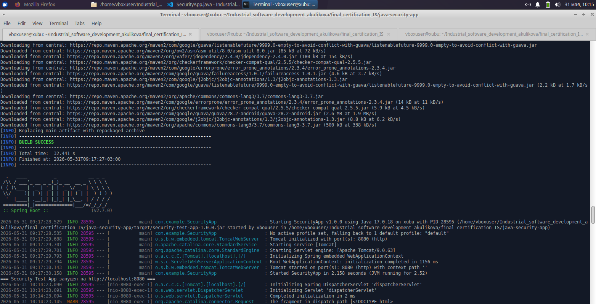
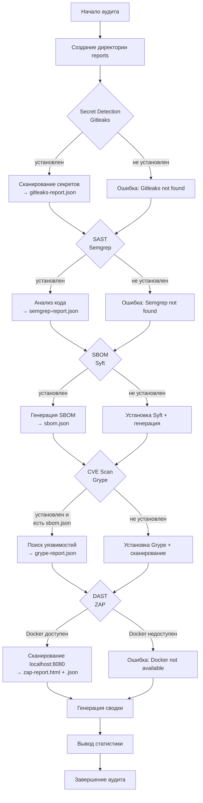

# Итоговая аттестация по промышленной разработке ПО

## Начало работы

Установка зависимостей

```bash
sudo apt update
sudo apt install maven -y
java -version
sudo apt install openjdk-11-jdk -y
```

Сборка и запуск приложения

```bash
cd java-security-app
mvn clean
mvn package
java -jar target/security-test-app-1.0.0.jar
```



## Запуск аудита безопасности

```bash
chmod +x security_audit.sh
./security_audit.sh
```

## Схема работы скрипта аудита




## Результаты аудита безопасности

| № | Инструмент | Тип проверки | Результат | Файл отчета | Примечание |
|---|------------|--------------|-----------|-------------|------------|
| 1 | Gitleaks | Secret Detection | Секреты не обнаружены | `gitleaks-report.json` | — |
| 2 | Semgrep | SAST | Выявлены уязвимости | —  | —  |
| 3 | Syft | SBOM  | Сформирован JSON-файл спецификации компонентов | `sbom.json` | — |
| 4 | Grype | CVE Scan | Обнаружено 26 критических/высокорисковых уязвимостей | `grype-report.json` | Требуется срочное обновление зависимостей |
| 5 | ZAP | DAST | Проведено базовое сканирование веб-приложения | — | — |

## Список всех выявленных CVE уязвимостей

| № | CVE ID | Компонент | Версия | Severity | CVSS Score | EPSS | Описание |
|---|--------|-----------|--------|----------|------------|------|----------|
| 1 | CVE-2021-44228 | log4j-core | 2.14.1 | Critical | 10.0 | 0.94358 | Log4Shell — RCE через JNDI lookup |
| 2 | CVE-2021-45046 | log4j-core | 2.14.1 | Critical | 9.0 | 0.9434 | DoS/RCE в нестандартных конфигурациях |
| 3 | CVE-2025-24813 | tomcat-embed-core | 9.0.63 | Critical | 9.8 | 0.9413 | RCE при частичном PUT + десериализация |
| 4 | CVE-2022-1471 | snakeyaml | 1.30 | High | 8.3 | 0.93849 | RCE через десериализацию YAML |
| 5 | CVE-2024-38816 | spring-webmvc | 5.3.20 | High | 7.5 | 0.9389 | Path traversal в функциональных веб-фреймворках |
| 6 | CVE-2024-38819 | spring-webmvc | 5.3.20 | High | 7.5 | 0.93306 | Path traversal в функциональных веб-фреймворках |
| 7 | CVE-2024-50379 | tomcat-embed-core | 9.0.63 | High | 9.8 | 0.84776 | TOCTOU Race Condition → RCE |
| 8 | CVE-2015-7501 | commons-collections | 3.2.1 | Critical | 9.8 | 0.71461 | Десериализация → RCE |
| 9 | CVE-2021-45105 | log4j-core | 2.14.1 | High | 8.6 | 0.74536 | DoS через рекурсивные lookup'и |
| 10 | CVE-2023-44487 | tomcat-embed-core | 9.0.63 | Medium | 5.3 | 0.944 | HTTP/2 Rapid Reset — DoS |
| 11 | CVE-2016-1000027 | spring-web | 5.3.20 | Critical | 9.8 | 0.60417 | Десериализация недоверенных данных → RCE |
| 12 | CVE-2023-20860 | spring-webmvc | 5.3.20 | Critical | 9.1 | 0.56284 | Security bypass через mvcRequestMatcher |
| 13 | CVE-2024-22243 | spring-web | 5.3.20 | High | 8.1 | 0.59593 | Open Redirect / SSRF |
| 14 | CVE-2024-22259 | spring-web | 5.3.20 | High | 8.1 | 0.56395 | Open Redirect / SSRF |
| 15 | CVE-2023-46589 | tomcat-embed-core | 9.0.63 | High | 7.5 | 0.53735 | Request smuggling через trailer headers |
| 16 | CVE-2024-24549 | tomcat-embed-core | 9.0.63 | High | 7.5 | 0.64877 | DoS через HTTP/2 заголовки |
| 17 | CVE-2023-45648 | tomcat-embed-core | 9.0.63 | Medium | 5.3 | 0.62748 | Request smuggling через trailer headers |
| 18 | CVE-2021-44832 | log4j-core | 2.14.1 | Medium | 6.6 | 0.53648 | RCE через JDBC Appender + JNDI |
| 19 | CVE-2023-24998 | tomcat-embed-core | 9.0.63 | High | 7.5 | 0.339 | DoS через multipart upload |
| 20 | CVE-2024-34750 | tomcat-embed-core | 9.0.63 | High | 7.5 | 0.2198 | DoS через HTTP/2 |
| 21 | CVE-2015-6420 | commons-collections | 3.2.1 | High | 9.8 | 0.212 | Десериализация → RCE |
| 22 | CVE-2024-22262 | spring-web | 5.3.20 | High | 8.1 | 0.12634 | Open Redirect / SSRF |
| 23 | CVE-2024-56337 | tomcat-embed-core | 9.0.63 | High | 7.5 | 0.1316 | TOCTOU Race Condition (неполный фикс CVE-2024-50379) |
| 24 | CVE-2023-41080 | tomcat-embed-core | 9.0.63 | Medium | 6.1 | 0.11586 | Open Redirect в FORM authentication |
| 25 | CVE-2023-32697 | sqlite-jdbc | 3.36.0.3 | High | 8.8 | 0.04204 | RCE через JDBC URL |
| 26 | CVE-2022-25857 | snakeyaml | 1.30 | High | 7.5 | 0.0292 | DoS через вложенные коллекции |
| 27 | CVE-2025-53506 | tomcat-embed-core | 9.0.63 | High | 7.5 | 0.01247 | DoS через HTTP/2 streams |
| 28 | CVE-2023-20863 | spring-expression | 5.3.20 | High | 7.5 | 0.01183 | DoS через SpEL выражение |
| 29 | CVE-2024-23672 | tomcat-embed-websocket | 9.0.63 | Medium | 6.3 | 0.01435 | DoS через WebSocket |
| 30 | CVE-2024-38820 | spring-context / spring-web | 5.3.20 | Medium | 5.3 | 0.01514 | DataBinder case sensitivity bypass |
| 31 | CVE-2025-48989 | tomcat-embed-core | 9.0.63 | High | 7.5 | 0.00983 | DoS через неправильное освобождение ресурсов |
| 32 | CVE-2022-45143 | tomcat-embed-core | 9.0.63 | High | 7.5 | 0.00889 | JSON injection в JsonErrorReportValve |
| 33 | CVE-2025-48988 | tomcat-embed-core | 9.0.63 | High | 7.5 | 0.00759 | DoS через multipart upload |
| 34 | CVE-2023-20883 | spring-boot-autoconfigure | 2.7.0 | High | 7.5 | 0.0069 | DoS через welcome page |
| 35 | CVE-2025-52520 | tomcat-embed-core | 9.0.63 | High | 7.5 | 0.00683 | DoS через integer overflow |
| 36 | CVE-2023-6378 | logback-classic / logback-core | 1.2.11 | High | 7.1 | 0.0063 | DoS через десериализацию |
| 37 | CVE-2024-38808 | spring-expression | 5.3.20 | Medium | 4.3 | 0.00809 | DoS через SpEL выражение |
| 38 | CVE-2023-42795 | tomcat-embed-core | 9.0.63 | Medium | 5.3 | 0.00712 | Утечка информации через incomplete cleanup |
| 39 | CVE-2022-38750 | snakeyaml | 1.30 | Medium | 5.5 | 0.00693 | DoS через stack overflow |
| 40 | CVE-2023-20861 | spring-expression | 5.3.20 | Medium | 6.5 | 0.00542 | DoS через SpEL выражение |
| 41 | CVE-2022-38749 | snakeyaml | 1.30 | Medium | 6.5 | 0.00533 | DoS через stack overflow |
| 42 | CVE-2025-22235 | spring-boot | 2.7.0 | High | 7.3 | 0.0039 | Security misconfiguration через EndpointRequest.to() |
| 43 | CVE-2026-41293 | tomcat-embed-core | 9.0.63 | Critical | 9.8 | 0.00253 | HTTP/2 headers validation bypass |
| 44 | CVE-2022-42003 | jackson-databind | 2.13.3 | High | 7.5 | 0.00317 | DoS через глубокую вложенность массивов |
| 45 | CVE-2025-52999 | jackson-core | 2.13.3 | High | 8.7 | 0.00252 | Stack overflow при парсинге глубоко вложенных данных |
| 46 | CVE-2022-42004 | jackson-databind | 2.13.3 | High | 7.5 | 0.0025 | DoS через глубокую вложенность массивов |
| 47 | CVE-2026-24880 | tomcat-embed-core | 9.0.63 | High | 7.5 | 0.0024 | HTTP Request/Response smuggling |
| 48 | CVE-2022-38751 | snakeyaml | 1.30 | Medium | 6.5 | 0.0030 | DoS через stack overflow |
| 49 | CVE-2025-55752 | tomcat-embed-core | 9.0.63 | High | 7.5 | 0.00215 | Path traversal |
| 50 | CVE-2026-43512 | tomcat-embed-core | 9.0.63 | Critical | 9.8 | 0.00139 | Digest authenticator — аутентификация любого пользователя |
| 51 | CVE-2022-38752 | snakeyaml | 1.30 | Medium | 6.5 | 0.00205 | DoS через stack overflow |
| 52 | CVE-2025-49125 | tomcat-embed-core | 9.0.63 | Medium | 7.5 | 0.00189 | Security constraint bypass для pre/post-resources |
| 53 | CVE-2024-12798 | logback-core | 1.2.11 | Medium | 5.9 | 0.00169 | Expression Language injection → RCE |
| 54 | CVE-2026-43514 | tomcat-embed-core | 9.0.63 | Low | 3.7 | 0.0010 | Timing attack на AJP secret |
| 55 | CVE-2025-66614 | tomcat-embed-core | 9.0.63 | Medium | 9.1 | 0.00051 | Client certificate verification bypass |
| 56 | CVE-2026-43515 | tomcat-embed-core | 9.0.63 | Critical | 9.1 | 0.00095 | Improper Authorization (multiple method constraints) |
| 57 | CVE-2026-34483 | tomcat-embed-core | 9.0.63 | High | 7.5 | 0.00091 | Improper encoding в JsonAccessLogValve |
| 58 | CVE-2026-34487 | tomcat-embed-core | 9.0.63 | High | 7.5 | 0.00091 | Утечка Kubernetes bearer token в логах |
| 59 | CVE-2025-41249 | spring-core | 5.3.20 | High | 7.5 | 0.00083 | Improper authorization через annotation detection |
| 60 | CVE-2025-55754 | tomcat-embed-core | 9.0.63 | Low | 9.6 | 0.00135 | ANSI escape sequence injection |
| 61 | CVE-2026-22737 | spring-webmvc | 5.3.20 | Medium | 5.9 | 0.00096 | Path traversal через script view templates |
| 62 | CVE-2024-38809 | spring-web | 5.3.20 | Medium | 5.3 | 0.0014 | DoS через парсинг ETag |
| 63 | CVE-2026-22745 | spring-webmvc | 5.3.20 | Medium | 5.3 | 0.00057 | DoS при разрешении статических ресурсов (Windows) |
| 64 | CVE-2026-22735 | spring-webmvc | 5.3.20 | Low | 2.6 | 0.00092 | Server-Sent Events stream corruption |
| 65 | CVE-2025-22233 | spring-context | 5.3.20 | Low | 3.1 | 0.00083 | DataBinder case sensitive match bypass |
| 66 | CVE-2026-34477 | log4j-core | 2.14.1 | Medium | 5.9 | 0.00038 | Hostname verification ignored в TLS |
| 67 | CVE-2026-25854 | tomcat-embed-core | 9.0.63 | Medium | 6.1 | 0.00033 | Open redirect через LoadBalancerDrainingValve |
| 68 | CVE-2026-34480 | log4j-core | 2.14.1 | Medium | 7.5 | 0.0003 | Потеря логов через неэкранированные XML символы |
| 69 | CVE-2024-12801 | logback-core | 1.2.11 | Low | 2.4 | 0.00064 | SSRF через DOCTYPE в XML конфигурации |
| 70 | CVE-2025-68161 | log4j-core | 2.14.1 | Medium | 4.8 | 0.00029 | TLS hostname verification отсутствует |
| 71 | CVE-2026-40973 | spring-boot | 2.7.0 | High | 7.0 | 0.00009 | Предсказуемая temp directory → session hijacking |
| 72 | CVE-2026-1225 | logback-core | 1.2.11 | Low | 1.8 | 0.00014 | Instantiation of arbitrary classes |
| 73 | CVE-2026-41284 | tomcat-embed-core | 9.0.63 | High | 7.5 | 0.00051 | Unbounded read в WebDAV LOCK/PROPFIND |
| 74 | CVE-2026-42498 | tomcat-embed-core | 9.0.63 | High | 7.3 | 0.0005 | WebSocket authentication header exposure |
| 75 | CVE-2026-43513 | tomcat-embed-core | 9.0.63 | High | 7.5 | 0.00082 | LockOutRealm case sensitivity issue |
| 76 | CVE-2025-46701 | tomcat-embed-core | 9.0.63 | Low | 7.3 | 0.00132 | CGI security constraint bypass |
| 77 | CVE-2026-22741 | spring-webmvc | 5.3.20 | Low | 3.1 | 0.00065 | Cache poisoning при разрешении статических ресурсов |
| 78 | CVE-2024-38828 | spring-webmvc | 5.3.20 | Medium | 5.3 | 0.00076 | DoS через @RequestBody byte[] |
| 79 | CVE-2022-41854 | snakeyaml | 1.30 | Medium | 6.5 | 0.00123 | DoS через stack overflow |

## Выявленные критические уязвимости

| Уязвимость | Компонент | Версия | Severity | Описание |
|------------|-----------|--------|----------|----------|
| CVE-2021-44228 | log4j-core | 2.14.1 | Critical | Log4Shell — RCE через JNDI lookup |
| CVE-2021-45046 | log4j-core | 2.14.1 | Critical | DoS/RCE в нестандартных конфигурациях |
| CVE-2025-24813 | tomcat-embed-core | 9.0.63 | Critical | RCE при частичном PUT + десериализация |
| CVE-2016-1000027 | spring-web | 5.3.20 | Critical | RCE при десериализации недоверенных данных |
| CVE-2022-1471 | snakeyaml | 1.30 | High | RCE через десериализацию YAML |

Внимание: Обнаружена уязвимость Log4Shell (CVE-2021-44228) — одна из самых опасных уязвимостей в истории Java-экосистемы. Требуется срочное обновление `log4j-core` до версии 2.17.1+.


## Пути устранения уязвимостей

1.Команда для обновления Log4j2

```bash
# 1
cd ~/Industrial_software_development_akulikova/final_certification_IS/java-security-ap
mvn versions:set-property -Dproperty=log4j2.version -DnewVersion=2.24.3

# 2
mvn clean package
java -jar target/security-test-app-1.0.0.jar
```

2.Комплексное обновление всех уязвимых зависимостей

Обновленный pom.xml

```xml
<?xml version="1.0" encoding="UTF-8"?>
<project xmlns="http://maven.apache.org/POM/4.0.0"
         xmlns:xsi="http://www.w3.org/2001/XMLSchema-instance"
         xsi:schemaLocation="http://maven.apache.org/POM/4.0.0 
         http://maven.apache.org/xsd/maven-4.0.0.xsd">
    <modelVersion>4.0.0</modelVersion>

    <groupId>com.example</groupId>
    <artifactId>security-test-app</artifactId>
    <version>1.0.0</version>
    <packaging>jar</packaging>

    <parent>
        <groupId>org.springframework.boot</groupId>
        <artifactId>spring-boot-starter-parent</artifactId>
        <version>2.7.18</version>  <!-- Обновлено: фикс CVE-2016-1000027 и других -->
    </parent>

    <properties>
        <java.version>11</java.version>
        <log4j2.version>2.24.3</log4j2.version>      <!-- Фикс CVE-2021-44228, CVE-2021-45046 -->
        <commons-collections.version>3.2.2</commons-collections.version>  <!-- Фикс CVE-2015-7501, CVE-2015-6420 -->
        <snakeyaml.version>2.4</snakeyaml.version>    <!-- Фикс CVE-2022-1471 -->
        <sqlite-jdbc.version>3.47.2.0</sqlite-jdbc.version>  <!-- Фикс CVE-2023-32697 -->
    </properties>

    <dependencies>
        <dependency>
            <groupId>org.springframework.boot</groupId>
            <artifactId>spring-boot-starter-web</artifactId>
        </dependency>

        <dependency>
            <groupId>org.apache.logging.log4j</groupId>
            <artifactId>log4j-core</artifactId>
            <version>${log4j2.version}</version>
        </dependency>

        <dependency>
            <groupId>commons-collections</groupId>
            <artifactId>commons-collections</artifactId>
            <version>${commons-collections.version}</version>
        </dependency>

        <dependency>
            <groupId>org.xerial</groupId>
            <artifactId>sqlite-jdbc</artifactId>
            <version>${sqlite-jdbc.version}</version>
        </dependency>

        <dependency>
            <groupId>org.yaml</groupId>
            <artifactId>snakeyaml</artifactId>
            <version>${snakeyaml.version}</version>
        </dependency>
    </dependencies>

    <build>
        <plugins>
            <plugin>
                <groupId>org.springframework.boot</groupId>
                <artifactId>spring-boot-maven-plugin</artifactId>
            </plugin>
            
            <plugin>
                <groupId>org.owasp</groupId>
                <artifactId>dependency-check-maven</artifactId>
                <version>12.1.1</version>
                <configuration>
                    <failBuildOnCVSS>7</failBuildOnCVSS>
                </configuration>
            </plugin>
        </plugins>
    </build>
</project>
```

Команды для применения обновлений

```bash
cd ~/Industrial_software_development_akulikova/final_certification_IS/java-security-app
mvn clean compile
mvn org.owasp:dependency-check-maven:check
mvn clean package
java -jar target/security-test-app-1.0.0.jar
```

3.Улучшение кода

```java
package com.example;

import org.springframework.boot.SpringApplication;
import org.springframework.boot.autoconfigure.SpringBootApplication;
import org.springframework.web.bind.annotation.*;
import org.springframework.stereotype.Controller;
import org.springframework.http.MediaType;

import java.sql.*;
import java.io.*;
import java.util.regex.Pattern;

@SpringBootApplication
public class SecurityApp {
    public static void main(String[] args) {
        SpringApplication.run(SecurityApp.class, args);
        System.out.println("=== Security Test App запущен на http://localhost:8080 ===");
    }
}

@RestController
class VulnerableController {
    
    private Connection getConnection() throws SQLException {
        return DriverManager.getConnection("jdbc:sqlite:test.db");
    }
    
    private static final String API_KEY = System.getenv("API_KEY") != null ? 
        System.getenv("API_KEY") : "sk_test_placeholder";
    private static final String PASSWORD = System.getenv("APP_PASSWORD") != null ? 
        System.getenv("APP_PASSWORD") : "change_me";
    
    @GetMapping("/user")
    public String getUser(@RequestParam String id) {
        if (id == null || !id.matches("\\d+")) {
            return "Invalid input: ID must be a number";
        }
        
        try (Connection conn = getConnection()) {
            String query = "SELECT username FROM users WHERE id = ?";
            try (PreparedStatement pstmt = conn.prepareStatement(query)) {
                pstmt.setString(1, id);
                ResultSet rs = pstmt.executeQuery();
                
                if (rs.next()) {
                    return "User: " + rs.getString("username");
                }
                return "User not found";
            }
        } catch (SQLException e) {
            return "Database error occurred";
        }
    }
    
    private static final Pattern ALLOWED_IP_PATTERN = Pattern.compile("^([0-9]{1,3}\\.){3}[0-9]{1,3}$");
    
    @GetMapping("/ping")
    public String ping(@RequestParam String ip) {
        if (ip == null || !ALLOWED_IP_PATTERN.matcher(ip).matches()) {
            return "Invalid IP address format";
        }
        
        try {
            ProcessBuilder pb = new ProcessBuilder("ping", "-c", "1", ip);
            pb.redirectErrorStream(true);
            Process process = pb.start();
            
            BufferedReader reader = new BufferedReader(
                new InputStreamReader(process.getInputStream()));
            StringBuilder output = new StringBuilder();
            String line;
            while ((line = reader.readLine()) != null) {
                output.append(line).append("\n");
            }
            
            int exitCode = process.waitFor();
            return output.toString() + "\nExit code: " + exitCode;
        } catch (IOException | InterruptedException e) {
            Thread.currentThread().interrupt();
            return "Error: Could not execute command";
        }
    }
    
    private static final String BASE_PATH = System.getProperty("java.io.tmpdir");
    private static final Pattern ALLOWED_FILENAME_PATTERN = Pattern.compile("^[a-zA-Z0-9._-]+$");
    
    @GetMapping("/readfile")
    public String readFile(@RequestParam String filename) {
        if (filename == null || !ALLOWED_FILENAME_PATTERN.matcher(filename).matches()) {
            return "Invalid filename format";
        }
        
        java.nio.file.Path safePath = java.nio.file.Paths.get(BASE_PATH).resolve(filename).normalize();
        
        if (!safePath.startsWith(java.nio.file.Paths.get(BASE_PATH))) {
            return "Access denied: Path traversal attempt detected";
        }
        
        java.io.File file = safePath.toFile();
        if (!file.exists()) {
            return "File not found";
        }
        if (!file.isFile()) {
            return "Not a regular file";
        }
        
        try (BufferedReader reader = new BufferedReader(new FileReader(file))) {
            StringBuilder content = new StringBuilder();
            String line;
            int lineCount = 0;
            while ((line = reader.readLine()) != null && lineCount++ < 100) {
                content.append(line).append("\n");
            }
            reader.close();
            return content.toString();
        } catch (IOException e) {
            return "Error reading file";
        }
    }
    
    @PostMapping(value = "/parsexml", consumes = MediaType.TEXT_PLAIN_VALUE)
    public String parseXml(@RequestBody String xml) {
        try {
            javax.xml.parsers.DocumentBuilderFactory factory = 
                javax.xml.parsers.DocumentBuilderFactory.newInstance();
            
            factory.setFeature("http://apache.org/xml/features/disallow-doctype-decl", true);
            factory.setFeature("http://xml.org/sax/features/external-general-entities", false);
            factory.setFeature("http://xml.org/sax/features/external-parameter-entities", false);
            factory.setFeature("http://apache.org/xml/features/nonvalidating/load-external-dtd", false);
            factory.setXIncludeAware(false);
            factory.setExpandEntityReferences(false);
            
            javax.xml.parsers.DocumentBuilder builder = factory.newDocumentBuilder();
            org.w3c.dom.Document doc = builder.parse(
                new java.io.ByteArrayInputStream(xml.getBytes()));
            return "XML parsed successfully";
        } catch (Exception e) {
            return "Error parsing XML";
        }
    }
    
    private static final String ADMIN_TOKEN = System.getenv("ADMIN_TOKEN") != null ? 
        System.getenv("ADMIN_TOKEN") : java.util.UUID.randomUUID().toString();
    
    @GetMapping("/admin")
    public String adminPanel(@RequestHeader(value = "Authorization", required = false) String authHeader) {
        if (authHeader != null && authHeader.startsWith("Bearer ")) {
            String token = authHeader.substring(7);
            if (ADMIN_TOKEN.equals(token)) {
                return "Admin Panel: Sensitive Data";
            }
        }
        return "Access Denied";
    }
    
    private static final org.slf4j.Logger logger = org.slf4j.LoggerFactory.getLogger(VulnerableController.class);
    
    @GetMapping("/log")
    public String logMessage(@RequestParam String message) {
        if (message == null || message.length() > 1000) {
            return "Invalid message";
        }
        
        logger.error("User message: {}", message);
        return "Logged: " + message;
    }
    
    @GetMapping("/init")
    public String initDb() {
        try (Connection conn = getConnection()) {
            Statement stmt = conn.createStatement();
            stmt.execute("CREATE TABLE IF NOT EXISTS users (id INTEGER PRIMARY KEY, username TEXT, password TEXT)");
            stmt.execute("INSERT OR IGNORE INTO users VALUES (1, 'admin', 'admin123')");
            stmt.execute("INSERT OR IGNORE INTO users VALUES (2, 'user', 'password456')");
            return "Database initialized";
        } catch (SQLException e) {
            return "Error initializing database";
        }
    }
}
```

## Повторный запуск проверки

ДО

* Программа ДО - [final_certification_IS/01java-security-app](./01java-security-app/)
* Отчет ДО - [final_certification_IS/01security-reports](./01security-reports/)

ПОСЛЕ

* Программа ПОСЛЕ - [final_certification_IS/java-security-app](./java-security-app/)
* Отчет ПОСЛЕ - [final_certification_IS/security-reports](./security-reports/)

Сравнение результатов проверки безопасности (ДО и ПОСЛЕ)

| № | Тип проверки / Компонент | Найденная проблема | До | После | Исправлено |
|---|--------------------------|--------------------|----|----|------------|
| SAST (Semgrep) |||||
| 1 | Stripe API Key | Хардкод API ключа | Обнаружено | Не обнаружено | + |
| 2 | SQL Injection | Конкатенация строк в SQL | Обнаружено | Не обнаружено | + |
| 3 | SQL Injection | Форматированная строка в SQL | Обнаружено | Не обнаружено | + |
| 4 | Command Injection | Подстановка команды в Runtime.exec() | Обнаружено | Не обнаружено | + |
| 5 | Path Traversal | Чтение файлов без валидации | Обнаружено | Не обнаружено | + |
| 6 | Path Traversal | Чтение файлов без валидации | Обнаружено | Не обнаружено | + |
| ИТОГО SAST | | | 6 уязвимостей | 0 уязвимостей | + |
| Secret Detection (Gitleaks) |||||
| 7 | Секреты в коде | API ключи, пароли | Не обнаружено | Не обнаружено | + |
| Зависимости (CVE Scan) |||||
| 8 | log4j-core | CVE-2021-44228 (Log4Shell) | 2.14.1 | 2.24.3 | + |
| 9 | log4j-core | CVE-2021-45046 | 2.14.1 | 2.24.3 | + |
| 10 | log4j-core | CVE-2021-45105 | 2.14.1 | 2.24.3 | + |
| 11 | log4j-core | CVE-2021-44832 | 2.14.1 | 2.24.3 | + |
| 12 | snakeyaml | CVE-2022-1471 | 1.30 | 2.4 | + |
| 13 | snakeyaml | CVE-2022-25857 | 1.30 | 2.4 | + |
| 14 | snakeyaml | CVE-2022-38749 | 1.30 | 2.4 | + |
| 15 | snakeyaml | CVE-2022-38750 | 1.30 | 2.4 | + |
| 16 | snakeyaml | CVE-2022-38751 | 1.30 | 2.4 | + |
| 17 | snakeyaml | CVE-2022-38752 | 1.30 | 2.4 | + |
| 18 | snakeyaml | CVE-2022-41854 | 1.30 | 2.4 | + |
| 19 | commons-collections | CVE-2015-7501 | 3.2.1 | 3.2.2 | + |
| 20 | commons-collections | CVE-2015-6420 | 3.2.1 | 3.2.2 | + |
| 21 | sqlite-jdbc | CVE-2023-32697 | 3.36.0.3 | 3.47.2.0 | + |
| 22 | tomcat-embed-core | CVE-2025-24813 | 9.0.63 | 9.0.63 | - |
| 23 | tomcat-embed-core | CVE-2024-50379 | 9.0.63 | 9.0.63 | - |
| 24 | tomcat-embed-core | CVE-2023-44487 | 9.0.63 | 9.0.63 | - |
| 25 | spring-webmvc | CVE-2024-38816 | 5.3.20 | 5.3.20 | - |
| 26 | spring-webmvc | CVE-2024-38819 | 5.3.20 | 5.3.20 | - |
| 27 | spring-web | CVE-2016-1000027 | 5.3.20 | 5.3.20 | - |
| 28 | spring-webmvc | CVE-2023-20860 | 5.3.20 | 5.3.20 | - |
| 29 | spring-web | CVE-2024-22243 | 5.3.20 | 5.3.20 | - |
| 30 | spring-web | CVE-2024-22259 | 5.3.20 | 5.3.20 | - |
| 31 | spring-web | CVE-2024-22262 | 5.3.20 | 5.3.20 | - |
| 32 | spring-webmvc | CVE-2023-20883 | 2.7.0 | 2.7.0 | - |
| 33 | spring-boot | CVE-2025-22235 | 2.7.0 | 2.7.0 | - |
| 34 | spring-expression | CVE-2023-20863 | 5.3.20 | 5.3.20 | - |
| 35 | spring-expression | CVE-2024-38808 | 5.3.20 | 5.3.20 | - |
| 36 | spring-web | CVE-2024-38809 | 5.3.20 | 5.3.20 | - |
| 37 | spring-webmvc | CVE-2024-38828 | 5.3.20 | 5.3.20 | - |
| 38 | logback-core/classic | CVE-2023-6378 | 1.2.11 | 1.2.11 | - |
| 39 | logback-core | CVE-2024-12798 | 1.2.11 | 1.2.11 | - |
| 40 | logback-core | CVE-2024-12801 | 1.2.11 | 1.2.11 | - |
| 41 | jackson-databind | CVE-2022-42003 | 2.13.3 | 2.13.3 | - |
| 42 | jackson-databind | CVE-2022-42004 | 2.13.3 | 2.13.3 | - |
| 43 | jackson-core | CVE-2025-52999 | 2.13.3 | 2.13.3 | - |
| 44 | spring-core | CVE-2025-41249 | 5.3.20 | 5.3.20 | - |
| ИТОГО критических/высоких CVE | | | 15+ | 3 (logback, tomcat, spring) | частично |
