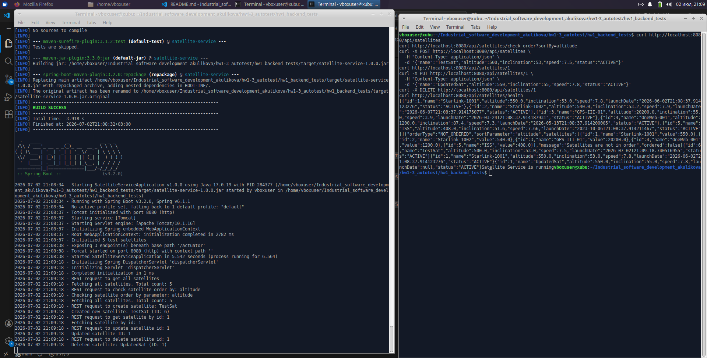
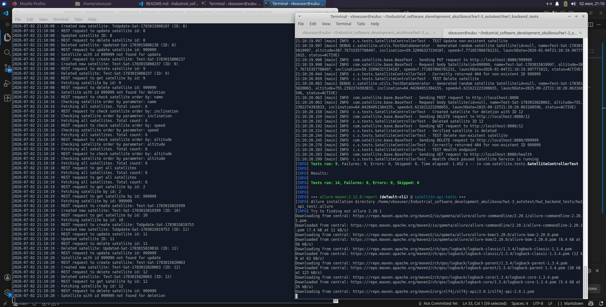
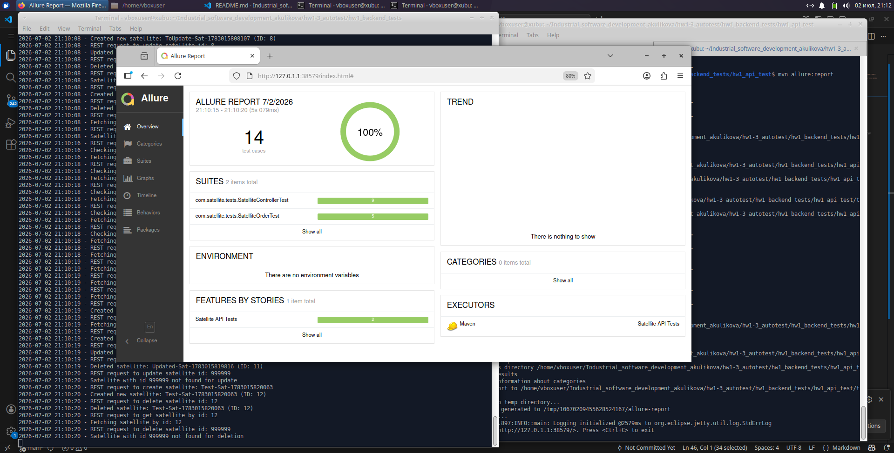
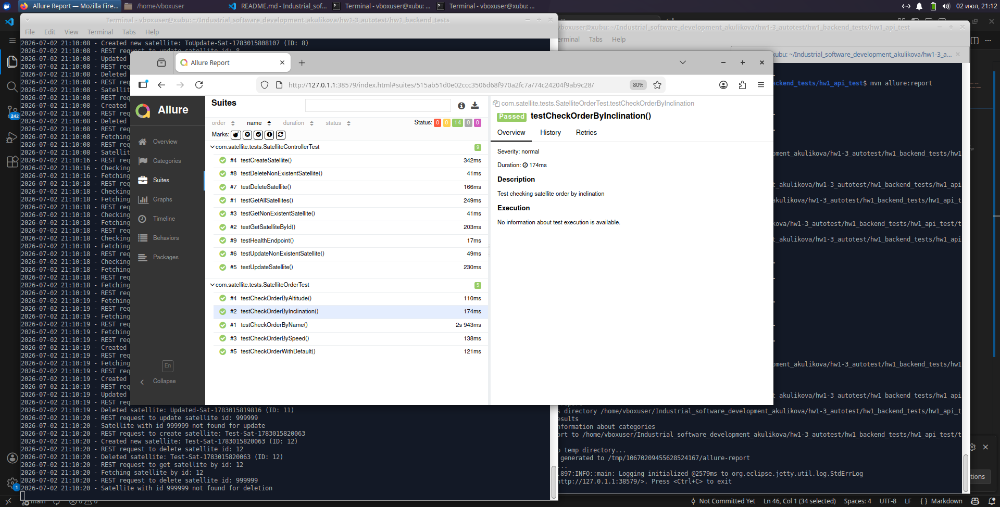
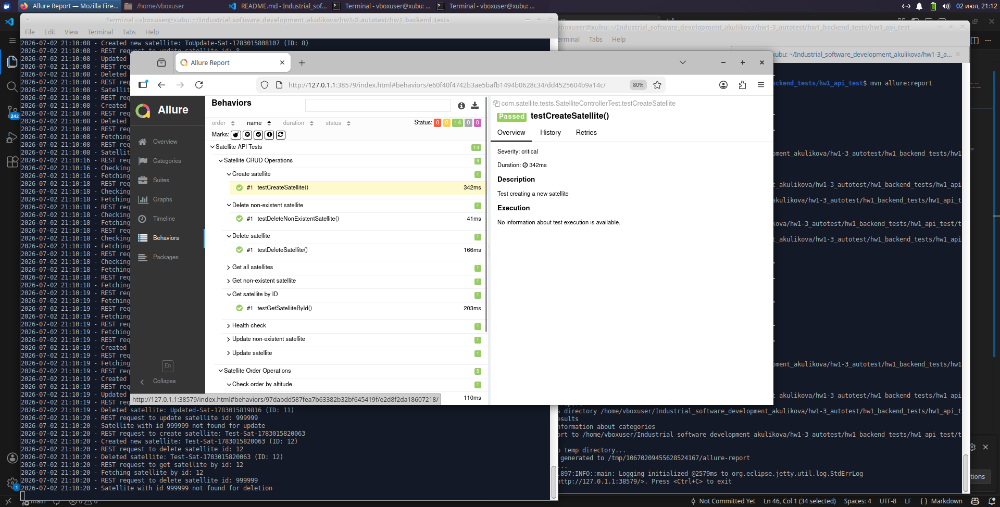
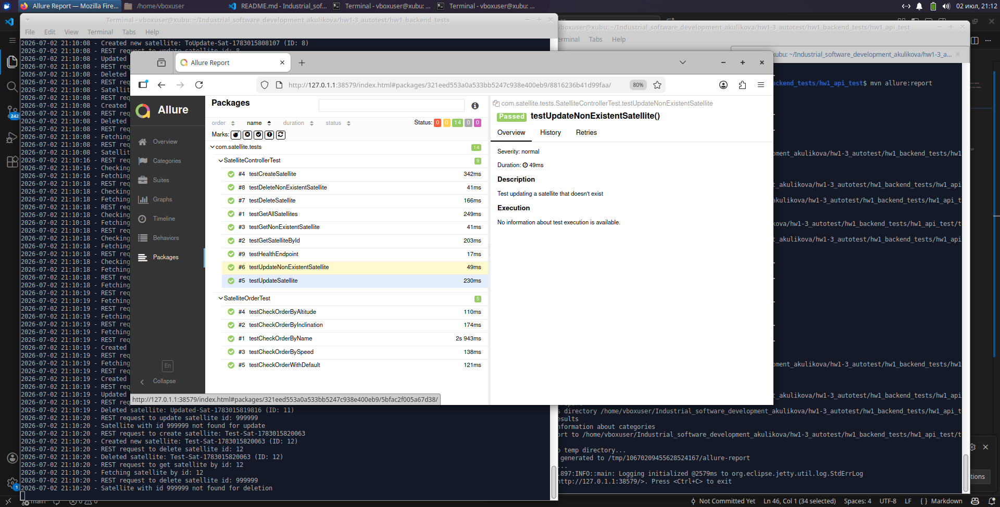

# Проект для автоматизированного тестирования API

## Требования

- Java
- Maven

## Сборка и запуск

```bash
mvn clean package -DskipTests
java -jar target/satellite-service-1.0.0.jar
```

API 

```bash
curl http://localhost:8080/api/satellites
curl http://localhost:8080/api/satellites/check-order?sortBy=altitude
curl -X POST http://localhost:8080/api/satellites \
  -H "Content-Type: application/json" \
  -d '{"name":"TestSat","altitude":500,"inclination":53,"speed":7.5,"status":"ACTIVE"}'
curl http://localhost:8080/api/satellites/1
curl -X PUT http://localhost:8080/api/satellites/1 \
  -H "Content-Type: application/json" \
  -d '{"name":"UpdatedSat","altitude":550,"inclination":55,"speed":7.8,"status":"ACTIVE"}'
curl -X DELETE http://localhost:8080/api/satellites/1
curl http://localhost:8080/api/satellites/health
```



## Запуск тестов

```bash
cd hw1_api_test
mvn clean test
mvn clean test allure:report
```



## Генерация Allure отчета

```bash
mvn allure:report
mvn allure:serve
```









Покрытые API:

- GET /api/satellites - получение всех спутников
- GET /api/satellites/{id} - получение спутника по ID
- POST /api/satellites - создание нового спутника
- PUT /api/satellites/{id} - обновление спутника
- DELETE /api/satellites/{id} - удаление спутника
- GET /api/satellites/check-order - проверка сортировки
- GET /api/satellites/health - проверка здоровья
