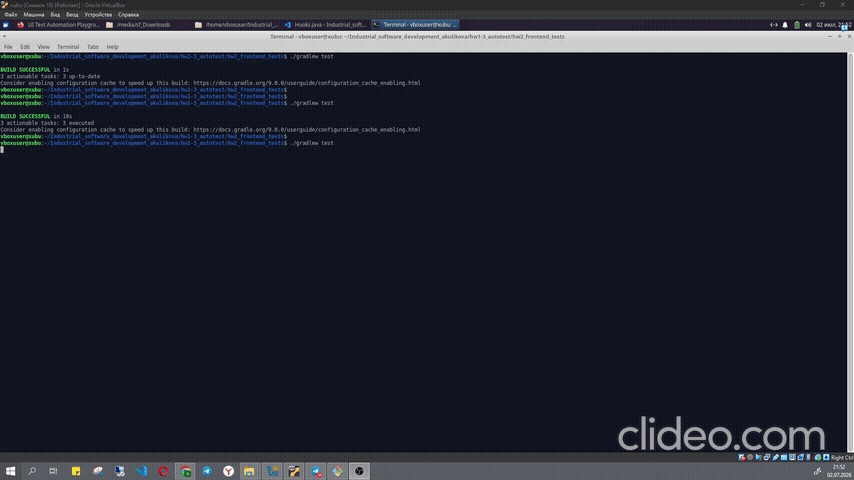
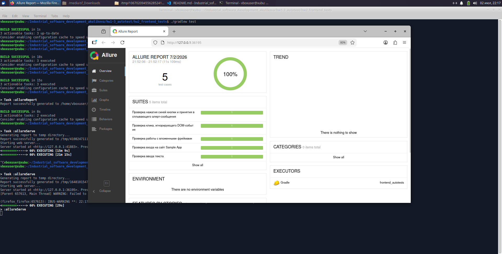
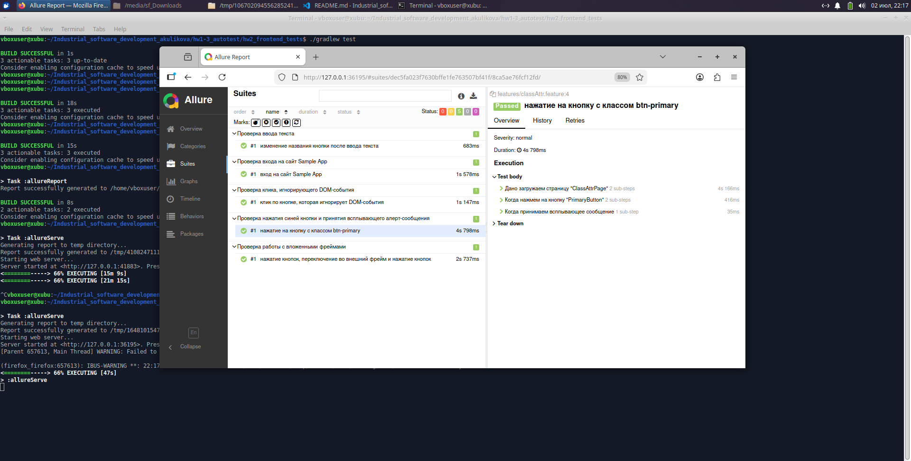
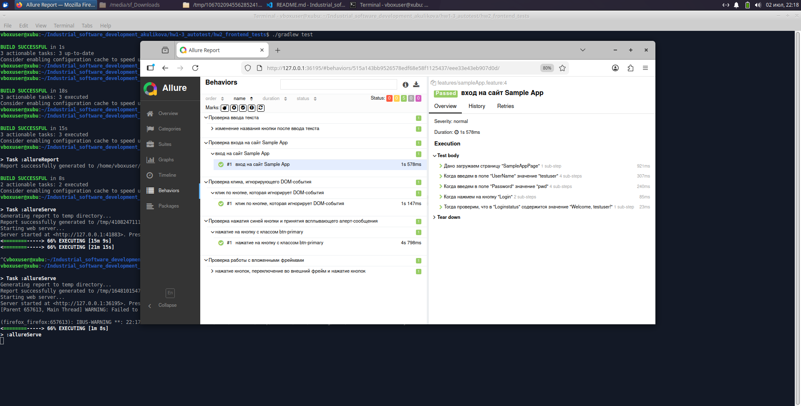
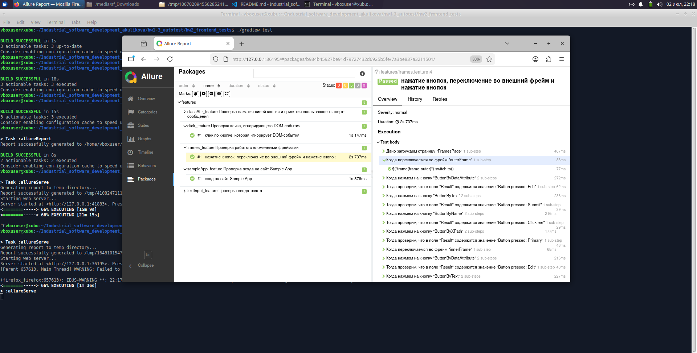

# Разработка автотестов для фронтенда

## Тестируемые темы

| № | Название сценария | URL | Обязательность | Проверяемое действие | Ожидаемый результат |
|---|-------------------|-----|----------------|---------------------|---------------------|
| 1 | Sample App | http://www.uitestingplayground.com/sampleapp | Обязательный | Вход в систему с валидными учетными данными | Появление сообщения "Welcome, [username]!" |
| 2 | Frames | http://www.uitestingplayground.com/frames | Обязательный | Работа с вложенными фреймами (outer/inner), нажатие кнопок внутри фреймов | Отображение статуса "Button pressed: [button_name]" |
| 3 | Click | http://www.uitestingplayground.com/click | По выбору | Клик по кнопке, игнорирующей DOM-события | Изменение класса кнопки с "btn-primary" на "btn-success" |
| 4 | Text Input | http://www.uitestingplayground.com/textinput | По выбору | Ввод текста в поле и обновление кнопки | Изменение названия кнопки на введенный текст |
| 5 | Classattr | http://www.uitestingplayground.com/classattr | По выбору | Нажатие на синюю кнопку с классом btn-primary | Появление всплывающего alert-сообщения и его подтверждение |

Детальная таблица с шагами тестов

| Сценарий | Шаги | Ожидаемый результат |
|----------|------|---------------------|
| Sample App | 1. Открыть страницу<br>2. Ввести логин "testuser"<br>3. Ввести пароль "pwd"<br>4. Нажать кнопку "Login" | Появление текста "Welcome, testuser!" |
| Frames | 1. Открыть страницу<br>2. Переключиться во внешний фрейм<br>3. Нажать кнопку "ButtonByDataAttribute"<br>4. Проверить результат<br>5. Нажать кнопку "ButtonByText"<br>6. Проверить результат<br>7. Нажать кнопку "ButtonByName"<br>8. Проверить результат<br>9. Нажать кнопку "ButtonByXPath"<br>10. Проверить результат<br>11. Переключиться во внутренний фрейм<br>12. Повторить шаги 3-10 | Для каждой кнопки отображается статус "Button pressed: [button_name]" |
| Click | 1. Открыть страницу<br>2. Проверить начальный класс кнопки<br>3. Нажать на кнопку<br>4. Проверить конечный класс кнопки | Начальный класс: "btn-primary"<br>Конечный класс: "btn-success" |
| Text Input | 1. Открыть страницу<br>2. Ввести текст "Butttoooooon"<br>3. Нажать кнопку "updatingButton" | Название кнопки изменяется на "Butttoooooon" |
| Classattr | 1. Открыть страницу<br>2. Нажать на синюю кнопку с классом btn-primary<br>3. Подтвердить всплывающее alert-сообщение | Alert успешно принят, тест завершен без ошибок |


## Требования к окружению Linux

Установите Java

```bash
sudo apt update
sudo apt install openjdk-17-jdk -y
java -version
```

Google Chrome

```bash
snap install chromiu
```

ChromeDriver

```bash
apt install chromium-chromedriver
chromedriver --version
```

## Запуск тестов

```bash
chmod +x gradlew
./gradlew test
```



## Allure

```bash
./gradlew allureReport --clean
./gradlew allureServe
```









Очистка проекта

```bash
./gradlew clean
```
