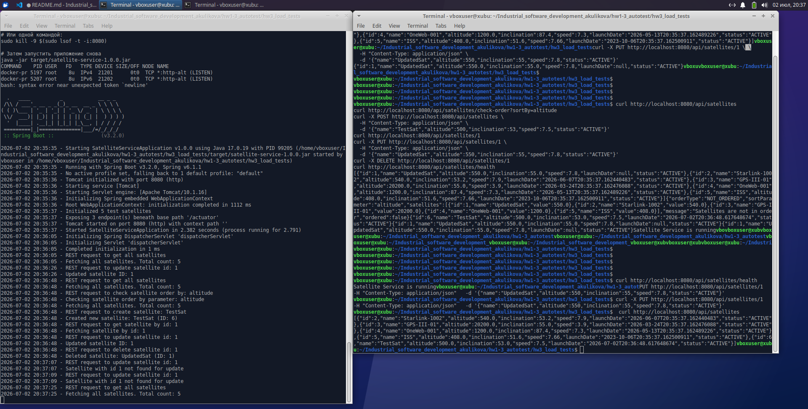
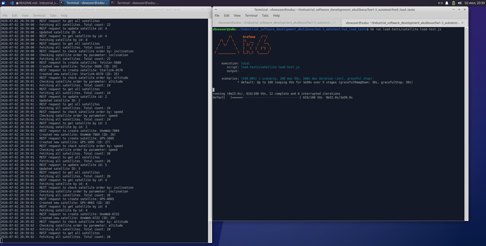
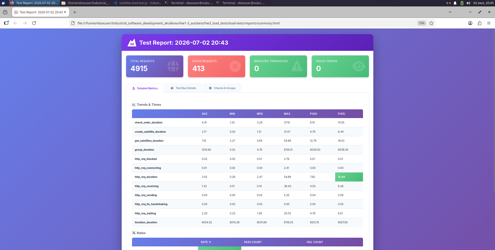
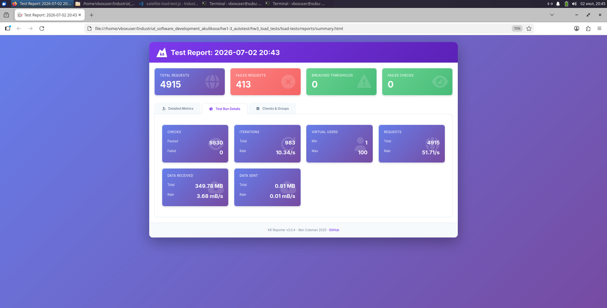
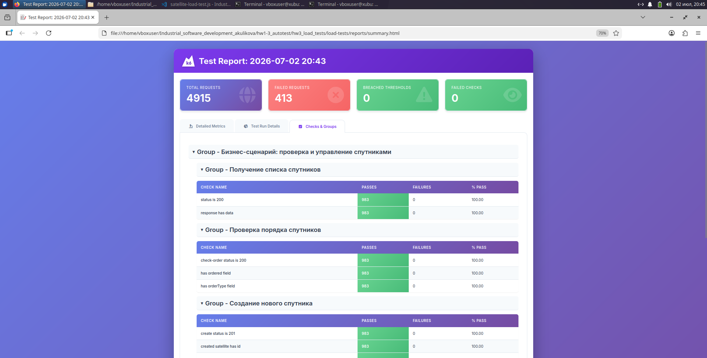
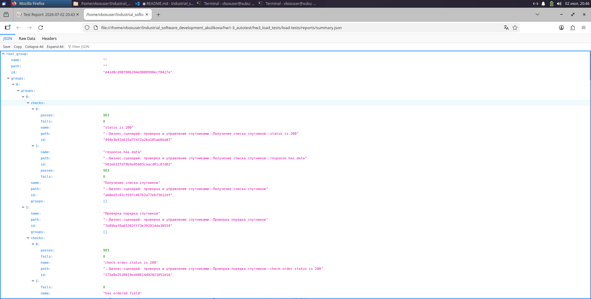

# Сервис для проверки упорядоченности спутников по различным параметрам

## Описание проекта

Java-сервис на Spring Boot, который позволяет:
- Получать список всех спутников
- Проверять, отсортированы ли спутники по заданному параметру (высота, скорость, наклонение)
- Создавать новые спутники
- Обновлять и удалять существующие спутники

пользовательский сценарий для нагрузочного тестирования

1. **Получение списка всех спутников** (GET `/api/satellites`) - пользователь просматривает каталог
2. **Проверка порядка спутников** (GET `/api/satellites/check-order?sortBy=altitude`) - проверка упорядоченности
3. **Создание нового спутника** (POST `/api/satellites`) - добавление спутника в систему
4. **Получение спутника по ID** (GET `/api/satellites/{id}`) - просмотр деталей
5. **Обновление спутника** (PUT `/api/satellites/{id}`) - изменение параметров

Этот сценарий имитирует реальную работу оператора спутниковой группировки.

## Требования

- Java
- Maven
- k6 (для нагрузочного тестирования)

## Логирование

Логи приложения сохраняются в `logs/satellite-service.log`

## Разработка

Проект использует:
- Spring Boot 3.2
- Java 17
- Maven
- Lombok
- Actuator + Prometheus для метрик


## Инструкция по запуску

Сборка и запуск

```bash
mvn clean package -DskipTests
java -jar target/satellite-service-1.0.0.jar
```

API 

```bash
curl http://localhost:8080/api/satellites
curl http://localhost:8080/api/satellites/check-order?sortBy=altitude
curl -X POST http://localhost:8080/api/satellites \
  -H "Content-Type: application/json" \
  -d '{"name":"TestSat","altitude":500,"inclination":53,"speed":7.5,"status":"ACTIVE"}'
curl http://localhost:8080/api/satellites/1
curl -X PUT http://localhost:8080/api/satellites/1 \
  -H "Content-Type: application/json" \
  -d '{"name":"UpdatedSat","altitude":550,"inclination":55,"speed":7.8,"status":"ACTIVE"}'
curl -X DELETE http://localhost:8080/api/satellites/1
curl http://localhost:8080/api/satellites/health
```



Запуск нагрузочного теста

```bash
k6 run load-tests/satellite-load-test.js
```

Просмотр результатов:

После выполнения теста:
- HTML-отчет будет в [load-tests/reports/summary.html](./load-tests/reports/summary.html)









- JSON-результаты в [load-tests/reports/summary.json](./load-tests/reports/summary.json)

