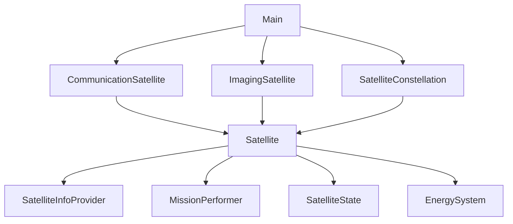

# [Рефакторинг] Домашнее задание №1. Закрепление принципов SOLID


## Что было сделано

### Исходная проблема

Первоначальный код имел следующие проблемы:

1. Нарушение SRP: 

Класс Satellite отвечал за состояние, энергию, логику активации

2. Нарушение OCP: 

Сложно было добавлять новые типы спутников

3. Плохая инкапсуляция: 

Поля напрямую использовались в наследниках

### Рефакторинг по принципам SOLID

#### 1. SRP (Single Responsibility Principle)

- SatelliteState.java: Только управление состоянием (активен/неактивен)
- EnergySystem.java: Только управление энергией (заряд, потребление, зарядка)
- Satellite.java: Координация компонентов и базовая логика
- Конкретные спутники: Только специфичная логика миссий

#### 2. OCP (Open/Closed Principle)

- Класс Satellite закрыт для модификаций
- Новые типы спутников добавляются через наследование
- Не требуется изменять существующий код

#### 3. LSP (Liskov Substitution Principle)

- CommunicationSatellite и ImagingSatellite полностью заменяют Satellite
- Сохранено полиморфное поведение

#### 4. ISP (Interface Segregation Principle)

- Созданы небольшие интерфейсы
- SatelliteInfoProvider: только информация о спутнике
- MissionPerformer: только выполнение миссий (заготовка)

#### 5. DIP (Dependency Inversion Principle)

- SatelliteConstellation зависит от абстракции Satellite
- Конкретные реализации зависят от абстрактного класса

## Структура файлов

```
hw1_SOLID2/
├── Main.java
├── Satellite.java
├── CommunicationSatellite.java
├── ImagingSatellite.java
├── SatelliteState.java
├── EnergySystem.java
├── SatelliteInfoProvider.java
├── MissionPerformer.java
└── SatelliteConstellation.java
```

## Компиляция и запуск

Вручную

```bash
javac *.java
java Main
```

Скрипт

```bash
run.sh
```

## Архитектура программы (Mermaid)


## Основные изменения

### До рефакторинга

```java
class Satellite {
    private boolean isActive;
    private int batteryLevel;
}
```

### После рефакторинга

```java
class Satellite {
    protected final SatelliteState state;
    protected final EnergySystem energy;
}

class SatelliteState {
    private boolean isActive;
}

class EnergySystem {
    private int batteryLevel;
}

```

## Преимущества новой архитектуры

1. Каждый компонент можно тестировать отдельно
2. Легко добавлять новые типы спутников
3. Код проще понимать и модифицировать
4. Можно легко добавлять новые системы (навигация, терморегуляция и т.д.)

## Пример вывода программы

```
=== Система управления спутниковой группировкой ===

Спутник КомСат-1 добавлен в группировку
Спутник КомСат-2 добавлен в группировку
Спутник ДЗЗ-1 добавлен в группировку
Спутник ДЗЗ-2 добавлен в группировку

=== Статус группировки спутников ===
КомСат-1 (Коммуникационный спутник): НЕ ОПЕРАЦИОНЕН
КомСат-2 (Коммуникационный спутник): НЕ ОПЕРАЦИОНЕН
ДЗЗ-1 (Спутник дистанционного зондирования): НЕ ОПЕРАЦИОНЕН
ДЗЗ-2 (Спутник дистанционного зондирования): НЕ ОПЕРАЦИОНЕН
Активация всей группировки...
Спутник КомСат-1 активирован. Энергия: 75
Спутник КомСат-2 активирован. Энергия: 75
Спутник ДЗЗ-1 активирован. Энергия: 85
Спутник ДЗЗ-2 активирован. Энергия: 85

Выполнение всех миссий...
Спутник КомСат-1 (Коммуникационный спутник): Передача данных...
  Данные успешно переданы. Остаток энергии: 60
Спутник КомСат-2 (Коммуникационный спутник): Передача данных...
  Данные успешно переданы. Остаток энергии: 60
Спутник ДЗЗ-1 (Спутник дистанционного зондирования): Съемка земной поверхности...
  Снимки получены и сохранены. Остаток энергии: 60
Спутник ДЗЗ-2 (Спутник дистанционного зондирования): Съемка земной поверхности...
  Снимки получены и сохранены. Остаток энергии: 60

=== Статус группировки спутников ===
КомСат-1 (Коммуникационный спутник): ОПЕРАЦИОНЕН
КомСат-2 (Коммуникационный спутник): ОПЕРАЦИОНЕН
ДЗЗ-1 (Спутник дистанционного зондирования): ОПЕРАЦИОНЕН
ДЗЗ-2 (Спутник дистанционного зондирования): ОПЕРАЦИОНЕН

=== Демонстрация специфичных методов ===
Спутник КомСат-1: соединение установлено
Спутник ДЗЗ-1: датчики откалиброваны

=== Перезарядка группировки ===
Зарядка всех спутников...
Спутник КомСат-1 деактивирован
Спутник КомСат-1 заряжен. Энергия: 100
Спутник КомСат-2 деактивирован
Спутник КомСат-2 заряжен. Энергия: 100
Спутник ДЗЗ-1 деактивирован
Спутник ДЗЗ-1 заряжен. Энергия: 100
Спутник ДЗЗ-2 деактивирован
Спутник ДЗЗ-2 заряжен. Энергия: 100
Активация всей группировки...
Спутник КомСат-1 активирован. Энергия: 95
Спутник КомСат-2 активирован. Энергия: 95
Спутник ДЗЗ-1 активирован. Энергия: 95
Спутник ДЗЗ-2 активирован. Энергия: 95

Выполнение всех миссий...
Спутник КомСат-1 (Коммуникационный спутник): Передача данных...
  Данные успешно переданы. Остаток энергии: 80
Спутник КомСат-2 (Коммуникационный спутник): Передача данных...
  Данные успешно переданы. Остаток энергии: 80
Спутник ДЗЗ-1 (Спутник дистанционного зондирования): Съемка земной поверхности...
  Снимки получены и сохранены. Остаток энергии: 70
Спутник ДЗЗ-2 (Спутник дистанционного зондирования): Съемка земной поверхности...
  Снимки получены и сохранены. Остаток энергии: 70

=== Статус группировки спутников ===
КомСат-1 (Коммуникационный спутник): ОПЕРАЦИОНЕН
КомСат-2 (Коммуникационный спутник): ОПЕРАЦИОНЕН
ДЗЗ-1 (Спутник дистанционного зондирования): ОПЕРАЦИОНЕН
ДЗЗ-2 (Спутник дистанционного зондирования): ОПЕРАЦИОНЕН

=== Демонстрация завершена ===

```