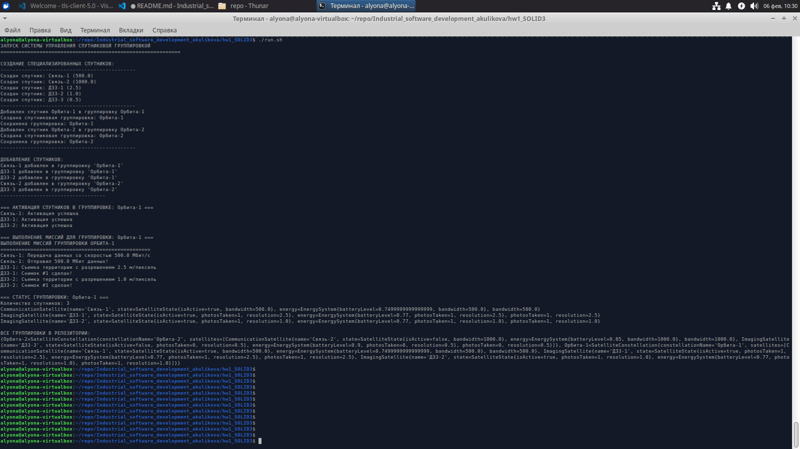
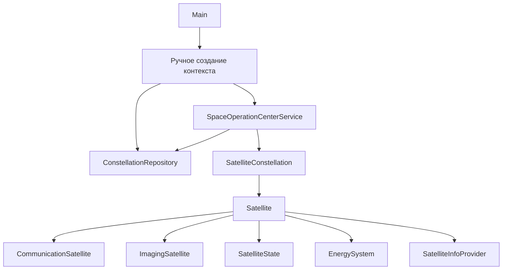

# [Рефакторинг] Домашнее задание №1. Закрепление принципов SOLID




## Компиляция и запуск

Вручную

```bash
javac *.java
java Main
```

Скрипт

```bash
run.sh
```

## Архитектура проекта с Spring Boot



Архитектура реализует Dependency Injection через ручное внедрение зависимостей в конструкторах, что следует принципу DIP. Также реализованы Repository pattern для хранения данных и Service layer для бизнес-логики, поддерживая принцип SRP. Domain model осталась без изменений, обеспечивая разделение ответственности.

## Пример вывода программы

```
alyona@alyona-virtualbox:~/repo/Industrial_software_development_akulikova/hw1_SOLID3$ ./run.sh 
ЗАПУСК СИСТЕМЫ УПРАВЛЕНИЯ СПУТНИКОВОЙ ГРУППИРОВКОЙ
============================================================

СОЗДАНИЕ СПЕЦИАЛИЗИРОВАННЫХ СПУТНИКОВ:
---------------------------------------------
Создан спутник: Связь-1 (500.0)
Создан спутник: Связь-2 (1000.0)
Создан спутник: ДЗЗ-1 (2.5)
Создан спутник: ДЗЗ-2 (1.0)
Создан спутник: ДЗЗ-3 (0.5)
---------------------------------------------
Добавлен спутник Орбита-1 в группировку Орбита-1
Создана спутниковая группировка: Орбита-1
Сохранена группировка: Орбита-1
Добавлен спутник Орбита-2 в группировку Орбита-2
Создана спутниковая группировка: Орбита-2
Сохранена группировка: Орбита-2
---------------------------------------------

ДОБАВЛЕНИЕ СПУТНИКОВ:
Связь-1 добавлен в группировку 'Орбита-1'
ДЗЗ-1 добавлен в группировку 'Орбита-1'
ДЗЗ-2 добавлен в группировку 'Орбита-1'
Связь-2 добавлен в группировку 'Орбита-2'
ДЗЗ-3 добавлен в группировку 'Орбита-2'
-----------------------------------

=== АКТИВАЦИЯ СПУТНИКОВ В ГРУППИРОВКЕ: Орбита-1 ===
Связь-1: Активация успешна
ДЗЗ-1: Активация успешна
ДЗЗ-2: Активация успешна

=== ВЫПОЛНЕНИЕ МИССИЙ ДЛЯ ГРУППИРОВКИ: Орбита-1 ===
ВЫПОЛНЕНИЕ МИССИЙ ГРУППИРОВКИ ОРБИТА-1
==================================================
Связь-1: Передача данных со скоростью 500.0 Мбит/с
Связь-1: Отправил 500.0 Мбит данных!
ДЗЗ-1: Съемка территории с разрешением 2.5 м/пиксель
ДЗЗ-1: Снимок #1 сделан!
ДЗЗ-2: Съемка территории с разрешением 1.0 м/пиксель
ДЗЗ-2: Снимок #1 сделан!

=== СТАТУС ГРУППИРОВКИ: Орбита-1 ===
Количество спутников: 3
CommunicationSatellite{name='Связь-1', state=SatelliteState{isActive=true, bandwidth=500.0}, energy=EnergySystem{batteryLevel=0.7499999999999999, bandwidth=500.0}, bandwidth=500.0}
ImagingSatellite{name='ДЗЗ-1', state=SatelliteState{isActive=true, photosTaken=1, resolution=2.5}, energy=EnergySystem{batteryLevel=0.77, photosTaken=1, resolution=2.5}, photosTaken=1, resolution=2.5}
ImagingSatellite{name='ДЗЗ-2', state=SatelliteState{isActive=true, photosTaken=1, resolution=1.0}, energy=EnergySystem{batteryLevel=0.77, photosTaken=1, resolution=1.0}, photosTaken=1, resolution=1.0}

ВСЕ ГРУППИРОВКИ В РЕПОЗИТОРИИ:
{Орбита-2=SatelliteConstellation{constellationName='Орбита-2', satellites=[CommunicationSatellite{name='Связь-2', state=SatelliteState{isActive=false, bandwidth=1000.0}, energy=EnergySystem{batteryLevel=0.85, bandwidth=1000.0}, bandwidth=1000.0}, ImagingSatellite{name='ДЗЗ-3', state=SatelliteState{isActive=false, photosTaken=0, resolution=0.5}, energy=EnergySystem{batteryLevel=0.9, photosTaken=0, resolution=0.5}, photosTaken=0, resolution=0.5}]}, Орбита-1=SatelliteConstellation{constellationName='Орбита-1', satellites=[CommunicationSatellite{name='Связь-1', state=SatelliteState{isActive=true, bandwidth=500.0}, energy=EnergySystem{batteryLevel=0.7499999999999999, bandwidth=500.0}, bandwidth=500.0}, ImagingSatellite{name='ДЗЗ-1', state=SatelliteState{isActive=true, photosTaken=1, resolution=2.5}, energy=EnergySystem{batteryLevel=0.77, photosTaken=1, resolution=2.5}, photosTaken=1, resolution=2.5}, ImagingSatellite{name='ДЗЗ-2', state=SatelliteState{isActive=true, photosTaken=1, resolution=1.0}, energy=EnergySystem{batteryLevel=0.77, photosTaken=1, resolution=1.0}, photosTaken=1, resolution=1.0}]}}
alyona@alyona-virtualbox:~/repo/Industrial_software_development_akulikova/hw1_SOLID3$ 

```