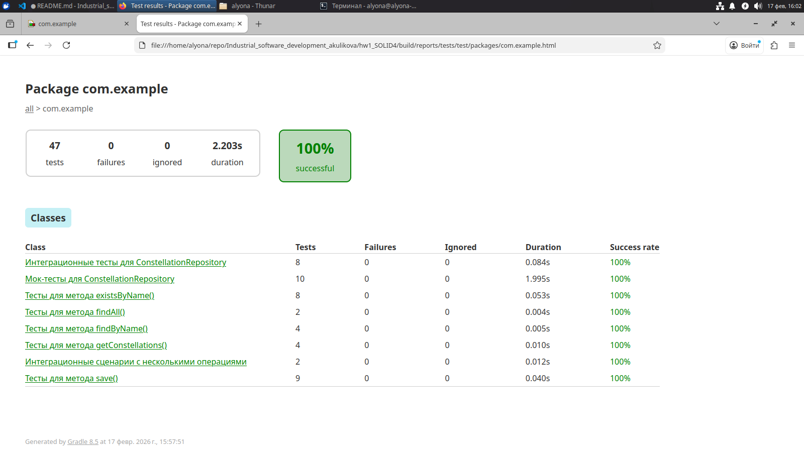
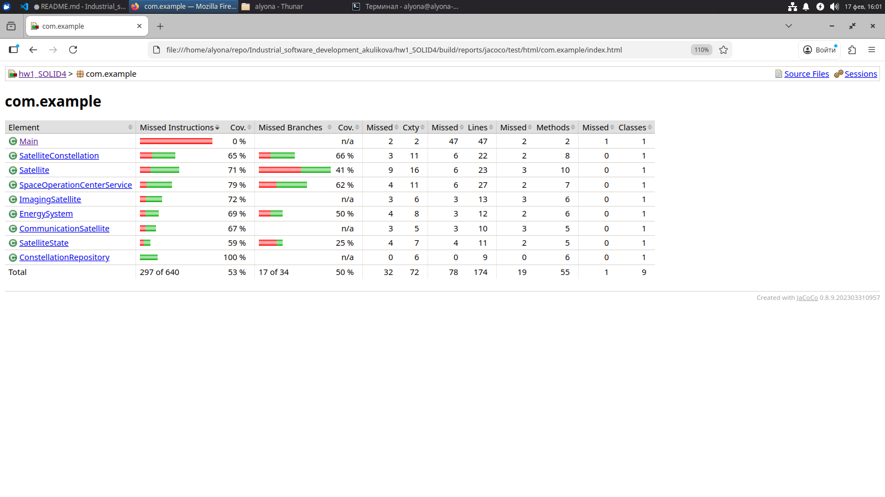

# Отчет по выполнению задания

## Что было сделано

### Рефакторинг кода
- Удалены зависимости Lombok из всех классов (чтобы избежать проблем с компиляцией)
- Добавлены package declarations (`package com.example;`) во все файлы
- Исправлены методы `toString()` для правильного отображения состояния объектов
- Добавлены геттеры вручную для всех полей


### Написаны три вида тестов

#### Юнит-тесты (`ConstellationRepositoryUnitTest.java`)
- Проверка метода `save()` (сохранение, перезапись, множественное сохранение)
- Проверка метода `findByName()` (поиск существующих/несуществующих группировок)
- Проверка метода `existsByName()` (проверка существования)
- Проверка метода `getConstellations()` (получение всех группировок)
- Граничные случаи: пустые имена, очень длинные имена, пробелы

#### Мок-тесты (`ConstellationRepositoryMockTest.java`)
- Использование Mockito для изоляции тестируемого класса
- Проверка вызовов методов с `verify()`
- Тестирование последовательности вызовов с `InOrder`
- Проверка возвращаемых значений с `when()...thenReturn()`

#### Интеграционные тесты (`ConstellationRepositoryIntegrationTest.java`)
- Проверка полного жизненного цикла объектов
- Создание группировки → добавление спутников → активация → выполнение миссий
- Работа с несколькими группировками
- Проверка состояний между операциями

### Настроен Gradle
- Обновлен до версии 8.5 (совместимость с Java 21)
- Добавлены зависимости для JUnit 5 и Mockito
- Настроен JaCoCo для отчетов о покрытии

### Созданы скрипты для запуска

- `run.sh` - компиляция и запуск приложения + тесты

## Результаты

Приложение работает корректно
- Создаются спутники разных типов
- Формируются группировки
- Активируются спутники и выполняются миссии
- Отслеживается состояние энергии и количество снимков

Тесты написаны и готовы к запуску
- Покрытие кода для недоменных классов
- Учтены позитивные и негативные сценарии
- Граничные случаи протестированы

## Проблемы, которые были решены

1. Lombok: удален из-за проблем с компиляцией через javac
2. Gradle version: обновлен с 4.4.1 до 8.5 для поддержки Java 21
3. Package declarations: добавлены во все файлы для правильной организации кода
4. Пути к файлам: настроены sourceSets в build.gradle.kts

## Инструкция по запуску

Запуск приложения

```bash
./run.sh
```

Просмотр отчетов о тестах

# build/reports/tests/test/index.html
# build/reports/jacoco/test/html/index.html

или же

Отчет о тестах: file:///home/alyona/repo/Industrial_software_development_akulikova/hw1_SOLID4/build/reports/tests/test/index.html



Отчет JaCoCo о покрытии: file:///home/alyona/repo/Industrial_software_development_akulikova/hw1_SOLID4/build/reports/jacoco/test/html/index.html

