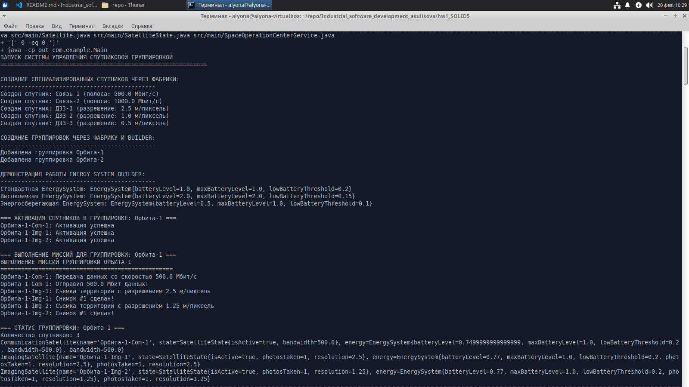
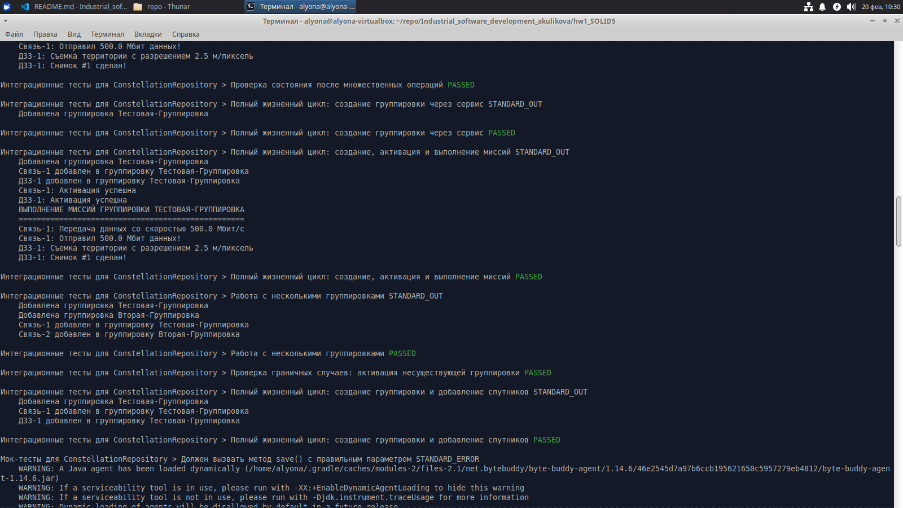
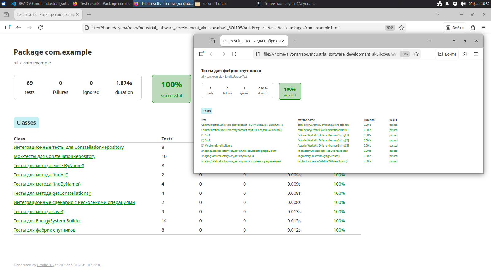
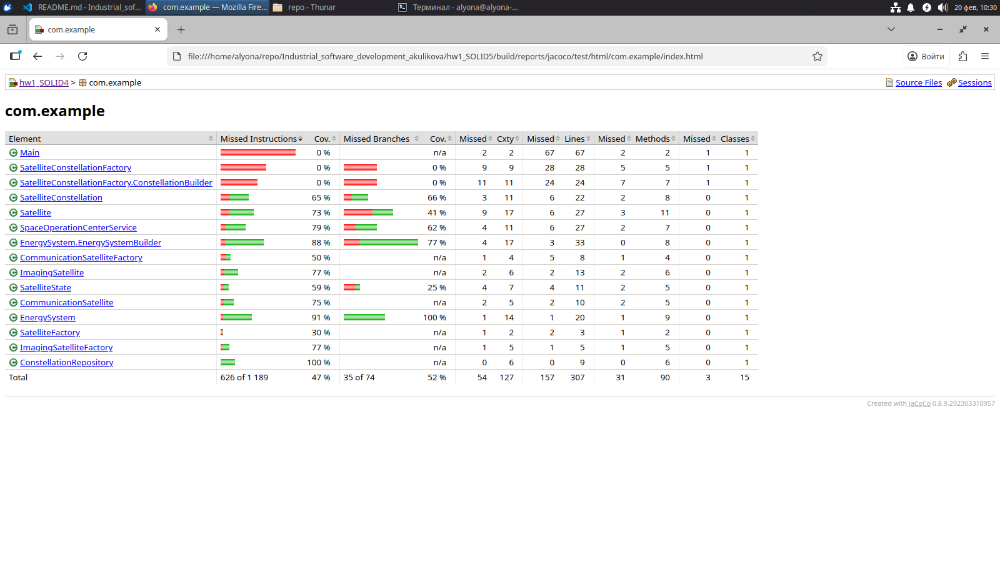

# Отчет по рефакторингу проекта спутниковой группировки

## Схема архитектуры

```mermaid
classDiagram
    %% Фабрики для спутников
    class SatelliteFactory {
        <<abstract>>
        +createSatellite(name: String) Satellite
        +createSatelliteWithParameter(name: String, parameter: double) Satellite
        +createConfiguredSatellite(name: String, batteryLevel: double, parameter: double) Satellite
    }
    
    class CommunicationSatelliteFactory {
        -DEFAULT_BATTERY_LEVEL: double
        -DEFAULT_BANDWIDTH: double
        +createSatellite(name: String) Satellite
        +createSatelliteWithParameter(name: String, bandwidth: double) Satellite
        +createSatelliteWithCustomBattery(name: String, bandwidth: double, batteryLevel: double) Satellite
    }
    
    class ImagingSatelliteFactory {
        -DEFAULT_BATTERY_LEVEL: double
        -DEFAULT_RESOLUTION: double
        +createSatellite(name: String) Satellite
        +createSatelliteWithParameter(name: String, resolution: double) Satellite
        +createHighResolutionSatellite(name: String) Satellite
        +createLowResolutionSatellite(name: String) Satellite
    }
    
    %% EnergySystem с Builder
    class EnergySystem {
        -batteryLevel: double
        -maxBatteryLevel: double
        -minBatteryLevel: double
        -lowBatteryThreshold: double
        +consume(amount: double): void
        +consumeWithCheck(amount: double): boolean
        +recharge(amount: double): void
        +hasEnoughEnergy(amount: double): boolean
        +hasSufficientPower(): boolean
        +isCritical(): boolean
        +getBatteryLevel(): double
    }
    
    class EnergySystemBuilder {
        -initialBattery: double
        -maxBattery: double
        -minBattery: double
        -lowBatteryThreshold: double
        +initialBattery(initialBattery: double) EnergySystemBuilder
        +maxBattery(maxBattery: double) EnergySystemBuilder
        +minBattery(minBattery: double) EnergySystemBuilder
        +lowBatteryThreshold(threshold: double) EnergySystemBuilder
        +withHighCapacity() EnergySystemBuilder
        +withLowPowerMode() EnergySystemBuilder
        +build() EnergySystem
    }
    
    %% Фабрика для группировок с Builder
    class SatelliteConstellationFactory {
        +createEmptyConstellation(name: String) SatelliteConstellation$
        +createCommunicationConstellation(name: String, count: int, baseBandwidth: double) SatelliteConstellation$
        +createImagingConstellation(name: String, count: int, baseResolution: double) SatelliteConstellation$
        +createMixedConstellation(name: String, comCount: int, bandwidth: double, imgCount: int, resolution: double) SatelliteConstellation$
    }
    
    class ConstellationBuilder {
        -name: String
        -satellites: List~Satellite~
        +withName(name: String) ConstellationBuilder
        +addSatellite(satellite: Satellite) ConstellationBuilder
        +addCommunicationSatellite(name: String, bandwidth: double) ConstellationBuilder
        +addImagingSatellite(name: String, resolution: double) ConstellationBuilder
        +addMultipleSatellites(count: int, factory: SatelliteFactory, baseName: String, baseParam: double) ConstellationBuilder
        +build() SatelliteConstellation
    }
    
    %% Основные классы системы
    class Satellite {
        <<abstract>>
        #name: String
        #state: SatelliteState
        #energy: EnergySystem
        +activate(): void
        +deactivate(): void
        +recharge(amount: double): void
        +executeMission(): void
        +performSpecificMission()*: void
        +isOperational(): boolean
    }
    
    class CommunicationSatellite {
        -bandwidth: double
        +performSpecificMission(): void
        +getBandwidth(): double
    }
    
    class ImagingSatellite {
        -resolution: double
        -photosTaken: int
        +performSpecificMission(): void
        +getResolution(): double
        +getPhotosTaken(): int
    }
    
    class SatelliteState {
        -isActive: boolean
        +activate(): void
        +deactivate(): void
        +isActive(): boolean
    }
    
    class SatelliteConstellation {
        -constellationName: String
        -satellites: List~Satellite~
        +addSatellite(satellite: Satellite): void
        +activateAll(): void
        +executeAllMissions(): void
        +showStatus(): void
        +getSatellites(): List~Satellite~
    }
    
    class ConstellationRepository {
        -constellations: Map~String, SatelliteConstellation~
        +save(constellation: SatelliteConstellation): void
        +findByName(name: String): SatelliteConstellation
        +findAll(): Map
        +existsByName(name: String): boolean
    }
    
    class SpaceOperationCenterService {
        -repository: ConstellationRepository
        +createAndSaveConstellation(name: String): void
        +addSatelliteToConstellation(constellationName: String, satellite: Satellite): void
        +executeConstellationMission(constellationName: String): void
        +activateAllSatellites(constellationName: String): void
        +showConstellationStatus(constellationName: String): void
    }
    
    class SatelliteInfoProvider {
        <<interface>>
        +getName(): String
        +getType(): String
        +isOperational(): boolean
    }

    %% Отношения наследования
    SatelliteFactory <|-- CommunicationSatelliteFactory
    SatelliteFactory <|-- ImagingSatelliteFactory
    Satellite <|-- CommunicationSatellite
    Satellite <|-- ImagingSatellite
    SatelliteInfoProvider <|.. Satellite
    
    %% Композиция и агрегация
    EnergySystemBuilder --> EnergySystem : создает
    SatelliteConstellationFactory --> ConstellationBuilder : содержит
    ConstellationBuilder --> SatelliteConstellation : создает
    Satellite *--> EnergySystem : содержит
    Satellite *--> SatelliteState : содержит
    SatelliteConstellation *--> Satellite : содержит
    SpaceOperationCenterService *--> ConstellationRepository : содержит
    ConstellationRepository *--> SatelliteConstellation : хранит
    
    %% Использование фабрик
    CommunicationSatelliteFactory --> CommunicationSatellite : создает
    ImagingSatelliteFactory --> ImagingSatellite : создает
    SatelliteConstellationFactory --> SatelliteConstellation : создает
    
    %% Интерфейсы и реализации
    note for SatelliteFactory "Абстрактная фабрика\nдля создания спутников"
    note for EnergySystemBuilder "Builder для пошагового\nсоздания EnergySystem"
    note for ConstellationBuilder "Builder для гибкого\nсоздания группировок"
```




## Таблица выполненных изменений

| № | Задача | Исходное состояние | Выполненные изменения | Результат |
|---|--------|---------------------|----------------------|-----------|
| 1 | Factory Pattern для спутников | Спутники создавались напрямую через конструкторы в Main и тестах | * Создана абстрактная фабрика `SatelliteFactory`<br>* Реализованы конкретные фабрики `CommunicationSatelliteFactory` и `ImagingSatelliteFactory`<br>* Добавлены методы создания с параметрами и готовые конфигурации | * Централизованное создание спутников<br>* Легкость добавления новых типов<br>* Инкапсуляция логики создания |
| 2 | Builder Pattern для EnergySystem | EnergySystem создавалась через конструктор с одним параметром, без валидации | * Создан внутренний класс `EnergySystemBuilder`<br>* Добавлены настраиваемые параметры (maxBattery, minBattery, lowBatteryThreshold)<br>* Реализованы готовые конфигурации <br>* Добавлена валидация на этапе сборки | * Гибкое создание различных конфигураций<br>* Читаемый fluent-интерфейс<br>* Защита от некорректных состояний | `EnergySystem.java` (обновлен) |
| 3 | Builder для группировок | Группировки создавались через конструктор и добавляли спутники вручную | * Создан `ConstellationBuilder` внутри `SatelliteConstellationFactory`<br>* Добавлены методы пошагового добавления спутников<br>* Реализованы специализированные методы для разных типов спутников | * Удобное создание сложных группировок<br>* Возможность создания в одной цепочке вызовов<br>* Типобезопасность |
| 4 | Фабрика для группировок | Отсутствовала | * Создана `SatelliteConstellationFactory`<br>* Реализованы статические методы для типовых конфигураций (`createCommunicationConstellation`, `createImagingConstellation`, `createMixedConstellation`)<br>* Добавлена возможность создания предопределенных группировок | * Быстрое создание типовых группировок<br>* Переиспользование кода<br>* Упрощение тестирования |
| 5 | Модернизация Satellite | Конструктор принимал только double для батареи | * Добавлен новый конструктор, принимающий готовый `EnergySystem`<br>* Сохранен старый конструктор для обратной совместимости<br>* Использование новых методов EnergySystem | * Гибкость в конфигурации энергосистемы<br>* Обратная совместимость<br>* Расширенная функциональность | `Satellite.java` (обновлен) |
| 6 | Расширение EnergySystem | Минимальный функционал (consume, recharge, hasEnoughEnergy) | * Добавлены методы `consumeWithCheck()`, `hasSufficientPower()`, `isCritical()`<br>* Добавлены геттеры для всех параметров<br>* Улучшено логирование состояния | * Полноценный мониторинг состояния<br>* Детальная информация о заряде<br>* Удобство отладки | `EnergySystem.java` (обновлен) |
| 7 | Тестирование Factory | Тесты создавали спутники напрямую | * Создан `SatelliteFactoryTest`<br>* Добавлены тесты для всех типов фабрик<br>* Параметризованные тесты для разных имен<br>* Проверка создания с параметрами | * 100% покрытие фабрик<br>* Проверка граничных случаев<br>* Надежность создания объектов | `SatelliteFactoryTest.java` |
| 8 | Тестирование Builder | Тесты для EnergySystem отсутствовали | * Создан `EnergySystemBuilderTest`<br>* Тесты для всех конфигураций<br>* Тесты валидации и обработки ошибок<br>* Проверка всех методов EnergySystem | * Полное покрытие Builder'а<br>* Проверка всех сценариев<br>* Гарантия корректности | `EnergySystemBuilderTest.java` |
| 9 | Обновление Main | Прямое создание спутников через конструкторы | * Использование фабрик для создания спутников<br>* Использование Builder для EnergySystem<br>* Использование фабрики и Builder для группировок<br>* Демонстрация всех новых возможностей | * Наглядная демонстрация паттернов<br>* Чистый, понятный код<br>* Примеры использования API |

## Инструкция по запуску

Запуск приложения

```bash
./run.sh
```




Просмотр отчетов о тестах

* build/reports/tests/test/index.html
* build/reports/jacoco/test/html/index.html



или же

Отчет о тестах: file:///home/alyona/repo/Industrial_software_development_akulikova/hw1_SOLID4/build/reports/tests/test/index.html



Отчет JaCoCo о покрытии: file:///home/alyona/repo/Industrial_software_development_akulikova/hw1_SOLID4/build/reports/jacoco/test/html/index.html

