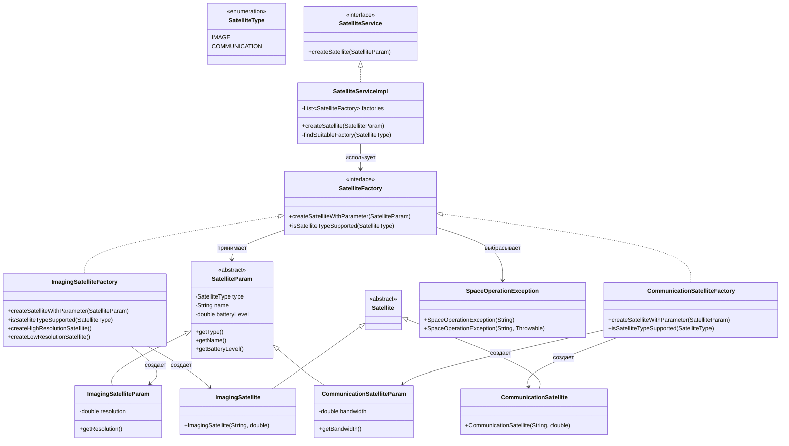

# Отчет по рефакторингу проекта спутниковой группировки

## Архитектура системы

## Что было изменено

Добавлены новые компоненты

| Компонент | Назначение |
|-----------|------------|
|SatelliteType(enum) | Перечисление типов спутников:IMAGE`,COMMUNICATION|
|SatelliteParam(abstract) | Базовый класс для параметров спутника |
|ImagingSatelliteParam| Параметры для спутника ДЗЗ (добавлено полеresolution`) |
|CommunicationSatelliteParam| Параметры для коммуникационного спутника (добавлено полеbandwidth`) |
|SpaceOperationException| Специализированное исключение для ошибок в операциях |
|SatelliteService(interface) | Интерфейс сервиса создания спутников |
|SatelliteServiceImpl| Реализация сервиса с выбором подходящей фабрики |

Реализованные паттерны GoF

Strategy Pattern (поведенческий)
- Контекст:SatelliteServiceImpl`
- Стратегии: различные реализацииSatelliteFactory`
- Результат: алгоритм создания спутника выбирается динамически на основе типа

Factory Method (порождающий)
- Создатели:SatelliteFactoryи его реализации
- Продукты:Satelliteи его наследники
- Результат: единый интерфейс создания с типизированными параметрами

Builder Pattern (уже был)
- Используется вEnergySystem.EnergySystemBuilderиConstellationBuilder`

Template Method (уже был)
- ВSatellite.executeMission()с вызовом абстрактногоperformSpecificMission()`

