# Отчет по рефакторингу проекта спутниковой группировки

## Архитектура системы

```mermaid
classDiagram
    %% Аннотации
    class Timed {
        <<annotation>>
        +String unit
    }
    
    %% Аспекты
    class TimingAspect {
        +measureTime(ProceedingJoinPoint) Object
    }
    
    %% DTO
    class AddSatelliteRequest {
        -String constellationName
        -List~SatelliteSpec~ satellites
        +getConstellationName() String
        +getSatellites() List
    }
    
    class SatelliteSpec {
        -SatelliteType type
        -String name
        -double batteryLevel
        -double specialParam
        +getType() SatelliteType
        +getName() String
        +getBatteryLevel() double
        +getSpecialParam() double
    }
    
    class MissionRequest {
        -String constellationName
        -List~String~ satelliteNames
        -MissionType missionType
        -int repeatCount
        +getters()
    }
    
    %% Enums
    class SatelliteType {
        <<enumeration>>
        IMAGE
        COMMUNICATION
    }
    
    class MissionType {
        <<enumeration>>
        STANDARD
        EMERGENCY
        SCHEDULED
        MAINTENANCE
    }
    
    %% Исключения
    class SpaceOperationException {
        +SpaceOperationException(String)
        +SpaceOperationException(String, Throwable)
    }
    
    %% Параметры
    class SatelliteParam {
        <<abstract>>
        #SatelliteType type
        #String name
        #double batteryLevel
        +getType() SatelliteType
        +getName() String
        +getBatteryLevel() double
    }
    
    class CommunicationSatelliteParam {
        -double bandwidth
        +getBandwidth() double
    }
    
    class ImagingSatelliteParam {
        -double resolution
        +getResolution() double
    }
    
    %% Модели
    class Satellite {
        <<abstract>>
        #String name
        #SatelliteState state
        #EnergySystem energy
        +activate()
        +deactivate()
        +recharge(double)
        +executeMission()*
        +isOperational() boolean
    }
    
    class CommunicationSatellite {
        -double bandwidth
        +performSpecificMission()
        +getBandwidth() double
    }
    
    class ImagingSatellite {
        -int photosTaken
        -double resolution
        +performSpecificMission()
        +getPhotosTaken() int
        +getResolution() double
    }
    
    class EnergySystem {
        -double batteryLevel
        -double maxBatteryLevel
        -double minBatteryLevel
        -double lowBatteryThreshold
        +consume(double)
        +recharge(double)
        +hasSufficientPower() boolean
    }
    
    class EnergySystemBuilder {
        -double initialBattery
        -double maxBattery
        -double minBattery
        -double lowBatteryThreshold
        +initialBattery() EnergySystemBuilder
        +maxBattery() EnergySystemBuilder
        +withHighCapacity() EnergySystemBuilder
        +build() EnergySystem
    }
    
    class SatelliteState {
        -boolean isActive
        +activate()
        +deactivate()
        +isActive() boolean
    }
    
    class SatelliteConstellation {
        -String constellationName
        -List~Satellite~ satellites
        +addSatellite(Satellite)
        +activateAll()
        +executeAllMissions()
        +showStatus()
    }
    
    class SatelliteInfoProvider {
        <<interface>>
        +getName() String
        +getType() String
        +isOperational() boolean
    }
    
    %% Фабрики
    class SatelliteFactory {
        <<interface>>
        +createSatelliteWithParameter(SatelliteParam) Satellite
        +isSatelliteTypeSupported(SatelliteType) boolean
    }
    
    class CommunicationSatelliteFactory {
        +createSatelliteWithParameter(SatelliteParam) Satellite
        +isSatelliteTypeSupported(SatelliteType) boolean
    }
    
    class ImagingSatelliteFactory {
        +createHighResolutionSatellite(String, double) Satellite
        +createLowResolutionSatellite(String, double) Satellite
    }
    
    class SatelliteConstellationFactory {
        +createEmptyConstellation(String) SatelliteConstellation$
        +createCommunicationConstellation(String, int, double) SatelliteConstellation$
        +createImagingConstellation(String, int, double) SatelliteConstellation$
        +createMixedConstellation(String, int, double, int, double) SatelliteConstellation$
    }
    
    class ConstellationBuilder {
        -String name
        -List~Satellite~ satellites
        +withName(String) ConstellationBuilder
        +addSatellite(Satellite) ConstellationBuilder
        +addCommunicationSatellite(String, double) ConstellationBuilder
        +build() SatelliteConstellation
    }
    
    %% Репозиторий
    class ConstellationRepository {
        -Map~String, SatelliteConstellation~ constellations
        +save(SatelliteConstellation)
        +findByName(String) SatelliteConstellation
        +findAll() Map
    }
    
    %% Сервисы
    class SatelliteService {
        <<interface>>
        +createSatellite(SatelliteParam) Satellite
    }
    
    class SatelliteServiceImpl {
        -List~SatelliteFactory~ factories
        +createSatellite(SatelliteParam) Satellite
        -findSuitableFactory(SatelliteType) SatelliteFactory
    }
    
    class ConstellationService {
        -ConstellationRepository constellationRepository
        +createAndSaveConstellation(String)
        +addSatelliteToConstellation(String, Satellite)
        +executeConstellationMission(String)
        +showConstellationStatus(String)
    }
    
    class SpaceOperationCenterService {
        -SatelliteService satelliteService
        -ConstellationService constellationService
        -ConstellationRepository constellationRepository
        -CommunicationSatelliteFactory comFactory
        -ImagingSatelliteFactory imgFactory
        +addSatellite(AddSatelliteRequest)
        +executeMission(MissionRequest)
        +monitorConstellation(String)
        +emergencyShutdown(String)
        +createStandardConstellation(String, int, int)
    }
    
    %% Наследование и реализация
    SatelliteParam <|-- CommunicationSatelliteParam
    SatelliteParam <|-- ImagingSatelliteParam
    
    Satellite <|-- CommunicationSatellite
    Satellite <|-- ImagingSatellite
    Satellite ..|> SatelliteInfoProvider
    
    SatelliteFactory <|.. CommunicationSatelliteFactory
    SatelliteFactory <|.. ImagingSatelliteFactory
    
    SatelliteService <|.. SatelliteServiceImpl
    
    EnergySystemBuilder --> EnergySystem
    
    %% Ассоциации
    CommunicationSatelliteFactory --> CommunicationSatelliteParam
    CommunicationSatelliteFactory --> EnergySystem
    CommunicationSatelliteFactory --> CommunicationSatellite
    
    ImagingSatelliteFactory --> ImagingSatelliteParam
    ImagingSatelliteFactory --> EnergySystem
    ImagingSatelliteFactory --> ImagingSatellite
    
    Satellite --> EnergySystem
    Satellite --> SatelliteState
    
    CommunicationSatellite --> CommunicationSatelliteParam
    ImagingSatellite --> ImagingSatelliteParam
    
    SatelliteConstellation --> Satellite
    
    ConstellationRepository --> SatelliteConstellation
    
    SatelliteServiceImpl --> SatelliteFactory
    
    SpaceOperationCenterService --> AddSatelliteRequest
    SpaceOperationCenterService --> MissionRequest
    SpaceOperationCenterService --> SatelliteService
    SpaceOperationCenterService --> ConstellationService
    SpaceOperationCenterService --> ConstellationRepository
    SpaceOperationCenterService --> CommunicationSatelliteFactory
    SpaceOperationCenterService --> ImagingSatelliteFactory
    
    AddSatelliteRequest --> SatelliteSpec
    SatelliteSpec --> SatelliteType
    MissionRequest --> MissionType
```



## Что было сделано

1. Паттерн Facade

Класс SpaceOperationCenterServiceтеперь выступает в роли фасада, предоставляя упрощенный интерфейс для сложной подсистемы.

Ключевые методы:
- addSatellite(AddSatelliteRequest)- массовое добавление спутников в группировку
- executeMission(MissionRequest)- выполнение различных типов миссий
- monitorConstellation(String)- мониторинг состояния группировки
- emergencyShutdown(String)- экстренная деактивация
- createStandardConstellation(...)- быстрое создание типовой группировки

DTO объекты:
- AddSatelliteRequest- инкапсулирует параметры добавляемых спутников
- MissionRequest- содержит параметры выполняемой миссии

2. Паттерн Decorator (через аннотации)

Реализован через создание собственной аннотации @Timedи аспекта для замера времени выполнения методов.

Компоненты:
- @Timed- аннотация для маркировки методов
- TimingAspect- аспект, перехватывающий вызовы и замеряющий время
- AspectConfig- конфигурация Spring AOP

Преимущества:
- Неинвазивность - не требует изменения логики методов
- Гибкость - можно применять к любым методам
- Прозрачность - автоматический вывод времени выполнения

3. Реорганизация структуры пакетов

```
src/main/java/com/example/
├── annotations/     # Аннотации (@Timed)
├── aspects/         # Аспекты (TimingAspect)
├── config/          # Конфигурация (AspectConfig)
├── dto/             # Data Transfer Objects
├── enums/           # Перечисления
├── exceptions/      # Исключения
├── factories/       # Фабрики (Factory Method)
├── models/          # Модели данных
├── params/          # Параметры для создания спутников
├── repositories/    # Репозитории для хранения
├── services/        # Сервисный слой
└── Main.java        # Точка входа
```

Переименование сервисов

- SpaceOperationCenterService -> ConstellationService(специализированный сервис для группировок)
- Создан новый SpaceOperationCenterServiceкак фасад

Архитектурные решения

Преимущества новой архитектуры:

1. Упрощение клиентского кода - фасад скрывает сложность подсистемы
2. Разделение ответственности - каждый класс отвечает за свою область
3. Тестируемость - легко тестировать каждый компонент отдельно
4. Расширяемость - просто добавлять новые типы миссий и запросов
5. Производительность - возможность отслеживать узкие места через @Timed
6. Инкапсуляция - DTO объекты изолируют внутренние изменения

Использованные паттерны:

- Facade - SpaceOperationCenterService
- Decorator - @Timed+ TimingAspect
- Factory Method - SatelliteFactoryи его реализации
- Builder - EnergySystemBuilder, ConstellationBuilder
- Repository - ConstellationRepository


## Запуск проекта

```bash
chmod +x run.sh
./run.sh
```
