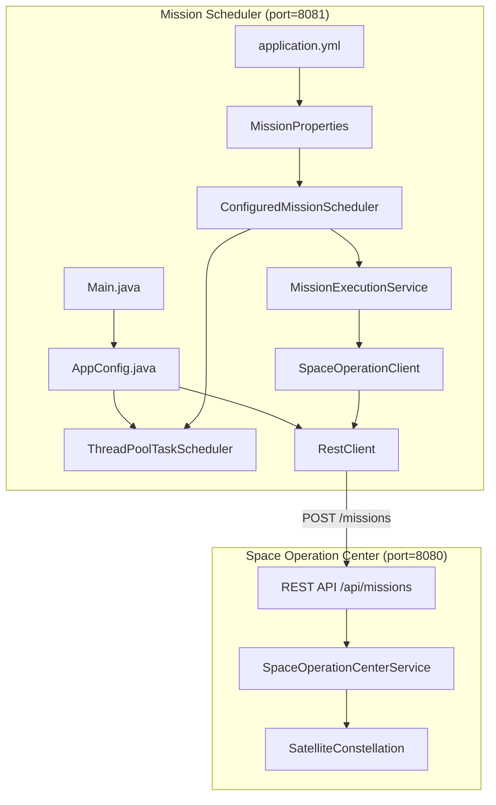
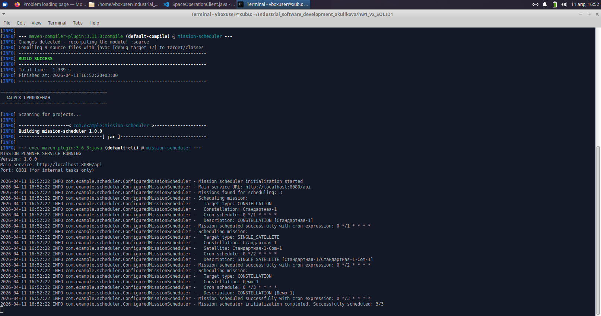

# Отчет по рефакторингу проекта спутниковой группировки

## Архитектура системы



## Что было сделано

Разработан микросервис-планировщик на Spring Framework, который автоматически выполняет запланированные миссии для спутниковых группировок по cron-расписанию 

Сервис читает конфигурацию миссий из YAML-файла, использует TaskScheduler для планирования задач и отправляет HTTP-запросы к основному сервису управления спутниками через RestClient



## Запуск проекта

```bash
chmod +x run.sh
./run.sh
```
