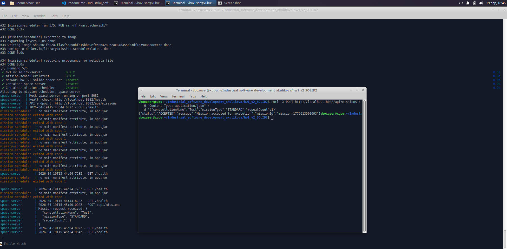

# Запуск и проверка

##Сборка и запуск всех сервисов

```
docker-compose up --build
```

## Проверка логов

```
sudo docker logs space-server
sudo docker logs mission-scheduler
```

## Проверка healthcheck клиента

```
curl http://localhost:8082/health
```

## Проверка healthcheck сервера

```
curl http://localhost:8083/actuator/health
```

## curl

```
curl -X POST http://localhost:8082/api/missions \
  -H "Content-Type: application/json" \
  -d '{"constellationName":"Test","missionType":"STANDARD","repeatCount":1}'
```

## Остановка

```
docker-compose down
```

## Результат


