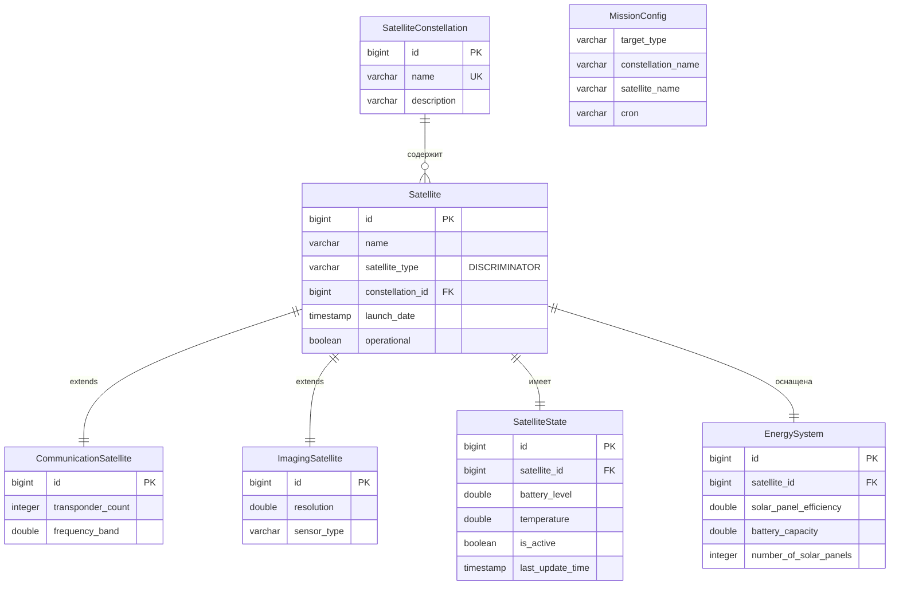

# Запуск и проверка

## Схемы

БД



Модули

```mermaid
graph TB
    subgraph "Внешние системы"
        CLIENT[Клиент/Фронтенд]
        MAIN_SERVICE[Главный сервис<br/>localhost:8080/api]
    end

    subgraph "Mission Scheduler Service"
        subgraph "Презентационный слой"
            CONTROLLER_CONST[ConstellationController<br/>/api/constellations]
            CONTROLLER_SAT[SatelliteController<br/>/api/satellites]
            CONTROLLER_COM[CommunicationSatelliteController]
            CONTROLLER_IMG[ImagingSatelliteController]
            CONTROLLER_STATE[SatelliteStateController<br/>/api/satellite-states]
            CONTROLLER_ENERGY[EnergySystemController<br/>/api/energy-systems]
        end

        subgraph "Слой сервисов"
            SCHEDULER[ConfiguredMissionScheduler]
            EXECUTOR[MissionExecutionService]
        end

        subgraph "Клиентский слой"
            REST_CLIENT[RestClient]
            SPACE_CLIENT[SpaceOperationClient]
        end

        subgraph "DAO слой - Репозитории"
            REPO_CONST[SatelliteConstellationRepository]
            REPO_SAT[SatelliteRepository]
            REPO_COM[CommunicationSatelliteRepository]
            REPO_IMG[ImagingSatelliteRepository]
            REPO_STATE[SatelliteStateRepository]
            REPO_ENERGY[EnergySystemRepository]
        end

        subgraph "Сущности JPA"
            ENTITY_CONST[SatelliteConstellation]
            ENTITY_SAT[Satellite<br/>(абстрактный)]
            ENTITY_COM[CommunicationSatellite]
            ENTITY_IMG[ImagingSatellite]
            ENTITY_STATE[SatelliteState]
            ENTITY_ENERGY[EnergySystem]
        end

        subgraph "Инфраструктура"
            CONFIG[AppConfig]
            ASPECT[TimingAspect]
            TASK_SCHEDULER[ThreadPoolTaskScheduler]
        end

        subgraph "Конфигурация"
            APP_YML[application.yml]
            PROPS[MissionProperties]
        end
    end

    subgraph "База данных"
        DB[(PostgreSQL<br/>mission_scheduler)]
    end

    %% Связи контроллеров с репозиториями
    CONTROLLER_CONST --> REPO_CONST
    CONTROLLER_SAT --> REPO_SAT
    CONTROLLER_COM --> REPO_COM
    CONTROLLER_IMG --> REPO_IMG
    CONTROLLER_STATE --> REPO_STATE
    CONTROLLER_ENERGY --> REPO_ENERGY

    %% Связи репозиториев с БД
    REPO_CONST --> DB
    REPO_SAT --> DB
    REPO_COM --> DB
    REPO_IMG --> DB
    REPO_STATE --> DB
    REPO_ENERGY --> DB

    %% Связи сущностей между собой
    ENTITY_SAT -- "ManyToOne" --> ENTITY_CONST
    ENTITY_CONST -- "OneToMany" --> ENTITY_SAT
    ENTITY_STATE -- "OneToOne" --> ENTITY_SAT
    ENTITY_ENERGY -- "OneToOne" --> ENTITY_SAT
    ENTITY_COM -- "extends" --> ENTITY_SAT
    ENTITY_IMG -- "extends" --> ENTITY_SAT

    %% Репозитории с сущностями
    REPO_CONST -.-> ENTITY_CONST
    REPO_SAT -.-> ENTITY_SAT
    REPO_COM -.-> ENTITY_COM
    REPO_IMG -.-> ENTITY_IMG
    REPO_STATE -.-> ENTITY_STATE
    REPO_ENERGY -.-> ENTITY_ENERGY

    %% Связь CLI с презентационным слоем
    CLIENT --> CONTROLLER_CONST
    CLIENT --> CONTROLLER_SAT
    CLIENT --> CONTROLLER_STATE
    CLIENT --> CONTROLLER_ENERGY

    %% Связи планировщика
    PROPS --> CONFIG
    CONFIG --> TASK_SCHEDULER
    CONFIG --> REST_CLIENT
    CONFIG --> SPACE_CLIENT
    CONFIG --> SCHEDULER
    CONFIG --> EXECUTOR
    APP_YML --> PROPS

    SCHEDULER --> TASK_SCHEDULER
    SCHEDULER --> EXECUTOR
    EXECUTOR --> SPACE_CLIENT
    SPACE_CLIENT --> REST_CLIENT
    REST_CLIENT --> MAIN_SERVICE

    %% Aspect
    ASPECT -.-> EXECUTOR
    ASPECT -.-> SCHEDULER

    %% Связь планировщика с репозиториями (для данных о миссиях)
    SCHEDULER -.-> REPO_CONST
    SCHEDULER -.-> REPO_SAT

    %% Стилизация
    style DB fill:#f9f,stroke:#333,stroke-width:2px
    style MAIN_SERVICE fill:#bbf,stroke:#333,stroke-width:2px
    style CLIENT fill:#bfb,stroke:#333,stroke-width:2px
    style CONTROLLER_CONST fill:#ffd,stroke:#333,stroke-width:1px
    style CONTROLLER_SAT fill:#ffd,stroke:#333,stroke-width:1px
    style CONTROLLER_STATE fill:#ffd,stroke:#333,stroke-width:1px
    style CONTROLLER_ENERGY fill:#ffd,stroke:#333,stroke-width:1px
```

## Сборка и запуск всех сервисов

```
docker-compose up --build
```

## Проверка логов

```
sudo docker logs space-server
sudo docker logs mission-scheduler
```

## Проверка healthcheck клиента

```
curl http://localhost:8082/health
```

## Проверка healthcheck сервера

```
curl http://localhost:8083/actuator/health
```

## curl

```
curl -X POST http://localhost:8082/api/missions \
  -H "Content-Type: application/json" \
  -d '{"constellationName":"Test","missionType":"STANDARD","repeatCount":1}'
```

## Остановка

```
docker-compose down
```
