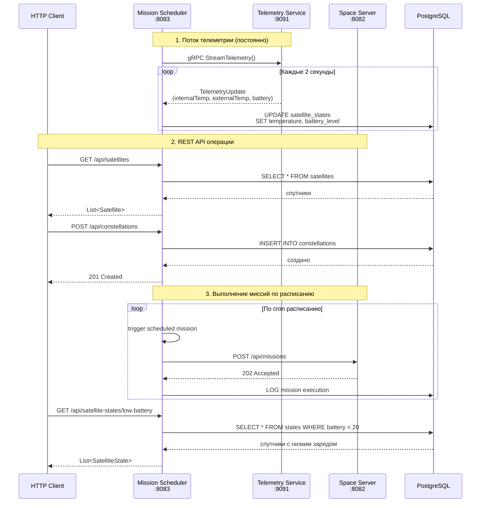

# Запуск и проверка

## Схемы

api запросы



Модули

```mermaid
graph TB
    subgraph "Внешние системы"
        CLIENT[HTTP Клиент<br/>REST запросы]
    end

    subgraph "Mission Scheduler Service :8083"
        REST_CONTROLLERS[Spring REST Controllers<br/>SatelliteController<br/>ConstellationController<br/>StateController<br/>EnergyController]

        SCHEDULER[ConfiguredMissionScheduler<br/>Планировщик миссий]

        EXECUTOR[MissionExecutionService<br/>Сервис выполнения миссий]

        JPA_REPOSITORIES[JPA Repositories<br/>SatelliteRepository<br/>ConstellationRepository<br/>StateRepository<br/>EnergyRepository]

        TELEMETRY_CLIENT[TelemetryClient<br/>gRPC Stream клиент]

        SPACE_CLIENT[SpaceOperationClient<br/>REST клиент]

        ASPECT[TimingAspect<br/>AOP замер времени]
    end

    subgraph "Telemetry Service :9091"
        GRPC_SERVER[TelemetryServiceImpl<br/>gRPC сервер]
        SATELLITE_EMULATOR[SatelliteEmulator<br/>Генератор телеметрии]
    end

    subgraph "Mock Space Server :8082"
        EXPRESS_SERVER[Express.js сервер<br/>REST API]
        MISSION_HANDLER[Обработчик миссий<br/>/api/missions]
        HEALTH_CHECK[Health check<br/>/health]
    end

    subgraph "PostgreSQL :5432"
        DB[(База данных<br/>mission_scheduler)]

        DB_CONSTELLATIONS[satellite_constellations]
        DB_SATELLITES[satellites<br/>inheritance: imaging/communication]
        DB_STATES[satellite_states<br/>температура, заряд батареи]
        DB_ENERGY[energy_systems]
    end

    CLIENT -->|HTTP GET/POST/PUT/DELETE| REST_CONTROLLERS

    REST_CONTROLLERS -->|CRUD операции| JPA_REPOSITORIES
    JPA_REPOSITORIES -->|SQL| DB_CONSTELLATIONS
    JPA_REPOSITORIES -->|SQL| DB_SATELLITES
    JPA_REPOSITORIES -->|SQL| DB_STATES
    JPA_REPOSITORIES -->|SQL| DB_ENERGY

    SCHEDULER -->|планирование по cron| TASK_SCHEDULER[ThreadPoolTaskScheduler]
    TASK_SCHEDULER -->|запуск миссии| EXECUTOR

    EXECUTOR -->|создание MissionRequest| SPACE_CLIENT
    SPACE_CLIENT -->|HTTP POST /api/missions| EXPRESS_SERVER
    EXPRESS_SERVER -->|логирование| MISSION_HANDLER

    TELEMETRY_CLIENT -->|gRPC Stream| GRPC_SERVER
    GRPC_SERVER -->|генерация данных каждые 2 сек| SATELLITE_EMULATOR
    TELEMETRY_CLIENT -->|обновление SatelliteState| JPA_REPOSITORIES

    ASPECT -.->|@Timed логирование| SCHEDULER
    ASPECT -.->|@Timed логирование| EXECUTOR

    HEALTH_CHECK -->|healthcheck| EXPRESS_SERVER

    DB_CONSTELLATIONS -->|OneToMany| DB_SATELLITES
    DB_SATELLITES -->|OneToOne| DB_STATES
    DB_SATELLITES -->|OneToOne| DB_ENERGY

    style CLIENT fill:#bfb,stroke:#333,stroke-width:2px
    style EXPRESS_SERVER fill:#bbf,stroke:#333,stroke-width:2px
    style GRPC_SERVER fill:#f9f,stroke:#333,stroke-width:2px
    style REST_CONTROLLERS fill:#ffd,stroke:#333,stroke-width:1px
    style DB fill:#fbb,stroke:#333,stroke-width:2px
```

## Сборка и запуск всех сервисов

```
docker-compose up --build
```

## Проверка логов

```
sudo docker logs space-server
sudo docker logs mission-scheduler
```

## Проверка healthcheck клиента

```
curl http://localhost:8082/health
```

## Проверка healthcheck сервера

```
curl http://localhost:8083/actuator/health
```

## curl

```
curl -X POST http://localhost:8082/api/missions \
  -H "Content-Type: application/json" \
  -d '{"constellationName":"Test","missionType":"STANDARD","repeatCount":1}'
```

## Остановка

```
docker-compose down
```
