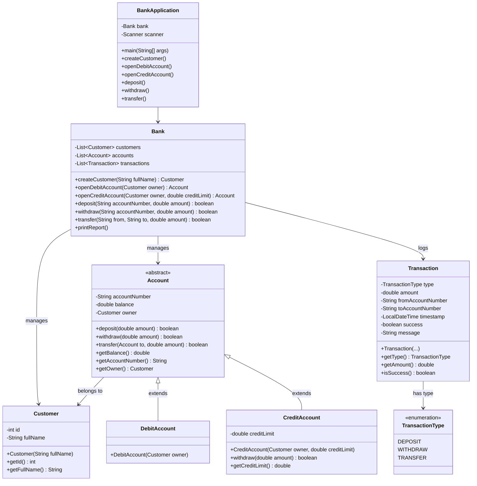
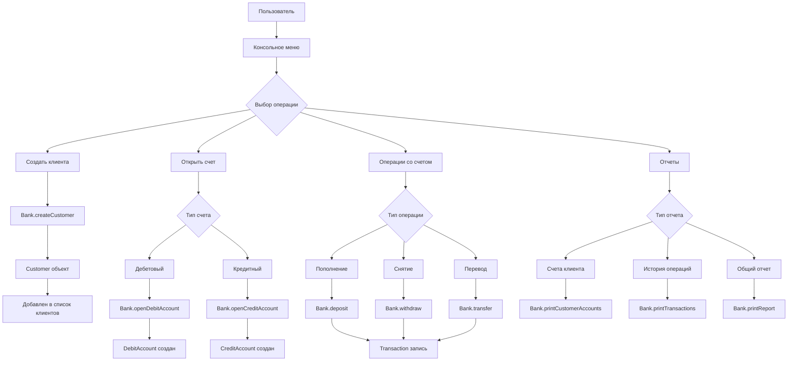

# Домашнее задание №2. Модуль 5. Практика: консольный калькулятор, работа с массивами и классами

Нужно написать консольное приложение, которое моделирует работу банка: создание счетов, операции, отчёты и начисления.

## Запуск

**Требования**:

- Java JDK 8 или выше
- Командная строка/терминал

Имеется возможность как самостоятельно запустить:

```bash
javac BankApplication.java
java BankApplication
```

Так и запустить скрипт:

```bash
./run.sh
```

## Меню приложения

После запуска, пользователя встречает меню приложения:

```java
BANKING SYSTEM MENU
1. Create New Customer
2. Open Debit Account
3. Open Credit Account
4. Deposit Money
5. Withdraw Money
6. Transfer Money
7. Show Customer Accounts
8. Show Transaction History
9. Generate Bank Report
10. Exit
```

Пользователь может взаимодействовать с меню выбирая нужный пункт

```java
Enter your choice (1-10):
```

## Архитектура проекта


### Схема иерархии классов



### Схема потока данных



### Таблица классов и зависимостей

| Класс | Назначение | Зависит от | Связан с |
|-------|------------|------------|----------|
| **BankApplication** | Точка входа, меню | Bank, Scanner | Bank |
| **Bank** | Центральный контроллер | Customer, Account, Transaction | Все основные классы |
| **Customer** | Данные клиента | - | Account, Bank |
| **Account** (абстрактный) | Базовый счет | Customer | Bank, транзакции |
| **DebitAccount** | Дебетовый счет | Account | Bank |
| **CreditAccount** | Кредитный счет | Account | Bank |
| **Transaction** | Запись операции | TransactionType | Bank |
| **TransactionType** | Типы операций | - | Transaction |

### Таблица основных методов

| Метод | Класс | Параметры | Возвращает | Описание |
|-------|-------|-----------|------------|----------|
| createCustomer | Bank | String fullName | Customer | Создает нового клиента |
| openDebitAccount | Bank | Customer owner | Account | Открывает дебетовый счет |
| openCreditAccount | Bank | Customer owner, double limit | Account | Открывает кредитный счет |
| deposit | Bank | String accNum, double amount | boolean | Пополнение счета |
| withdraw | Bank | String accNum, double amount | boolean | Снятие со счета |
| transfer | Bank | String from, String to, double amount | boolean | Перевод между счетами |
| deposit | Account | double amount | boolean | Изменение баланса |
| withdraw | Account | double amount | boolean | Списание средств |
| transfer | Account | Account to, double amount | boolean | Перевод на другой счет |