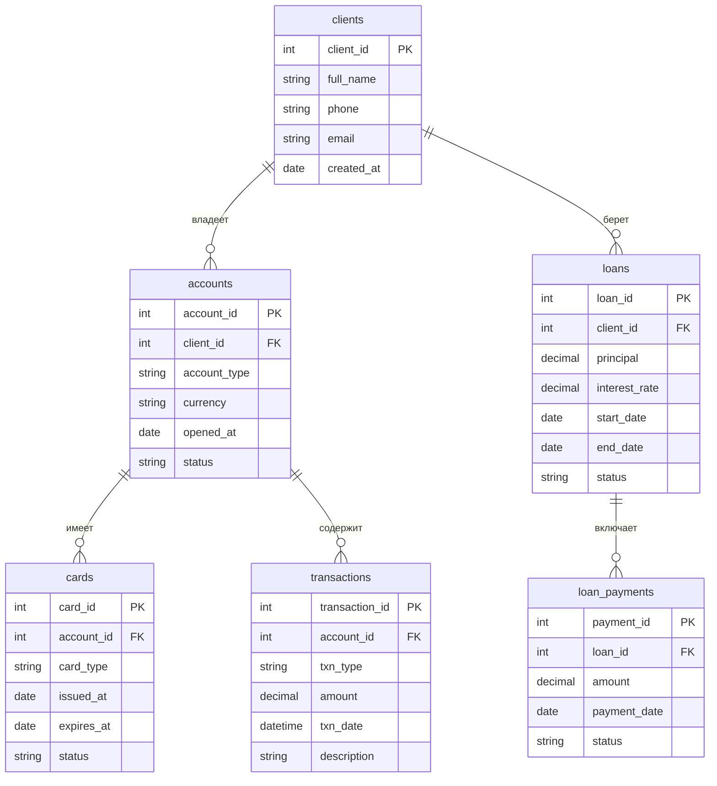

# Домашнее задание. Банковская система

ФИО: Куликова Алёна Владимировна

## Содержание

- [Структура базы данных](#структура-базы-данных)
- [ER-диаграмма](#er-диаграмма)
- [Описание запросов](#описание-запросов)
- [Как запустить`](#как-запустить)

## Структура базы данных

### 1. `clients` — Клиенты

Хранит информацию о клиентах банка

| Поле        | Тип           | Описание                     |
|-------------|---------------|------------------------------|
| `client_id` | SERIAL        | Уникальный ID (PK)           |
| `full_name` | VARCHAR(120)  | ФИО клиента                  |
| `phone`     | VARCHAR(30)   | Телефон (уникальный)         |
| `email`     | VARCHAR(120)  | Email (уникальный)           |
| `created_at`| DATE          | Дата регистрации             |

### 2. `accounts` — Счета

Банковские счета клиентов

| Поле         | Тип           | Описание                                  |
|--------------|---------------|-------------------------------------------|
| `account_id` | SERIAL        | Уникальный ID (PK)                        |
| `client_id`  | INT           | Ссылка на клиента (FK -> `clients`)        |
| `account_type`| VARCHAR(20)  | Тип: `debit`, `savings`, `credit`         |
| `currency`   | CHAR(3)       | Валюта (например, `RUB`, `USD`, `EUR`)    |
| `opened_at`  | DATE          | Дата открытия                             |
| `status`     | VARCHAR(20)   | Статус: `active`, `blocked`, `closed`     |


### 3. `cards` — Карты

Платежные карты, привязанные к счету

| Поле         | Тип           | Описание                                  |
|--------------|---------------|-------------------------------------------|
| `card_id`    | SERIAL        | Уникальный ID (PK)                        |
| `account_id` | INT           | Ссылка на счет (FK -> `accounts`)          |
| `card_type`  | VARCHAR(20)   | Тип: `debit`, `credit`, `virtual`         |
| `issued_at`  | DATE          | Дата выпуска                              |
| `expires_at` | DATE          | Срок действия                             |
| `status`     | VARCHAR(20)   | Статус: `active`, `blocked`, `expired`    |

---

### 4. `transactions` — Транзакции

Операции по счетам

| Поле           | Тип             | Описание                                  |
|----------------|-----------------|-------------------------------------------|
| `transaction_id`| SERIAL         | Уникальный ID (PK)                        |
| `account_id`   | INT            | Счет (FK -> `accounts`)                    |
| `txn_type`     | VARCHAR(20)    | Тип: `deposit`, `withdrawal`, `transfer_in`, `transfer_out`, `fee` |
| `amount`       | NUMERIC(14,2)  | Сумма (≥ 0)                               |
| `txn_date`     | TIMESTAMP      | Дата и время операции                     |
| `description`  | VARCHAR(200)   | Описание                                  |

---

### 5. `loans` — Кредиты

Кредитные договоры клиентов

| Поле           | Тип             | Описание                                  |
|----------------|-----------------|-------------------------------------------|
| `loan_id`      | SERIAL          | Уникальный ID (PK)                        |
| `client_id`    | INT             | Клиент (FK -> `clients`)                   |
| `principal`    | NUMERIC(14,2)   | Сумма кредита (> 0)                       |
| `interest_rate`| NUMERIC(5,2)    | Процентная ставка (≥ 0)                   |
| `start_date`   | DATE            | Дата начала                               |
| `end_date`     | DATE            | Дата окончания                            |
| `status`       | VARCHAR(20)     | Статус: `active`, `closed`, `overdue`     |

---

### 6. `loan_payments` — Платежи по кредитам

| Поле           | Тип             | Описание                                  |
|----------------|-----------------|-------------------------------------------|
| `payment_id`   | SERIAL          | Уникальный ID (PK)                        |
| `loan_id`      | INT             | Кредит (FK -> `loans`)                     |
| `amount`       | NUMERIC(14,2)   | Сумма платежа (> 0)                       |
| `payment_date` | DATE            | Дата платежа                              |
| `status`       | VARCHAR(20)     | Статус: `success`, `failed`               |

---

## ER-диаграмма



## Описание запросов

Полный отчет предоставлен в [Полный отчет](results_20260121_111919.txt)

1. **Активные счета в EUR, открытые после 2024-01-01**  

Выводит все активные банковские счета в евро, открытые позже 1 января 2024 года, отсортированные по дате открытия.

```sql
SELECT *
FROM accounts
WHERE status = 'active'
  AND currency = 'EUR'
  AND opened_at > '2024-01-01'
ORDER BY opened_at;
```


2. **Информация о клиентах и их счетах**  

Отображает ФИО клиента, тип счёта, валюту и статус счёта, объединяя данные из таблиц `clients` и `accounts`.

```sql
SELECT c.full_name, a.account_type, a.currency, a.status
FROM clients c
JOIN accounts a ON c.client_id = a.client_id;
```


3. **Количество счетов у каждого клиента (включая 0)**  

Показывает всех клиентов и число принадлежащих им счетов, включая тех, у кого счетов нет (используется `LEFT JOIN`).

```sql
SELECT c.full_name, COUNT(a.account_id) AS account_count
FROM clients c
LEFT JOIN accounts a ON c.client_id = a.client_id
GROUP BY c.client_id, c.full_name;
```


4. **Клиенты с более чем двумя активными счетами**  

Находит клиентов, у которых открыто более двух активных счетов.

```sql
SELECT c.full_name
FROM clients c
JOIN accounts a ON c.client_id = a.client_id
WHERE a.status = 'active'
GROUP BY c.client_id, c.full_name
HAVING COUNT(a.account_id) > 2;
```


5. **Счета с входящими операциями выше среднего по банку**  

Возвращает счета, у которых сумма входящих операций (депозиты и переводы «на счёт») превышает среднее значение по всем таким операциям в банке.

```sql
WITH incoming_totals AS (
    SELECT account_id, SUM(amount) AS total_incoming
    FROM transactions
    WHERE txn_type IN ('deposit', 'transfer_in')
    GROUP BY account_id
),
bank_avg AS (
    SELECT AVG(total_incoming) AS avg_incoming
    FROM incoming_totals
)
SELECT i.account_id, i.total_incoming
FROM incoming_totals i
CROSS JOIN bank_avg b
WHERE i.total_incoming > b.avg_incoming;
```

6. **Топ-5 клиентов по обороту за 2025 год**  

Выводит пять клиентов с наибольшей общей суммой всех транзакций (оборотом) за 2025 год.

```sql
SELECT c.full_name, SUM(t.amount) AS total_turnover
FROM clients c
JOIN accounts a ON c.client_id = a.client_id
JOIN transactions t ON a.account_id = t.account_id
WHERE EXTRACT(YEAR FROM t.txn_date) = 2025
GROUP BY c.client_id, c.full_name
ORDER BY total_turnover DESC
LIMIT 5;
```


7. **Уровень активности клиента за последние 90 дней**  

Классифицирует клиентов по количеству операций за последние 90 дней:  

- `inactive` — 0 операций,  
- `low` — 1 – 5 операций,  
- `medium` — 6 – 20 операций,  
- `high` — более 20 операций.

```sql
WITH client_txn_counts AS (
    SELECT c.client_id, c.full_name,
           COUNT(t.transaction_id) AS txn_count
    FROM clients c
    LEFT JOIN accounts a ON c.client_id = a.client_id
    LEFT JOIN transactions t ON a.account_id = t.account_id
        AND t.txn_date >= CURRENT_DATE - INTERVAL '90 days'
    GROUP BY c.client_id, c.full_name
)
SELECT full_name,
       CASE
           WHEN txn_count = 0 THEN 'inactive'
           WHEN txn_count BETWEEN 1 AND 5 THEN 'low'
           WHEN txn_count BETWEEN 6 AND 20 THEN 'medium'
           WHEN txn_count > 20 THEN 'high'
       END AS activity_level
FROM client_txn_counts;
```


8. **Кредиты, по которым выплачено менее 50% от суммы**  

Находит кредиты, где сумма успешных платежей составляет менее 50% от первоначального долга (principal).

```sql
SELECT l.loan_id, l.client_id, l.principal,
       COALESCE(SUM(lp.amount), 0) AS paid_amount
FROM loans l
LEFT JOIN loan_payments lp ON l.loan_id = lp.loan_id AND lp.status = 'success'
GROUP BY l.loan_id, l.client_id, l.principal
HAVING COALESCE(SUM(lp.amount), 0) < l.principal * 0.5;
```


9. **Активные карты с указанием владельца**  

Показывает все активные карты с ФИО владельца, идентификатором счёта и датой окончания срока действия.

```sql
SELECT c.full_name, cr.account_id, cr.expires_at
FROM cards cr
JOIN accounts a ON cr.account_id = a.account_id
JOIN clients c ON a.client_id = c.client_id
WHERE cr.status = 'active';
```


10. **Сводка по списаниям со счёта**  

Для каждого счёта подсчитывает общее количество операций и сумму всех списаний (снятия наличных, исходящие переводы и комиссии).

```sql
SELECT a.account_id,
       COUNT(t.transaction_id) AS transaction_count,
       COALESCE(SUM(
           CASE
               WHEN t.txn_type IN ('withdrawal', 'transfer_out', 'fee') THEN t.amount
               ELSE 0
           END
       ), 0) AS total_debits
FROM accounts a
LEFT JOIN transactions t ON a.account_id = t.account_id
GROUP BY a.account_id;
```


## Как запустить

1. Убедитесь, что PostgreSQL установлен и запущен.

2. Настройте `.env` (пример представлен далее).

3. Запустите скрипт:

```bash
chmod +x init_db.sh
./init_db.sh
```

4. Результаты запросов сохранятся в файл `results_*.txt`.

### Пример `.env`

```ini
DB_NAME=bank_db
DB_USER=bank_user
DB_PASSWORD=secure_password123
DB_HOST=localhost
DB_PORT=5432
```

