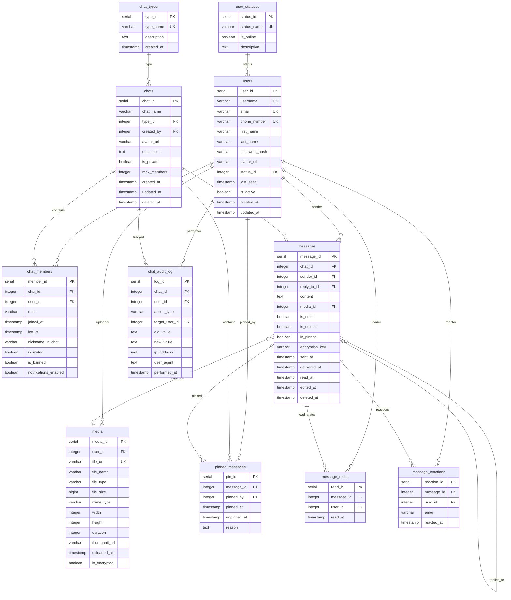

# Домашнее задание 2. Мессенджер, MMORPG, Компания, занимающаяся грузоперевозками

## Содержание

- [Структура БД](#структура-бд)
- [Задание](#задание)
- [Отчет о выполнении задания](#отчет-о-выполнении-задания)
- [Схема базы данных](#схема-базы-данных)
- [Типы данных](#типы-данных)
- [Развертывание](#развертывание)

## Задание

Представьте что вы создаете базу данных для одной из предметных областей (Мессенджер, MMORPG, Компания, занимающаяся грузоперевозками). Попробуйте спроектировать базу данных под выбранную предметную область соблюдая принципы нормальных форм включая  НФБК.

## Отчет о выполнении задания

Сам отчет о выполнении задания реализован по следующему пути: [Отчет о выполнении задания](./report.md)

## Схема базы данных



## Типы данных

### Типы чатов
| Тип | Описание |
|------|-------------|
| `private` | Индивидуальный чат между двумя пользователями |
| `group` | Многопользовательский чат с разрешениями |
| `channel" | Широковещательный канал с одним отправителем |
| "broadcast" | Рассылка сообщений "Один ко многим" |

### Статусы пользователей
| Статус | Онлайн | Описание |
|--------|--------|-------------|
| `online` | Да | Пользователь активен |
| "offline" | Нет | Пользователь отключен |
| `away" | Нет | Пользователь в отъезде |
| `busy" | Нет | Пользователь занят |
| "invisible" | Нет | Онлайн, но скрыт |

### Роли участников чата
| Роль | Разрешения /
|------|-------------|
| "owner" | Полный контроль, может удалять чат |
| "admin" | Управляет участниками, удаляет сообщения |
| "moderator" | Удаляет сообщения, отключает звук |
| `member` | Базовый доступ для чтения/записи |

## Примеры данных

### Системные пользователи
| Имя пользователя | Пароль | Роль | Статус |
|----------|----------|------|--------|
| `system` | автоматически сгенерированный | Системный бот | онлайн |
| `admin" | Admin123!@# | Администратор | онлайн |
| `support" | Support123! | Сотрудники службы поддержки | онлайн |

### Тестовые пользователи
| Имя пользователя | Пароль | Фамилия |
|----------|----------|------------|-----------|
| `alice` | Пароль 123 | Алиса | Чудо |
| `bob` | Пароль 123 | Боб | Строитель |
| `charlie` | Пароль 123 | Чарли | Чаплин |
| `diana` | Пароль 123 | Диана | Принц |
| `eva` | Пароль 123 | Ева | Грин |
| `frank` | Пароль 123 | Фрэнк | Оушен |

### Примеры чатов

1.  Общий чат в мессенджере  - Общедоступный групповой чат для всех пользователей
2.  Техническая поддержка  - Канал поддержки, управляемый сотрудниками службы поддержки

## Развертывание

### .env

```bash
DB_NAME=messenger_db
DB_USER=messenger_user
DB_PASSWORD=secure_password_123
DB_HOST=localhost
DB_PORT=5432
DB_BACKUP_ENABLED=true
```

### быстрый старт

```bash
sudo ./deploy.sh --simple-env
nano .env
sudo ./deploy.sh --deploy
```

### Команды скрипта

```bash
./deploy.sh --deploy      # Full deployment
./deploy.sh --backup      # Create backup
./deploy.sh --status      # Check status
./deploy.sh --simple-env  # Create .env file
./deploy.sh --fix-collation  # Fix collation issues
```

### Подключение к базе данных

```bash
psql -h localhost -p 5432 -U messenger_user -d messenger_db
```
