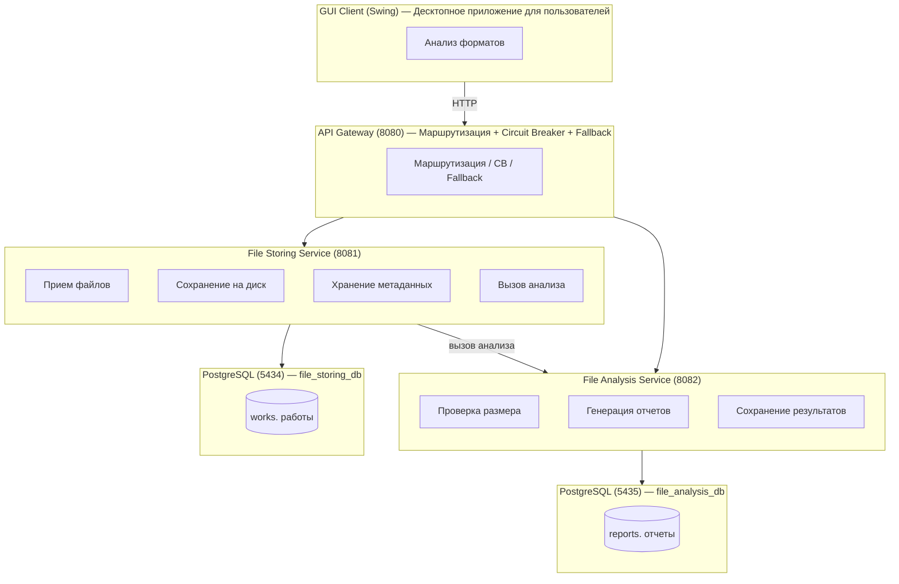
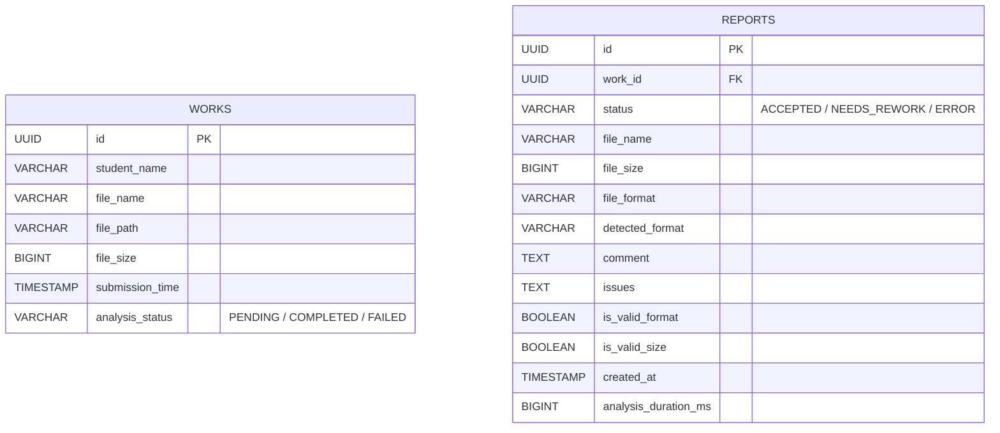
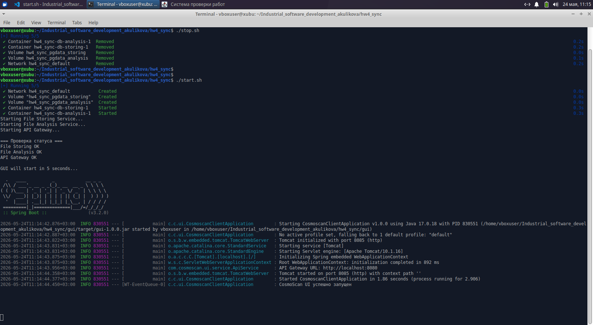
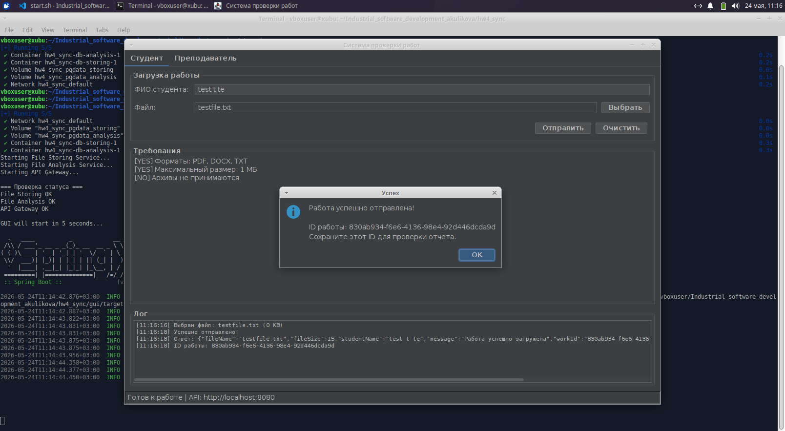
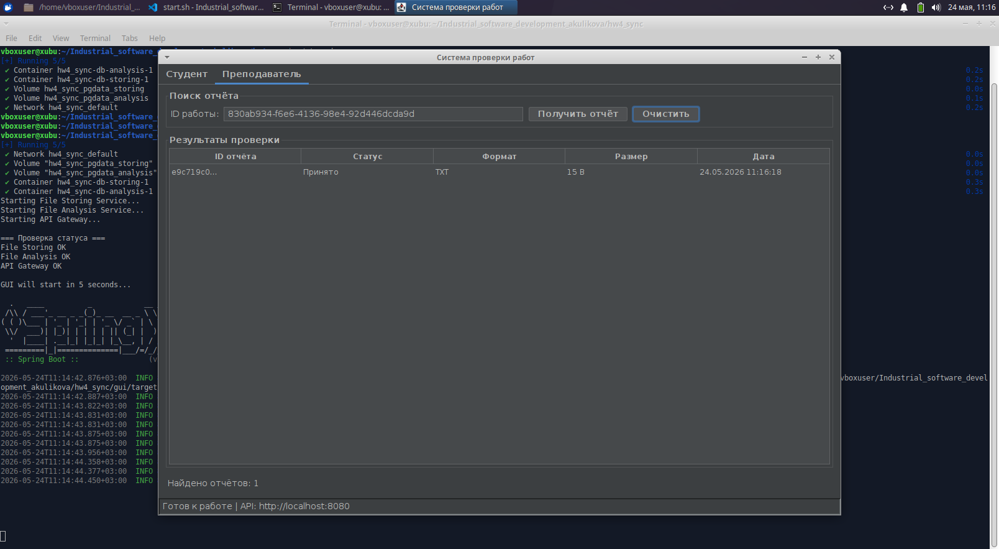
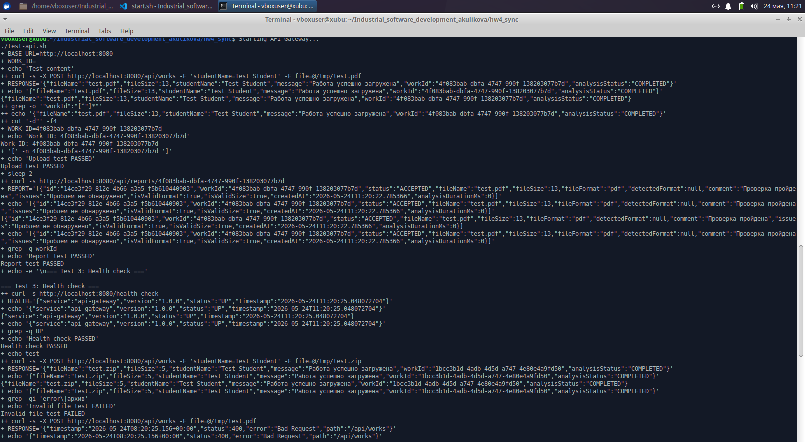

# Система проверки студенческих работ

## Содержание

1. [Описание проекта](#описание-проекта)
2. [Архитектура](#архитектура)
3. [Пользовательские сценарии](#пользовательские-сценарии)
4. [Технические сценарии взаимодействия](#технические-сценарии-взаимодействия)
5. [Модели и диаграммы](#модели)
6. [Установка и запуск](#установка-и-запуск)
8. [API Документация](#api-документация)
9. [Тестирование](#тестирование)

## Описание проекта

Система позволяет студентам загружать свои работы в различных форматах (PDF, DOCX, TXT), а преподавателям — просматривать результаты автоматической проверки с детальными отчетами.

Микросервисы

| Сервис | Порт | Назначение |
|--------|------|------------|
| API Gateway | 8080 | Единая точка входа, маршрутизация, circuit breaker |
| File Storing Service | 8081 | Прием файлов, сохранение, управление метаданными |
| File Analysis Service | 8082 | Анализ форматов, валидация, генерация отчетов |
| GUI Client | 8085 | Десктопное приложение для пользователей |


возможности

| Функция | Описание |
|---------|----------|
| Загрузка работ | Поддержка форматов PDF, DOCX, TXT (макс. 1 МБ) |
| Автоматический анализ | Проверка формата и размера файла |
| Детальные отчеты | Результаты проверки с комментариями и замечаниями |
| Отказоустойчивость | Circuit Breaker и graceful degradation |
| Контейнеризация | Полная Docker-совместимость |
| GUI | Десктопное приложение |

## Архитектура

### Общая схема



## Пользовательские сценарии

Сценарий 1. Студент загружает работу

```
Актор. Студент
Предусловия. GUI клиент запущен и подключен к API Gateway

Основной поток:
1. Студент открывает вкладку "Студент"
2. Вводит ФИО в поле "ФИО студента"
3. Нажимает "Выбрать" и выбирает файл (PDF/DOCX/TXT, до 1 МБ)
4. Нажимает "Отправить"
5. Система отображает сообщение с ID работы
6. Студент сохраняет ID работы для будущей проверки

Альтернативный поток (ошибка):
- Если файл пустой → сообщение "Файл обязателен"
- Если имя студента пустое → сообщение "Имя студента обязательно"
- Если формат не поддерживается → ошибка валидации
- Если сервис анализа недоступен → работа сохраняется со статусом "FAILED"
```

Сценарий 2. Преподаватель просматривает отчет

```
Актор. Преподаватель
Предусловия. У студента есть ID загруженной работы

Основной поток:
1. Преподаватель открывает вкладку "Преподаватель"
2. Вводит ID работы в поле поиска
3. Нажимает "Получить отчет"
4. Система отображает таблицу с результатами проверки
5. Преподаватель выбирает строку для просмотра деталей
6. В нижней панели отображается полный отчет

Содержание отчета:
- Статус проверки (ACCEPTED / NEEDS_REWORK)
- Валидность формата
- Валидность размера
- Комментарий
- Замечания
- Длительность анализа
```

Сценарий 3. Отказоустойчивость при падении сервиса

```
Актор. Система
Сценарий. File Analysis Service недоступен

Поведение:
1. File Storing Service сохраняет работу в БД
2. При вызове analysis service происходит таймаут
3. WorkService перехватывает исключение
4. Статус работы устанавливается в "FAILED"
5. Пользователь получает успешный ответ о загрузке
6. Отчет будет сгенерирован при восстановлении сервиса

API Gateway Circuit Breaker:
- При 50% ошибок за 10 вызовов → размыкание цепи
- В открытом состоянии → fallback ответ за 5 секунд
- Затем полуоткрытое состояние для проверки восстановления
```


## Технические сценарии взаимодействия

Диаграмма последовательности загрузки работы

```mermaid
sequenceDiagram
    participant S as Student
    participant GUI as GUI Client
    participant GW as API Gateway
    participant FS as File Storing Service
    participant AS as File Analysis Service
    participant DB as Database

    S->>GUI. Upload work
    GUI->>GW. POST /api/works
    GW->>FS. Forward request
    FS->>DB. Save work
    DB-->>FS. OK
    FS->>AS. POST /analyze
    AS->>DB. Validate file
    DB-->>AS. Validation result
    AS-->>FS. Analysis response
    FS-->>GW. Response with workId
    GW-->>GUI. Return workId
    GUI-->>S. Show work ID
```

Диаграмма последовательности получения отчета

```mermaid
sequenceDiagram
    participant T as Teacher
    participant GUI as GUI Client
    participant GW as API Gateway
    participant AS as File Analysis Service
    participant DB as Database

    T->>GUI. Get report
    GUI->>GW. GET /api/reports/{id}
    GW->>AS. Forward request
    AS->>DB. SELECT * FROM reports
    DB-->>AS. Return reports
    AS-->>GW. JSON response
    GW-->>GUI. JSON response
    GUI-->>T. Display report
```


## Модели


    

## Установка и запуск

### Требования

- Docker и Docker Compose
- Java 17
- Maven 3.8+

### Быстрый старт

```bash
./start.sh
```



## API Документация

API Gateway

| Метод | Endpoint | Описание |
|-------|----------|----------|
| POST | `/api/works` | Загрузка работы |
| GET | `/api/works/{workId}/file` | Скачивание файла работы |
| GET | `/api/reports/{workId}` | Получение отчетов по ID работы |
| GET | `/health-check` | Проверка статуса gateway |

File Storing Service

| Метод | Endpoint | Описание |
|-------|----------|----------|
| POST | `/api/works` | Сохранение работы |
| GET | `/api/works/{workId}/file` | Получение файла |
| GET | `/api/works/health` | Health check |

File Analysis Service

| Метод | Endpoint | Описание |
|-------|----------|----------|
| POST | `/api/internal/analyze` | Внутренний анализ файла |
| GET | `/api/reports/{workId}` | Получение отчетов |
| GET | `/api/internal/health` | Health check |

### Примеры запросов

#### Загрузка работы



#### Получение отчета



---

## Тестирование

```bash
./test-api.sh
```

