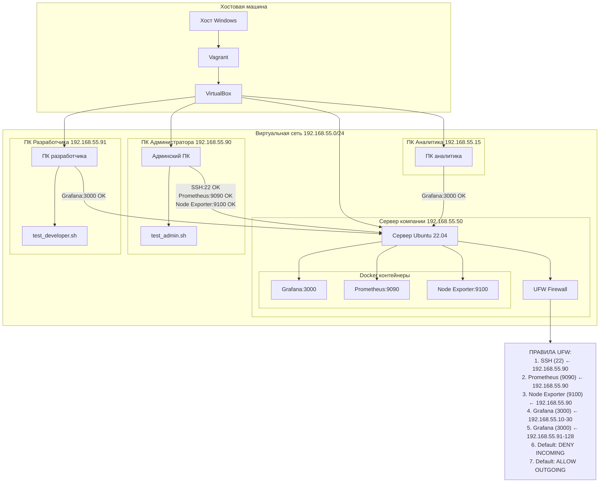
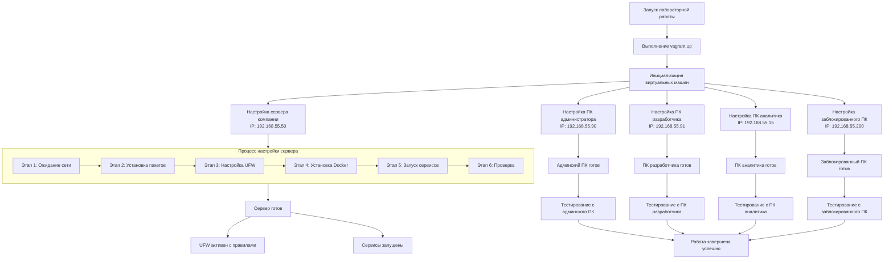
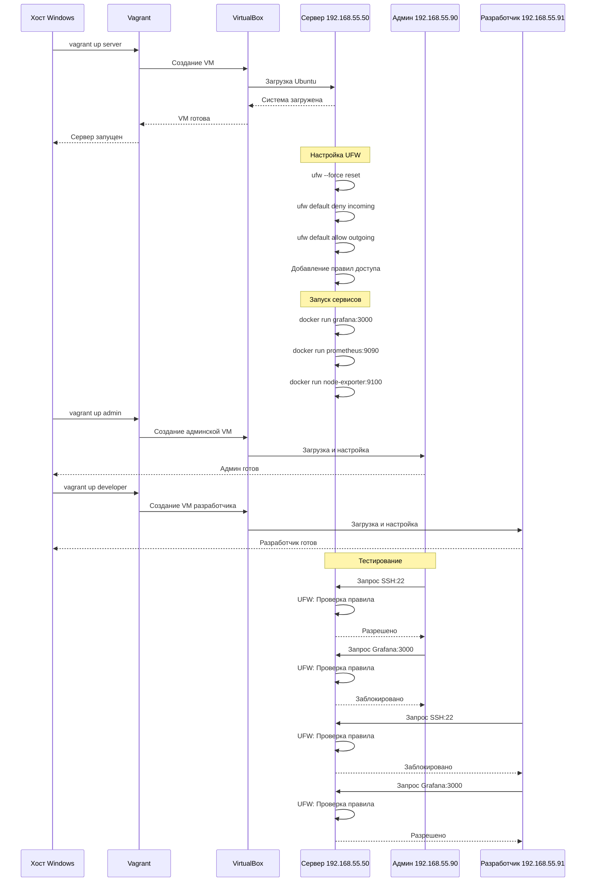

# Отчет по домашней работе. Настроить сетевой фильтр с помощью ufw

## Архитектура системы



## Процесс выполнения работы



## Последовательность взаимодействия



## Технические детали реализации

### 1. Конфигурация виртуальных машин

Сервер компании (192.168.55.50):

- Операционная система: Ubuntu 22.04
- Ресурсы: 2 CPU, 2GB RAM
- Установленные сервисы:
  - UFW (Uncomplicated Firewall)
  - Docker CE
  - Grafana (порт 3000)
  - Prometheus (порт 9090)
  - Node Exporter (порт 9100)

Клиентские машины:

- Все машины: Ubuntu 22.04, 1 CPU, 512MB RAM
- ПК администратора: 192.168.55.90
- ПК разработчика: 192.168.55.91
- ПК аналитика: 192.168.55.15
- Заблокированный ПК: 192.168.55.200

### 2. Правила UFW

```bash
ufw default deny incoming
ufw default allow outgoing

ufw allow from 192.168.55.90 to any port 22 proto tcp 
ufw allow from 192.168.55.90 to any port 9090 proto tcp
ufw allow from 192.168.55.90 to any port 9100 proto tcp
ufw allow from 127.0.0.1 to any port 9090 proto tcp
ufw allow from 127.0.0.1 to any port 9100 proto tcp
ufw allow from 192.168.55.10/28 to any port 3000 proto tcp
ufw allow from 192.168.55.91/27 to any port 3000 proto tcp
```

### 3. Этапы настройки сервера

1. Инициализация сети - ожидание полной загрузки сетевых интерфейсов
2. Установка пакетов - обновление системы и установка необходимого ПО
3. Настройка UFW - применение правил фаервола согласно заданию
4. Установка Docker - установка Docker для запуска сервисов мониторинга
5. Запуск сервисов - запуск Grafana, Prometheus и Node Exporter в контейнерах
6. Финальная проверка - проверка доступности всех сервисов и правил UFW

### 4. Результаты тестирования

С админского ПК (192.168.55.90):

- SSH (22) - доступен
- Prometheus (9090) - доступен
- Node Exporter (9100) - доступен
- Grafana (3000) - заблокирован (соответствует требованиям)

С ПК разработчика (192.168.55.91):

- SSH (22) - заблокирован
- Prometheus (9090) - заблокирован
- Node Exporter (9100) - заблокирован
- Grafana (3000) - доступен (соответствует требованиям)

С ПК аналитика (192.168.55.15):

- SSH (22) - заблокирован
- Prometheus (9090) - заблокирован
- Node Exporter (9100) - заблокирован
- Grafana (3000) - доступен (соответствует требованиям)

С заблокированного ПК (192.168.55.200):

- Все порты заблокированы (соответствует требованиям)

### 5. Верификация результатов

1. Проверка правил UFW:

```bash
sudo ufw status verbose
```

2. Проверка запущенных сервисов:

```bash
sudo docker ps
```

3. Проверка доступности сервисов:

- Grafana: http://192.168.55.50:3000 (admin/admin123)
- Prometheus: http://192.168.55.50:9090
- Node Exporter: http://192.168.55.50:9100/metrics
