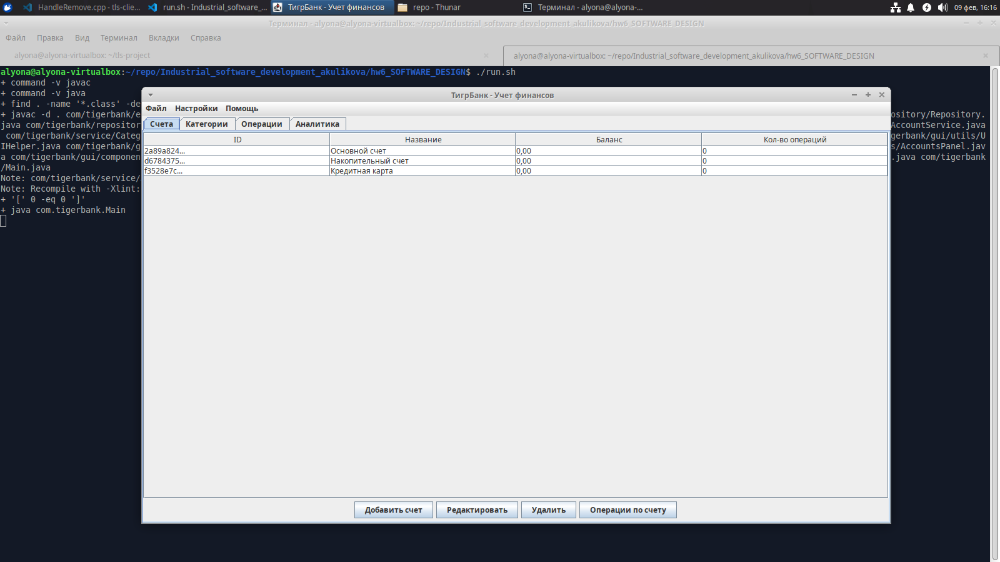
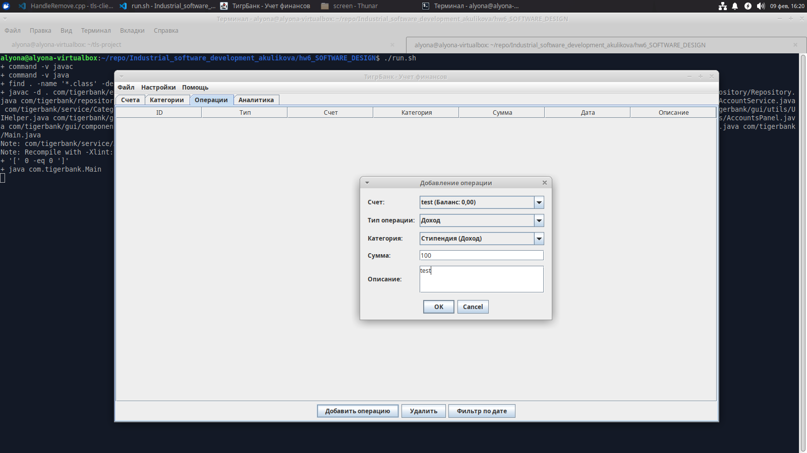
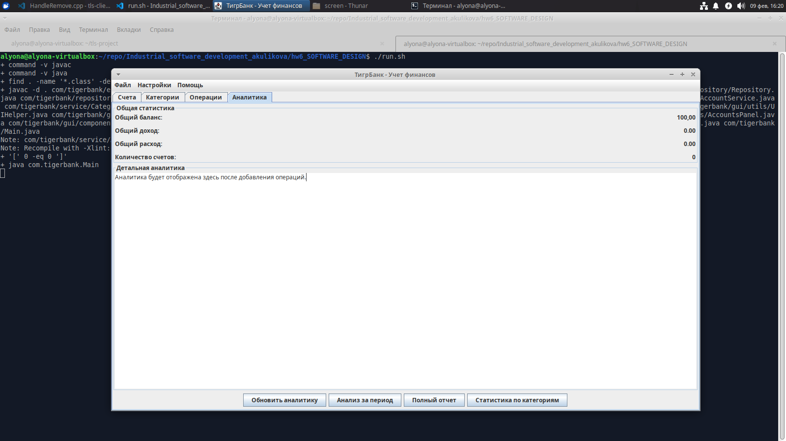
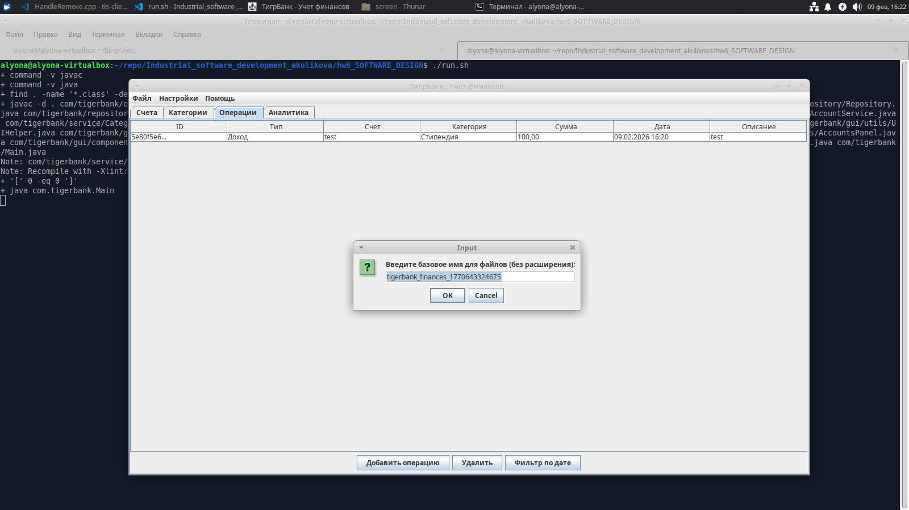
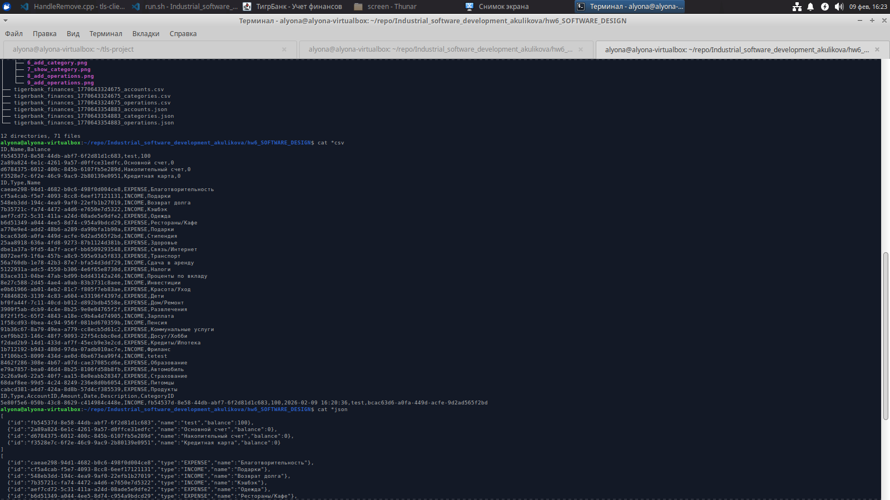
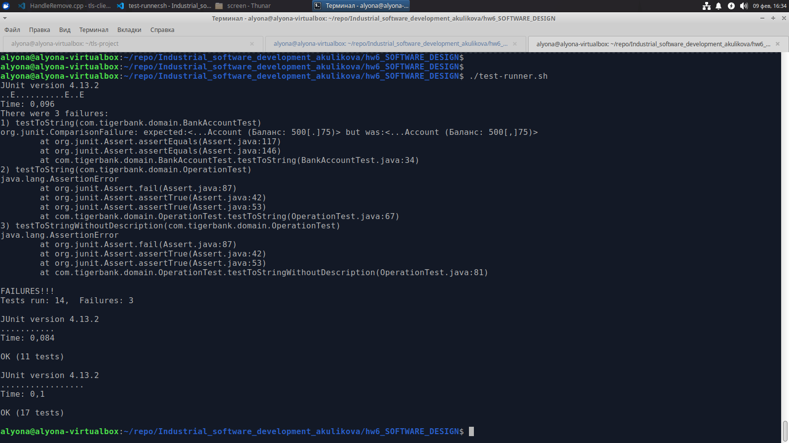

# Домашнее задание №2. Конструирование программного обеспечения

Многие компании активно развивают собственные финтех-направления, а некоторые и вовсе открывают свои банки. Московский зоопарк не собирается оставаться в стороне! ТигрБанк в своем будущем приложении сделает акцент на модуле «Учет финансов». Этот модуль будет включать инструменты, упрощающие управление личными финансами: анализ доходов и расходов, планирование бюджета, рекомендация выгодных предложений. Такой подход поможет пользователям более осознанно распоряжаться средствами и достигать своих финансовых целей!

Московский зоопарк обратился к вам с новой просьбой: разработать классы доменной модели ключевого модуля будущего приложения, а именно – модуль «Учет финансов» ТигрБанка.

## Архитектура системы

```mermaid
classDiagram
    %% ENUMS
    class OperationType {
        <<enumeration>>
        INCOME
        EXPENSE
    }

    %% DOMAIN ENTITIES
    class BankAccount {
        -UUID id
        -String name
        -BigDecimal balance
        -List~Operation~ operations
        +BankAccount()
        +BankAccount(String)
        +getId() UUID
        +setId(UUID)
        +getName() String
        +setName(String)
        +getBalance() BigDecimal
        +setBalance(BigDecimal)
        +getOperations() List~Operation~
        +addOperation(Operation)
        +removeOperation(Operation)
        +toString() String
        +toCsv() String
        +toJson() String
    }

    class Category {
        -UUID id
        -OperationType type
        -String name
        -List~Operation~ operations
        +Category()
        +Category(OperationType, String)
        +getId() UUID
        +setId(UUID)
        +getType() OperationType
        +setType(OperationType)
        +getName() String
        +setName(String)
        +getOperations() List~Operation~
        +addOperation(Operation)
        +removeOperation(Operation)
        +toString() String
        +toCsv() String
        +toJson() String
    }

    class Operation {
        -UUID id
        -OperationType type
        -UUID bankAccountId
        -BankAccount bankAccount
        -BigDecimal amount
        -LocalDateTime date
        -String description
        -UUID categoryId
        -Category category
        +Operation()
        +Operation(OperationType, UUID, BigDecimal, UUID)
        +getId() UUID
        +setId(UUID)
        +getType() OperationType
        +setType(OperationType)
        +getBankAccountId() UUID
        +setBankAccountId(UUID)
        +getBankAccount() BankAccount
        +setBankAccount(BankAccount)
        +getAmount() BigDecimal
        +setAmount(BigDecimal)
        +getDate() LocalDateTime
        +setDate(LocalDateTime)
        +getDescription() String
        +setDescription(String)
        +getCategoryId() UUID
        +setCategoryId(UUID)
        +getCategory() Category
        +setCategory(Category)
        +toString() String
        +toCsv() String
        +toJson() String
    }

    %% REPOSITORIES (INTERFACES)
    class Repository~T~ {
        <<interface>>
        +save(T entity) T
        +findById(UUID id) Optional~T~
        +findAll() List~T~
        +delete(UUID id) boolean
    }

    class BankAccountRepository {
        -Map~UUID, BankAccount~ accounts
        -OperationRepository operationRepository
        +BankAccountRepository(OperationRepository)
        +save(BankAccount) BankAccount
        +findById(UUID) Optional~BankAccount~
        +findAll() List~BankAccount~
        +delete(UUID) boolean
    }

    class CategoryRepository {
        -Map~UUID, Category~ categories
        -OperationRepository operationRepository
        +CategoryRepository(OperationRepository)
        +save(Category) Category
        +findById(UUID) Optional~Category~
        +findAll() List~Category~
        +delete(UUID) boolean
        +findByType(OperationType) List~Category~
    }

    class OperationRepository {
        -Map~UUID, Operation~ operations
        -BankAccountRepository accountRepository
        -CategoryRepository categoryRepository
        +OperationRepository(BankAccountRepository, CategoryRepository)
        +save(Operation) Operation
        +findById(UUID) Optional~Operation~
        +findAll() List~Operation~
        +delete(UUID) boolean
        +findByBankAccountId(UUID) List~Operation~
        +findByCategoryId(UUID) List~Operation~
        +findByDateBetween(LocalDateTime, LocalDateTime) List~Operation~
        +findByType(OperationType) List~Operation~
    }

    %% SERVICES
    class AccountService {
        -BankAccountRepository accountRepository
        -OperationRepository operationRepository
        +AccountService(BankAccountRepository, OperationRepository)
        +createAccount(String) BankAccount
        +getAccount(UUID) Optional~BankAccount~
        +getAllAccounts() List~BankAccount~
        +deleteAccount(UUID) boolean
        +updateAccountBalance(UUID, BigDecimal, OperationType)
        +calculateTotalBalance() BigDecimal
    }

    class CategoryService {
        -CategoryRepository categoryRepository
        +CategoryService(CategoryRepository)
        +createCategory(OperationType, String) Category
        +getCategory(UUID) Optional~Category~
        +getAllCategories() List~Category~
        +getCategoriesByType(OperationType) List~Category~
        +deleteCategory(UUID) boolean
        +loadDefaultCategories()
    }

    class OperationService {
        -OperationRepository operationRepository
        -AccountService accountService
        -CategoryService categoryService
        +OperationService(OperationRepository, AccountService, CategoryService)
        +createOperation(OperationType, UUID, BigDecimal, UUID, String) Operation
        +getOperation(UUID) Optional~Operation~
        +getOperationsByAccount(UUID) List~Operation~
        +getAllOperations() List~Operation~
        +deleteOperation(UUID) boolean
        +getOperationsByCategory(UUID) List~Operation~
        +getOperationsByType(OperationType) List~Operation~
        +getOperationsByDateRange(LocalDateTime, LocalDateTime) List~Operation~
        +getTotalIncome(LocalDateTime, LocalDateTime) BigDecimal
        +getTotalExpense(LocalDateTime, LocalDateTime) BigDecimal
        +getBalanceForPeriod(LocalDateTime, LocalDateTime) BigDecimal
    }

    class AnalyticsService {
        -OperationService operationService
        -CategoryService categoryService
        -AccountService accountService
        +AnalyticsService(OperationService, CategoryService, AccountService)
        +getFullAnalytics(LocalDateTime, LocalDateTime) Map~String, Object~
        +getCategoryStatistics(OperationType) Map~String, BigDecimal~
        +generateAnalyticsReport(LocalDateTime, LocalDateTime) String
    }

    class FileExporter {
        +exportAllToCsv(String, List~BankAccount~, List~Category~, List~Operation~)
        +exportAllToJson(String, List~BankAccount~, List~Category~, List~Operation~)
        -exportToCsv~T~(List~T~, String, String[], Function~T, String[]~)
        -exportToJson(List~?~, String)
    }

    %% GUI
    class Main {
        -AccountService accountService
        -CategoryService categoryService
        -OperationService operationService
        -AnalyticsService analyticsService
        -FileExporter fileExporter
        -JTabbedPane tabbedPane
        -JTable accountsTable
        -JTable categoriesTable
        -JTable operationsTable
        -DefaultTableModel accountsModel
        -DefaultTableModel categoriesModel
        -DefaultTableModel operationsModel
        -Map~UUID, BankAccount~ accountMap
        -Map~UUID, Category~ categoryMap
        -Map~UUID, Operation~ operationMap
        +Main()
        -initializeUI()
        -createMenuBar()
        -createAccountsPanel() JPanel
        -createCategoriesPanel() JPanel
        -createOperationsPanel() JPanel
        -createAnalyticsPanel() JPanel
        -loadInitialData()
        -refreshAllTables()
        +main(String[])
    }

    %% RELATIONSHIPS
    BankAccount "1" *-- "0..*" Operation : has
    Category "1" *-- "0..*" Operation : has
    Operation --> BankAccount : references
    Operation --> Category : references
    
    Repository~T~ <|.. BankAccountRepository
    Repository~T~ <|.. CategoryRepository
    Repository~T~ <|.. OperationRepository
    
    BankAccountRepository --> OperationRepository : uses
    CategoryRepository --> OperationRepository : uses
    OperationRepository --> BankAccountRepository : uses
    OperationRepository --> CategoryRepository : uses
    
    AccountService --> BankAccountRepository : depends on
    AccountService --> OperationRepository : depends on
    CategoryService --> CategoryRepository : depends on
    OperationService --> OperationRepository : depends on
    OperationService --> AccountService : depends on
    OperationService --> CategoryService : depends on
    AnalyticsService --> OperationService : depends on
    AnalyticsService --> CategoryService : depends on
    AnalyticsService --> AccountService : depends on
    
    Main --> AccountService : creates
    Main --> CategoryService : creates
    Main --> OperationService : creates
    Main --> AnalyticsService : creates
    Main --> FileExporter : creates
```



## Скринкаст

**[важно!]** все скрины находятся по пути /screen/*.png

Что было сделано:

- Выполнено задание
- (Дополнительно) Сделана GUI чтобы пользователь мог взаимодействовать с приложением
- Модульное тестирование

Стартовое окно, что встречает пользователя



Пользователь может добавлять счета, категории, операции, а также просматривать аналитику. Также пользователю предоставляется возможность экспортировать данные в CSV / JSON файл

Окно Категорий


Окно операции



Окно аналитики



Экспорт данных csv



Экспорт данных json


Экспортированные данные



Модульное тестирование




## Модульная структура

| Уровень | Компоненты | Ответственность | Принцип проектирования | Взаимодействие |
|---------|------------|-----------------|------------------------|----------------|
| Слой доменной модели<br>(Domain Layer) | `BankAccount`<br>`Category`<br>`Operation`<br>`OperationType` (enum) | Представление бизнес-сущностей и их поведения | Каждая сущность содержит бизнес-логику и данные | Независим от других слоев |
| Слой доступа к данным<br>(Repository Layer) | `Repository<T>` (интерфейс)<br>`BankAccountRepository`<br>`CategoryRepository`<br>`OperationRepository` | Изоляция логики доступа к данным, CRUD операции | Изоляция логики доступа к данным | Зависит от Domain Layer |
| Слой бизнес-логики<br>(Service Layer) | `AccountService`<br>`CategoryService`<br>`OperationService`<br>`AnalyticsService` | Управление сущностями, сложная бизнес-логика | Отделение бизнес-логики от представления | Зависит от Repository Layer |
| Слой инфраструктуры<br>(Infrastructure Layer) | `FileExporter` | Работа с файлами (CSV, JSON), технические аспекты | Реализация технических аспектов | Зависит от Domain Layer |
| Слой представления<br>(Presentation Layer) | `Main` (GUI на Swing) | Пользовательский интерфейс, ввод/вывод данных | MVC-паттерн для UI | Зависит от Service Layer |

## Принципы SOLID

| Принцип SOLID | Реализация в системе | Конкретные примеры | Эффект для системы |
|---------------|----------------------|-------------------|-------------------|
| Single Responsibility Principle (SRP)<br>Единая ответственность | Каждый класс имеет одну четкую ответственность | • `BankAccount` - только данные счета<br>• `CategoryService` - только управление категориями<br>• `FileExporter` - только экспорт данных | Упрощение тестирования, поддержки и модификации кода |
| Open/Closed Principle (OCP)<br>Открыт для расширения, закрыт для модификации | Классы можно расширять без изменения исходного кода | • `Repository<T>` - можно добавлять новые репозитории<br>• `FileExporter` - можно добавлять новые форматы экспорта<br>• Диалоги GUI - новые формы без изменения существующих | Легкое добавление нового функционала |
| Liskov Substitution Principle (LSP)<br>Принцип подстановки Лисков | Реализации интерфейсов взаимозаменяемы | • Все репозитории реализуют `Repository<T>` интерфейс<br>• Можно заменять реализации репозиториев<br>• Сервисы работают с абстракциями, а не реализациями | Гибкость, возможность замены компонентов |
| Interface Segregation Principle (ISP)<br>Разделение интерфейсов | Узкоспециализированные интерфейсы | • `Repository<T>` - минимальный интерфейс для CRUD операций<br>• Каждый сервис имеет свою специализацию<br>• GUI компоненты разделены по функциям | Клиенты не зависят от неиспользуемых методов |
| Dependency Inversion Principle (DIP)<br>Инверсия зависимостей | Зависимости от абстракций, а не реализаций | • Сервисы зависят от интерфейсов `Repository<T>`<br>• Высокоуровневые модули не зависят от низкоуровневых<br>• Внедрение зависимостей через конструкторы | Тестируемость, гибкость архитектуры |

## DI-контейнер

Система использует ручную реализацию DI-контейнера через конструкторы:

- Инициализация сервисов
- Инициализация репозиториев (циклические зависимости)
- Установка связей (разрешение циклических зависимостей)

Инициализация репозиториев (циклические зависимости):

```java
OperationRepository operationRepo = new OperationRepository(null, null);
BankAccountRepository accountRepo = new BankAccountRepository(operationRepo);
CategoryRepository categoryRepo = new CategoryRepository(operationRepo);
```

Установка связей (разрешение циклических зависимостей):

```java
operationRepo = new OperationRepository(accountRepo, categoryRepo);
```

Инициализация сервисов: 

```java
AccountService accountService = new AccountService(accountRepo, operationRepo);
CategoryService categoryService = new CategoryService(categoryRepo);
OperationService operationService = new OperationService(operationRepo, accountService, categoryService);
AnalyticsService analyticsService = new AnalyticsService(operationService, categoryService, accountService);
```

Преимущества ручной реализации:

- Полный контроль над жизненным циклом объектов
- Нет внешних зависимостей от фреймворков
- Прозрачность зависимостей
- Легкая отладка

### Запуск тестов:

```bash
javac -cp ".:junit-platform-console-standalone-1.9.0.jar" *.java
java -jar junit-platform-console-standalone-1.9.0.jar --class-path . --scan-class-path
```

## Потенциальные проблемы при расширении

| № | Проблема | Причина | Решение | Влияние на архитектуру |
|---|----------|---------|---------|------------------------|
| 1 | Добавление новой сущности "Пользователь" | Требуется изменения во всех репозиториях и сервисах | Использовать generic репозитории и шаблон Unit of Work | Высокое - потребуется рефакторинг всей системы |
| 2 | Поддержка транзакций между счетами | Текущая архитектура не поддерживает ACID транзакции | Внедрение паттерна Transaction Script или использование БД с транзакциями | Среднее - добавление нового слоя транзакций |
| 3 | Добавление новых форматов экспорта (XML, PDF) | Класс `FileExporter` может стать "божественным объектом" | Применить паттерн Strategy для форматов экспорта | Низкое - изолированные изменения в FileExporter |
| 4 | Поддержка многопользовательского режима | Текущие репозитории хранят данные в памяти | Внедрение базы данных и системы аутентификации | Очень высокое - полная переработка архитектуры |
| 5 | Добавление сложных бизнес-правил | Бизнес-логика размазана по сервисам | Внедрение Domain-Driven Design (DDD) с агрегатами | Высокое - реорганизация бизнес-логики |

## Преимущества введенных абстракций

| № | Абстракция | Проблема до внедрения | Решение после внедрения | Выигрыш | Принцип SOLID |
|---|------------|----------------------|-------------------------|---------|---------------|
| 1 | Интерфейс `Repository<T>` | Привязка к конкретной реализации хранилища | Легкая замена in-memory репозиториев на БД | Тестируемость, гибкость, соблюдение DIP | DIP - зависимости от абстракций |
| 2 | Отдельные сервисы для каждой сущности | Один "божественный" сервис со всей логикой | Разделение ответственности | SRP, легкое тестирование, понятная структура | SRP - единая ответственность |
| 3 | Класс `AnalyticsService` | Аналитика смешана с CRUD операциями | Отделение сложной бизнес-логики | Чистая архитектура, возможность оптимизации расчетов | SRP - отделение аналитики от CRUD |
| 4 | Двусторонние связи между сущностями | Отсутствие целостности данных | Полная связность модели | Надежность, удобство навигации по данным | Не относится напрямую к SOLID |
| 5 | Отдельный `FileExporter` | Логика экспорта смешана с UI | Изоляция инфраструктурного кода | Переиспользование, тестируемость, OCP | OCP - открыт для расширения |

## Работа с файлами

### Поддерживаемые форматы:

#### 1. CSV формат (раздельные файлы):
- `filename_accounts.csv` - счета
- `filename_categories.csv` - категории  
- `filename_operations.csv` - операции

#### 2. JSON формат (раздельные файлы):
- `filename_accounts.json` - массив объектов счетов
- `filename_categories.json` - массив объектов категорий
- `filename_operations.json` - массив объектов операций

### Пример CSV файла операций:
```csv
ID,Type,AccountID,Amount,Date,Description,CategoryID
b601e52e-2116-447b-a997-dc720039611e,EXPENSE,abe502e6-4622-4a0b-969c-661b09f93400,2500.00,2026-02-09 14:04:33,Поход в кино,cfdb8cba-f060-4d82-85d7-be346dbccd78
```

### Пример JSON файла счетов:
```json
[
  {
    "id": "abe502e6-4622-4a0b-969c-661b09f93400",
    "name": "Основной счет",
    "balance": 57799.50
  }
]
```

## Запуск приложения

### Требования:
- Java 11 или выше
- Swing (входит в стандартную библиотеку Java)

### Компиляция и запуск:

Вручную

```bash
javac *.java
java Main
```

Скрипт

```bash
./run.sh
```

### Структура проекта:
```
TigerBank/
├── Main.java                    # Главный класс с GUI
├── README.md                    # Документация (этот файл)
├── finances_accounts.csv        # Экспорт счетов (создается)
├── finances_categories.csv      # Экспорт категорий (создается)
├── finances_operations.csv      # Экспорт операций (создается)
└── test/                        # Тесты
    ├── AccountServiceTest.java
    ├── CategoryServiceTest.java
    ├── OperationServiceTest.java
    ├── AnalyticsServiceTest.java
    └── FileExporterTest.java
```

## Критерии оценки (чек-лист)

### Выполнено:
- [x] 1 балл - Краткое описание предметной области
- [x] 1 балл - Единый code style (Java Code Conventions)
- [x] 1.5 балла - Модульное тестирование (JUnit 5)
- [x] 2.5 балла - Принципы SOLID
- [x] 3.5 балла - DI-контейнер (ручная реализация)
- [x] 1 балл - Анализ проблем расширения
- [x] 1 балл - Аргументация абстракций
- [x] 1.5 балла - Работа с файлами (CSV, JSON)
- [x] 2 балла - Использование ИИ с указанием

### 🎥 Скринкаст должен содержать:
1. Демонстрацию функционала (2-3 минуты):
   - Создание счетов и категорий
   - Добавление операций
   - Аналитика и отчеты
   - Экспорт данных

2. Архитектурные особенности (2 минуты):
   - Объяснение DI-контейнера
   - Демонстрация SOLID принципов
   - Показ связей между классами

3. Тестирование (1 минута):
   - Запуск unit-тестов
   - Демонстрация покрытия

4. Работа с файлами (1 минута):
   - Экспорт в CSV/JSON
   - Показ созданных файлов

