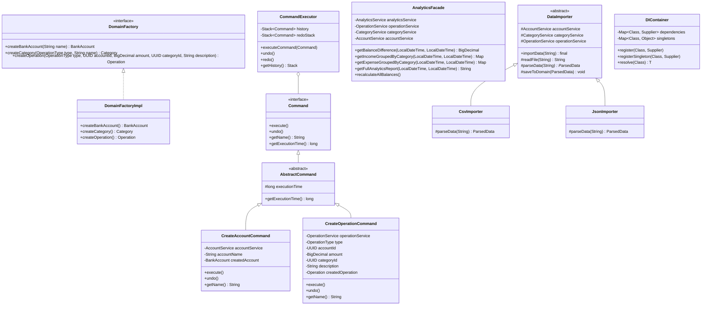
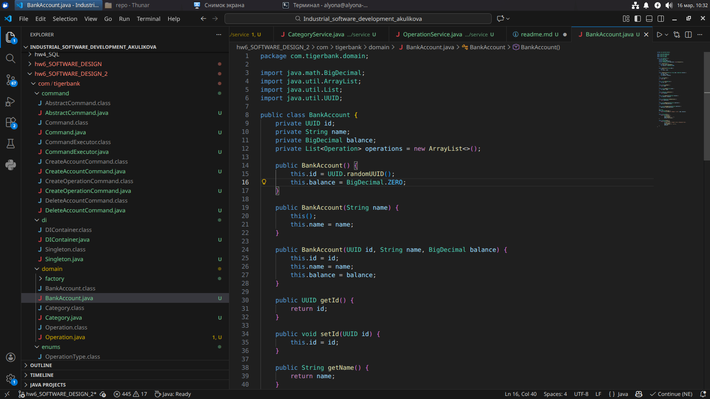
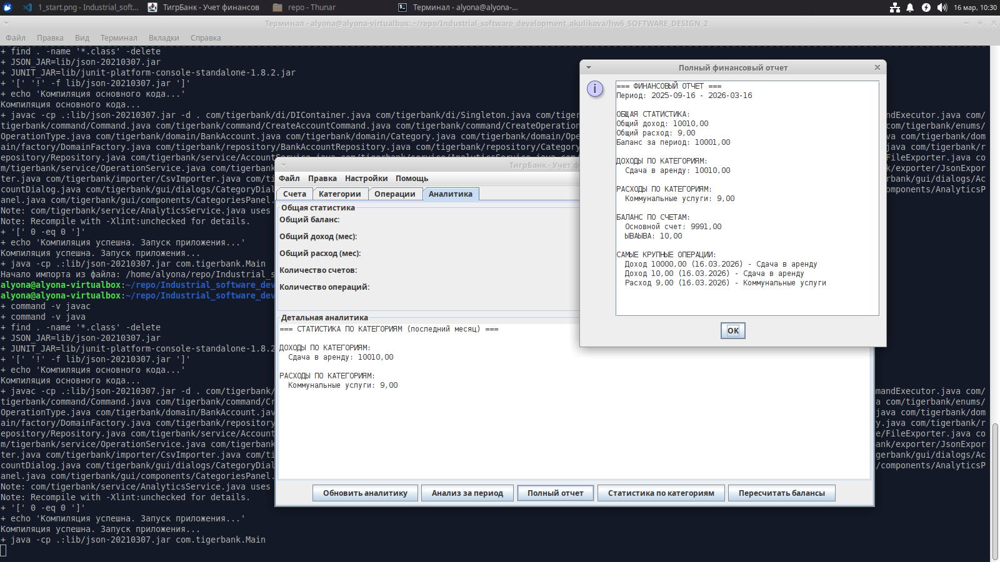

# Домашнее задание №2. Конструирование программного обеспечения (рефактор)

**Важно!** Основное объяснение о работе представлена в [Домашнее задание №2. Конструирование программного обеспечения](../hw6_SOFTWARE_DESIGN/readme.md)

## Диаграмма классов паттернов



## Скринкаст

Код



Приложение



## Выполненная работа

**1.Фабричный метод**

| Характеристика | Описание |
|----------------|----------|
| Где реализован | `com.tigerbank.domain.factory.DomainFactory` и `DomainFactoryImpl` |
| Проблема | Создание сложных доменных объектов было разбросано по разным сервисам, затрудняя модификацию и тестирование |
| Решение | Единый интерфейс фабрики, централизующий логику создания всех доменных объектов |

**2.Фасад**

| Характеристика | Описание |
|----------------|----------|
| Где реализован | `com.tigerbank.facade.AnalyticsFacade` |
| Проблема | Для аналитики требовалось взаимодействие с несколькими сервисами, создавая высокую связанность |
| Решение | Простой унифицированный интерфейс для всех аналитических операций |

**3.Команда**

| Характеристика | Описание |
|----------------|----------|
| Где реализован | Пакет `com.tigerbank.command` |
| Проблема | Логика пользовательских сценариев была размазана по обработчикам GUI |
| Решение | Инкапсуляция каждого сценария в отдельный класс команды |

**4.Шаблонный метод**

| Характеристика | Описание |
|----------------|----------|
| Где реализован | `com.tigerbank.importer.DataImporter` и его наследники |
| Проблема | Импорт из разных форматов имел общую структуру, но отличался парсингом. Код дублировался |
| Решение | Абстрактный класс, определяющий "скелет" алгоритма |

**5.Иерархия импортеров**

| Класс | Назначение |
|-------|------------|
| `DataImporter` | Абстрактный базовый класс с шаблонным методом |
| `CsvImporter` | Импорт из CSV файлов |
| `JsonImporter` | Импорт из JSON файлов |

**6.DI-контейнер**

| Характеристика | Описание |
|----------------|----------|
| Где реализован | `com.tigerbank.di.DIContainer` |
| Назначение | Управление зависимостями между классами |

**7.Принципы SOLID**

| Принцип | Реализация |
|---------|------------|
| Single Responsibility | `CreateAccountCommand` отвечает только за создание счета, `CsvExporter` - только за экспорт в CSV |
| Open/Closed | Можно добавить новый формат импорта (`YamlImporter`), не меняя существующий код |
| Liskov Substitution | Любой `DataImporter` может быть использован там, где ожидается базовый класс |
| Interface Segregation | `Repository<T>` имеет только необходимые методы |
| Dependency Inversion | Сервисы зависят от интерфейсов Repository, а не от конкретных реализаций |

**8.Принципы GRASP**

| Принцип | Реализация |
|---------|------------|
| High Cohesion (Высокая связность) | `CsvExporter` занимается только экспортом в CSV, `AnalyticsFacade` - только аналитикой |
| Low Coupling (Низкая связанность) | Классы слабо связаны через DI-контейнер и интерфейсы |

**9.Функциональные требования**

CRUD операции

| Сущность | Создание | Чтение | Редактирование | Удаление |
|----------|----------|--------|----------------|----------|
| Счета | + | + | + | + (с проверкой операций) |
| Категории | + | + | - | + (с предупреждением) |
| Операции | + | + | - | + (с пересчетом баланса) |

Аналитика

| Функция | Реализация |
|---------|------------|
| Разница доходов и расходов за период | + |
| Группировка по категориям | + |
| Полный финансовый отчет | + |
| Автоматический пересчет балансов | + |

Импорт/Экспорт

| Формат | Экспорт | Импорт |
|--------|---------|--------|
| CSV | + (индивидуально и общий файл) | + |
| JSON | + (индивидуально и общий файл) | + |

Измерение времени

| Функция | Реализация |
|---------|------------|
| Измерение времени выполнения команд | + (в наносекундах) |
| Отображение пользователю | + |
| Возможность оптимизации | + |

**10.Модульное тестирование**

реализовано в `test/com/tigerbank`


## Структура

```bash
alyona@alyona-virtualbox:~/repo/Industrial_software_development_akulikova/hw6_SOFTWARE_DESIGN_2$ tree
.
├── build.xml
├── com
│   └── tigerbank
│       ├── command
│       │   ├── AbstractCommand.java
│       │   ├── CommandExecutor.java
│       │   ├── Command.java
│       │   ├── CreateAccountCommand.java
│       │   ├── CreateOperationCommand.java
│       │   └── DeleteAccountCommand.java
│       ├── di
│       │   ├── DIContainer.java
│       │   └── Singleton.java
│       ├── domain
│       │   ├── BankAccount.java
│       │   ├── Category.java
│       │   ├── factory
│       │   │   ├── DomainFactoryImpl.java
│       │   │   └── DomainFactory.java
│       │   └── Operation.java
│       ├── enums
│       │   └── OperationType.java
│       ├── exporter
│       │   ├── CsvExporter.java
│       │   ├── DataExporter.java
│       │   └── JsonExporter.java
│       ├── facade
│       │   └── AnalyticsFacade.java
│       ├── gui
│       │   ├── components
│       │   │   ├── AccountsPanel.java
│       │   │   ├── AnalyticsPanel.java
│       │   │   ├── CategoriesPanel.java
│       │   │   ├── OperationService.java
│       │   │   └── OperationsPanel.java
│       │   ├── dialogs
│       │   │   ├── AccountDialog.java
│       │   │   ├── CategoryDialog.java
│       │   │   └── OperationDialog.java
│       │   ├── MainFrame.java
│       │   └── utils
│       │       └── UIHelper.java
│       ├── importer
│       │   ├── CsvImporter.java
│       │   ├── DataImporter.java
│       │   └── JsonImporter.java
│       ├── Main.class
│       ├── Main.java
│       ├── repository
│       │   ├── BankAccountRepository.class
│       │   ├── BankAccountRepository.java
│       │   ├── CategoryRepository.class
│       │   ├── CategoryRepository.java
│       │   ├── OperationRepository.class
│       │   ├── OperationRepository.java
│       │   └── Repository.java
│       └── service
│           ├── AccountService.java
│           ├── AnalyticsService.java
│           ├── CategoryService.java
│           ├── FileExporter.java
│           └── OperationService.java
├── download-junit.sh
├── hamcrest-core-1.3.jar
├── junit-4.13.2.jar
├── lib
│   ├── json-20210307.jar
│   ├── junit-jupiter-api-5.8.2.jar
│   ├── junit-jupiter-engine-5.8.2.jar
│   └── junit-platform-console-standalone-1.8.2.jar
├── readme.md
├── run.sh
├── screen
│   ├── 0_code.png
│   └── 1_start.png
├── test
│   └── com
│       └── tigerbank
│           ├── command
│           │   └── CommandTest.java
│           ├── domain
│           │   ├── BankAccountTest.java
│           │   ├── CategoryTest.java
│           │   └── OperationTest.java
│           ├── repository
│           │   ├── BankAccountRepositoryTest.java
│           │   ├── CategoryRepositoryTest.java
│           │   └── OperationRepositoryTest.java
│           └── service
│               ├── AccountServiceTest.java
│               ├── CategoryServiceTest.java
│               └── OperationServiceTest.java
├── test-runner.sh
├── tigerbank_finances_1773644860602_accounts.csv
├── tigerbank_finances_1773644860602_categories.csv
└── tigerbank_finances_1773644860602_operations.csv

26 directories, 111 files

```

## Запуск приложения

### Требования:
- Java 11 или выше
- Swing (входит в стандартную библиотеку Java)

### Компиляция и запуск:

Вручную

```bash
javac *.java
java Main
```

Скрипт

```bash
./run.sh
```
